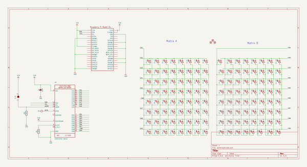

# adafruit_charlieplex_bonnet_pcbs
 
## summary 
* id: adafruit_adafruit_charlieplex_bonnet_pcbs_adafruit_charlieplex_bonnet
* user: adafruit
* name: adafruit_charlieplex_bonnet_pcbs
* board: adafruit_charlieplex_bonnet
* repo: https://github.com/adafruit/Adafruit-CharliePlex-Bonnet-PCBs

* src_file_repo_sch: 
*
 src_file_repo_sch_link: https://github.com/adafruit/Adafruit-CharliePlex-Bonnet-PCBs/tree/master/
* full details link: https://github.com/oomlout/oomlout_oomp_project_bot_v_2/tree/main/projects/adafruit_adafruit_charlieplex_bonnet_pcbs_adafruit_charlieplex_bonnet/current_version/working  

## schematic  
  
[schematic (pdf)](working_schematic.pdf)  

## pcb  
 
  
  
  
[board (pdf)](working.pdf)  

## working_bom
| Id | Designator | Footprint | Quantity | Designation | Supplier and ref |  | None | 
| --- | --- | --- | --- | --- | --- | --- | --- | 
| 1 | C2-4,C8-15,C7-12,C7-8,C3-8,C5-14,C9-11,C7-7,C5-2,C6-4,C7-6,C9-4,C6-2,C4-12,C9-13,C5-7,C7-5,C4-1,C5-15,C3-3,C5-5,C2-5,C2-1,C3-11,C9-2,C9-10,C2-3,C9-16,C7-2,C6-1,C6-8,C3-5,C6-13,C9-3,C4-6,C8-5,C8-12,C5-1,C3-16,C5-6,C4-3,C4-11,C6-11,C5-16,C6-14,C2-8,C9-14,C9-15,C4-13,C5-10,C6-9,C7-9,C4-4,C4-9,C8-9,C7-15,C7-14,C8-8,C2-12,C7-10,C6-5,C7-13,C2-7,C8-4,C7-4,C3-13,C5-8,C4-14,C8-16,C3-6,C6-10,C8-7,C8-6,C5-12,C7-1,C8-3,C5-9,C8-10,C7-16,C2-13,C8-11,C2-10,C9-9,C2-14,C3-9,C8-13,C3-15,C2-9,C4-16,C4-8,C9-1,C9-7,C4-7,C4-10,C8-2,C8-1,C6-6,C3-4,C6-15,C9-6,C3-2,C3-10,C6-12,C5-13,C4-2,C3-1,C2-6,C5-4,C5-11,C7-11,C6-16,C6-7,C3-12,C7-3,C2-2,C8-14,C9-12,C2-11,C2-16,C4-5,C9-5,C2-15,C5-3,C6-3,C3-7,C9-8,C3-14,C4-15 | CHIPLED_0603_NOOUTLINE | 128 |  |  |  | [''] | 
| 2 | FID3,FID1,FID2 | FIDUCIAL_1MM | 3 | FIDUCIAL_1MM |  |  | [''] | 
| 3 | U1 | QFN28_4MM_0.4MM | 1 | IS31FL3731-SALS2 |  |  | [''] | 
| 4 | U$1 | ADAFRUIT_5MM | 1 |  |  |  | [''] | 
| 5 | U$13 | CHARLIE_BONNET_GRID | 1 |  |  |  | [''] | 
| 6 | C4 | 0805-NO | 1 | 10uF |  |  | [''] | 
| 7 | R1,R2 | 0603-NO | 2 | 10K |  |  | [''] | 
| 8 | U$14 | PCBFEAT-REV-040 | 1 |  |  |  | [''] | 
| 9 | RPI1 | PI_BONNET_THMSMT | 1 | RASPBERRYPI_BPLUS_BONNET_THMSMT |  |  | [''] | 
| 10 | TP1 | TESTPOINT_ROUND_1.5MM | 1 |  |  |  | [''] | 
| 11 | U$2 | ADAFRUIT_TEXT_20MM | 1 |  |  |  | [''] | 
| 12 | SJ1 | SOLDERJUMPER_ARROW_NOPASTE | 1 |  |  |  | [''] | 

## bom_schematic
| Ref | Qnty | Value | Cmp name | Footprint | Description | Vendor | DNP | 
| --- | --- | --- | --- | --- | --- | --- | --- | 
| C2-1, C2-2, C2-3, C2-4, C2-5, C2-6, C2-7, C2-8, C2-9, C2-10, C2-11, C2-12, C2-13, C2-14, C2-15, C2-16 | 16 | LED0603_NOOUTLINE | LED0603_NOOUTLINE | working:CHIPLED_0603_NOOUTLINE |  |  |  | 
| C3-1, C3-2, C3-3, C3-4, C3-5, C3-6, C3-7, C3-8, C3-9, C3-10, C3-11, C3-12, C3-13, C3-14, C3-15, C3-16 | 16 | LED0603_NOOUTLINE | LED0603_NOOUTLINE | working:CHIPLED_0603_NOOUTLINE |  |  |  | 
| C4 | 1 | 10uF | CAP_CERAMIC0805-NOOUTLINE | working:0805-NO |  |  |  | 
| C4-1, C4-2, C4-3, C4-4, C4-5, C4-6, C4-7, C4-8, C4-9, C4-10, C4-11, C4-12, C4-13, C4-14, C4-15, C4-16 | 16 | LED0603_NOOUTLINE | LED0603_NOOUTLINE | working:CHIPLED_0603_NOOUTLINE |  |  |  | 
| C5-1, C5-2, C5-3, C5-4, C5-5, C5-6, C5-7, C5-8, C5-9, C5-10, C5-11, C5-12, C5-13, C5-14, C5-15, C5-16 | 16 | LED0603_NOOUTLINE | LED0603_NOOUTLINE | working:CHIPLED_0603_NOOUTLINE |  |  |  | 
| C6-1, C6-2, C6-3, C6-4, C6-5, C6-6, C6-7, C6-8, C6-9, C6-10, C6-11, C6-12, C6-13, C6-14, C6-15, C6-16 | 16 | LED0603_NOOUTLINE | LED0603_NOOUTLINE | working:CHIPLED_0603_NOOUTLINE |  |  |  | 
| C7-1, C7-2, C7-3, C7-4, C7-5, C7-6, C7-7, C7-8, C7-9, C7-10, C7-11, C7-12, C7-13, C7-14, C7-15, C7-16 | 16 | LED0603_NOOUTLINE | LED0603_NOOUTLINE | working:CHIPLED_0603_NOOUTLINE |  |  |  | 
| C8-1, C8-2, C8-3, C8-4, C8-5, C8-6, C8-7, C8-8, C8-9, C8-10, C8-11, C8-12, C8-13, C8-14, C8-15, C8-16 | 16 | LED0603_NOOUTLINE | LED0603_NOOUTLINE | working:CHIPLED_0603_NOOUTLINE |  |  |  | 
| C9-1, C9-2, C9-3, C9-4, C9-5, C9-6, C9-7, C9-8, C9-9, C9-10, C9-11, C9-12, C9-13, C9-14, C9-15, C9-16 | 16 | LED0603_NOOUTLINE | LED0603_NOOUTLINE | working:CHIPLED_0603_NOOUTLINE |  |  |  | 
| FID1, FID2, FID3 | 3 | FIDUCIAL_1MM | FIDUCIAL_1MM | working:FIDUCIAL_1MM |  |  |  | 
| R1, R2 | 2 | 10K | RESISTOR_0603_NOOUT | working:0603-NO |  |  |  | 
| RPI1 | 1 | RASPBERRYPI_BPLUS_BONNET_THMSMT | RASPBERRYPI_BPLUS_BONNET_THMSMT | working:PI_BONNET_THMSMT |  |  |  | 
| SJ1 | 1 | SOLDERJUMPER | SOLDERJUMPER | working:SOLDERJUMPER_ARROW_NOPASTE |  |  |  | 
| TP1 | 1 | TESTPOINTROUND1.5MM | TESTPOINTROUND1.5MM | working:TESTPOINT_ROUND_1.5MM |  |  |  | 
| U1 | 1 | IS31FL3731-SALS2 | IS31FL3731QFN | working:QFN28_4MM_0.4MM |  |  |  | 

