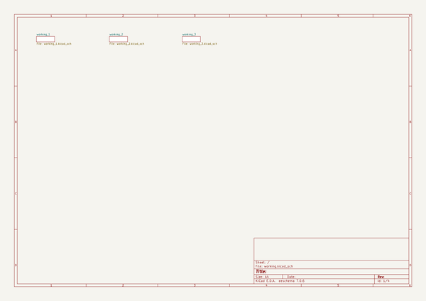
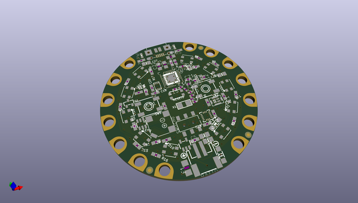
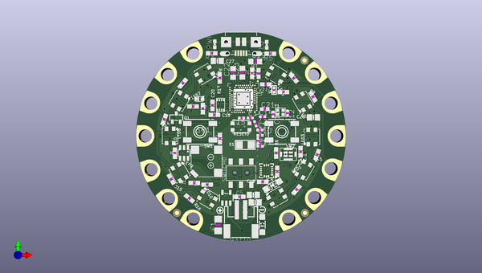
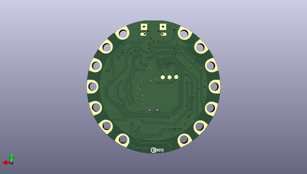

# adafruit_circuit_playground_bluefruit_pcb
 
## summary 
* id: adafruit_adafruit_circuit_playground_bluefruit_pcb_adafruit_circuit_playground_bluefruit
* user: adafruit
* name: adafruit_circuit_playground_bluefruit_pcb
* board: adafruit_circuit_playground_bluefruit
* repo: https://github.com/adafruit/Adafruit-Circuit-Playground-Bluefruit-PCB

* src_file_repo_sch: 
*
 src_file_repo_sch_link: https://github.com/adafruit/Adafruit-Circuit-Playground-Bluefruit-PCB/tree/master/
* full details link: https://github.com/oomlout/oomlout_oomp_project_bot_v_2/tree/main/projects/adafruit_adafruit_circuit_playground_bluefruit_pcb_adafruit_circuit_playground_bluefruit/current_version/working  

## schematic  
  
[schematic (pdf)](working_schematic.pdf)  

## pcb  
 
  
  
  
[board (pdf)](working.pdf)  

## working_bom
| Id | Designator | Footprint | Quantity | Designation | Supplier and ref |  | None | 
| --- | --- | --- | --- | --- | --- | --- | --- | 
| 1 | BATT0 | JSTPH2 | 1 | 3-6VDC |  |  | [''] | 
| 2 | U2 | ALS-PT19-315C | 1 | ALS-PT19-315C |  |  | [''] | 
| 3 | R7,R2,R3,R4,R6 | 0603-NO | 5 | 10K |  |  | [''] | 
| 4 | LED4,LED1,LED2,LED10,LED9,LED6,LED8,LED3,LED7,LED5 | LED3535 | 10 | WS2812B3535 |  |  | [''] | 
| 5 | R8,R16,R13,R11,R12,R15,R14,R9 | 0603-NO | 8 | 1M |  |  | [''] | 
| 6 | RESET0 | BTN_KMR2_4.6X2.8 | 1 | KMR2 |  |  | [''] | 
| 7 | U$2,U$6,U$3 | FIDUCIAL_1MM | 3 | FIDUCIAL_1MM |  |  | [''] | 
| 8 | C18,C2,C6,C3,C5 | 0603-NO | 5 | 1uF |  |  | [''] | 
| 9 | C13,C12 | RESC0402_N | 2 | 12pF |  |  | [''] | 
| 10 | C9 | 0603-NO | 1 | 0.1uF |  |  | [''] | 
| 11 | C7,C20,C16 | 0603-NO | 3 | 0.1uF X7R 10% |  |  | [''] | 
| 12 | C26,C4,C27,C8 | 0805-NO | 4 | 10uF |  |  | [''] | 
| 13 | U$35 | SYMBOL_PLUS | 1 |  |  |  | [''] | 
| 14 | IC3 | USON8 | 1 | GD25Q16 |  |  | [''] | 
| 15 | R10,R17 | 0603-NO | 2 | 100K |  |  | [''] | 
| 16 | D2,D1 | SOD-123 | 2 | MBR120 |  |  | [''] | 
| 17 | C25,C24 | RESC0603_N | 2 | 1uF X7R 10% |  |  | [''] | 
| 18 | R5 | 0603-NO | 1 | 4.7K |  |  | [''] | 
| 19 | F1 | R1206 | 1 | 6V+ 500mA |  |  | [''] | 
| 20 | SW2,SW1 | EVQ-Q2_SMALLER | 2 | EVQQ |  |  | [''] | 
| 21 | UNK3V3TAP2,SCL0,SDA0,VCC2,D6,IO12,GNDTAP0,GND3TAP0,UNK3.3VTAP0,TX0,IO9,RX0,GNDTAP2,IO10 | SEWALLI | 14 | SEWTAP-ALLIGATOR |  |  | [''] | 
| 22 | L0 | CHIPLED_0603_NOOUTLINE | 1 | RED |  |  | [''] | 
| 23 | C17,C10,C11,C1 | RESC0402_N | 4 | 1pF NP0 |  |  | [''] | 
| 24 | SP1 | BUZZER_SMT_7.5MM | 1 | 7.5mm SPK |  |  | [''] | 
| 25 | X1 | ANT_2450AT18B100 | 1 | 2450AT18B100 |  |  | [''] | 
| 26 | IC4 | LGA16_3X3MM | 1 | LIS3DH |  |  | [''] | 
| 27 | IC2 | SOT23-6 | 1 | PAM8301 |  |  | [''] | 
| 28 | C23,C19 | RESC0805_N | 2 | 10uF X5R |  |  | [''] | 
| 29 | U$44 | CPLAY_BLUEFRUIT_TOP | 1 |  |  |  | [''] | 
| 30 | R1 | 0603-NO | 1 | 47K |  |  | [''] | 
| 31 | C22 | RESC0805_N | 1 | 4.7uF X7S 10% |  |  | [''] | 
| 32 | THM1 | _0402 | 1 | THERM |  |  | [''] | 
| 33 | U3 | SOT23-5 | 1 | AP2112K-3.3 |  |  | [''] | 
| 34 | U4 | AQFN50P700X800X85_HS-74N_SMALLCENTER | 1 | NRF52840 |  |  | [''] | 
| 35 | L2,L1 | RESC0402_N | 2 | 3.9nH |  |  | [''] | 
| 36 | C15 | RESC0402_N | 1 | 820pF NP0 5% |  |  | [''] | 
| 37 | C21 | RESC0603_L | 1 | 0.1uF X7R 10% |  |  | [''] | 
| 38 | U$1 | SYMBOL_MINUS | 1 |  |  |  | [''] | 
| 39 | CN1 | 4UCONN_20329_V2 | 1 | MicroB USB |  |  | [''] | 
| 40 | Q1 | SOT23-R | 1 | DMG3405 |  |  | [''] | 
| 41 | Y1 | CRYSTAL_2X1.6 | 1 | 32MHz |  |  | [''] | 
| 42 | PWR0 | CHIPLED_0603_NOOUTLINE | 1 | GREEN |  |  | [''] | 
| 43 | SWITCH0 | EG1390 | 1 | EG1390 |  |  | [''] | 
| 44 | IC1 | SPK0415HM4H | 1 | MIC_PDM |  |  | [''] | 
| 45 | C14 | RESC0402_N | 1 | 100pF NP0 5% |  |  | [''] | 
| 46 | U$7 | PCBFEAT-REV-040 | 1 |  |  |  | [''] | 
| 47 | TP2,TP1,TP3 | TESTPOINT_ROUND_1.5MM_NO | 3 |  |  |  | [''] | 
| 48 | U$16 | CPLAY_BLUEFRUIT_BOT | 1 |  |  |  | [''] | 

## bom_schematic
| Ref | Qnty | Value | Cmp name | Footprint | Description | Vendor | DNP | 
| --- | --- | --- | --- | --- | --- | --- | --- | 
| BATT0 | 1 | 3-6VDC | CON_JST_PH_2PIN | working:JSTPH2 |  |  |  | 
| C1, C10, C11, C17 | 4 | 1pF NP0 | CAPACITOR_0402_N | working:RESC0402_N |  |  |  | 
| C2, C3, C5, C6, C18 | 5 | 1uF | CAP_CERAMIC0603_NO | working:0603-NO |  |  |  | 
| C4, C8, C26, C27 | 4 | 10uF | CAP_CERAMIC0805-NOOUTLINE | working:0805-NO |  |  |  | 
| C7, C16, C20 | 3 | 0.1uF X7R 10% | CAP_CERAMIC0603_NO | working:0603-NO |  |  |  | 
| C9 | 1 | 0.1uF | CAP_CERAMIC0603_NO | working:0603-NO |  |  |  | 
| C12, C13 | 2 | 12pF | CAPACITOR_0402_N | working:RESC0402_N |  |  |  | 
| C14 | 1 | 100pF NP0 5% | CAPACITOR_0402_N | working:RESC0402_N |  |  |  | 
| C15 | 1 | 820pF NP0 5% | CAPACITOR_0402_N | working:RESC0402_N |  |  |  | 
| C19, C23 | 2 | 10uF X5R | CAPACITOR_0805_N | working:RESC0805_N |  |  |  | 
| C21 | 1 | 0.1uF X7R 10% | CAPACITOR_0603_L | working:RESC0603_L |  |  |  | 
| C22 | 1 | 4.7uF X7S 10% | CAPACITOR_0805_N | working:RESC0805_N |  |  |  | 
| C24, C25 | 2 | 1uF X7R 10% | CAPACITOR_0603_N | working:RESC0603_N |  |  |  | 
| CN1 | 1 | MicroB USB | USB_MICRO_20329_V2 | working:4UCONN_20329_V2 |  |  |  | 
| D1, D2 | 2 | MBR120 | DIODESOD-123 | working:SOD-123 |  |  |  | 
| D6 | 1 | SEWTAP-ALLIGATOR | SEWTAP-ALLIGATOR | working:SEWALLI |  |  |  | 
| F1 | 1 | 6V+ 500mA | PTCFUSE-1206 | working:R1206 |  |  |  | 
| GND3TAP0 | 1 | SEWTAP-ALLIGATOR | SEWTAP-ALLIGATOR | working:SEWALLI |  |  |  | 
| GNDTAP0, GNDTAP2 | 2 | SEWTAP-ALLIGATOR | SEWTAP-ALLIGATOR | working:SEWALLI |  |  |  | 
| IC1 | 1 | MIC_PDM_SPK0415 | MIC_PDM_SPK0415 | working:SPK0415HM4H |  |  |  | 
| IC2 | 1 | PAM8301 | PAM8301 | working:SOT23-6 |  |  |  | 
| IC3 | 1 | GD25Q16 | SPIFLASH_8PINUX | working:USON8 |  |  |  | 
| IC4 | 1 | LIS3DH | ACCEL_LIS3DHTR | working:LGA16_3X3MM |  |  |  | 
| IO9, IO10, IO12 | 3 | SEWTAP-ALLIGATOR | SEWTAP-ALLIGATOR | working:SEWALLI |  |  |  | 
| L0 | 1 | RED | LED0603_NOOUTLINE | working:CHIPLED_0603_NOOUTLINE |  |  |  | 
| L1, L2 | 2 | 3.9nH | INDUCTOR_0402_N | working:RESC0402_N |  |  |  | 
| LED1, LED2, LED3, LED4, LED5, LED6, LED7, LED8, LED9, LED10 | 10 | WS2812B3535 | WS2812B3535 | working:LED3535 |  |  |  | 
| PWR0 | 1 | GREEN | LED0603_NOOUTLINE | working:CHIPLED_0603_NOOUTLINE |  |  |  | 
| Q1 | 1 | DMG3405 | MOSFET-P | working:SOT23-R |  |  |  | 
| R1 | 1 | 47K | RESISTOR_0603_NOOUT | working:0603-NO |  |  |  | 
| R2, R3, R4, R6, R7 | 5 | 10K | RESISTOR_0603_NOOUT | working:0603-NO |  |  |  | 
| R5 | 1 | 4.7K | RESISTOR_0603_NOOUT | working:0603-NO |  |  |  | 
| R8, R9, R11, R12, R13, R14, R15, R16 | 8 | 1M | RESISTOR_0603_NOOUT | working:0603-NO |  |  |  | 
| R10, R17 | 2 | 100K | RESISTOR_0603_NOOUT | working:0603-NO |  |  |  | 
| RESET0 | 1 | KMR2 | SWITCH_TACT_SMT4.6X2.8 | working:BTN_KMR2_4.6X2.8 |  |  |  | 
| RX0 | 1 | SEWTAP-ALLIGATOR | SEWTAP-ALLIGATOR | working:SEWALLI |  |  |  | 
| SCL0 | 1 | SEWTAP-ALLIGATOR | SEWTAP-ALLIGATOR | working:SEWALLI |  |  |  | 
| SDA0 | 1 | SEWTAP-ALLIGATOR | SEWTAP-ALLIGATOR | working:SEWALLI |  |  |  | 
| SP1 | 1 | SPEAKER_7.5MM | SPEAKER_7.5MM | working:BUZZER_SMT_7.5MM |  |  |  | 
| SW1, SW2 | 2 | EVQQ | SWITCH_TACT_SMT_EVQQ2_SMALL | working:EVQ-Q2_SMALLER |  |  |  | 
| SWITCH0 | 1 | EG1390 | DPDT-EG1390 | working:EG1390 |  |  |  | 
| THM1 | 1 | THERM | RESISTOR_0402 | working:_0402 |  |  |  | 
| TP1, TP2, TP3 | 3 | TESTPOINTROUND1.5MMNO | TESTPOINTROUND1.5MMNO | working:TESTPOINT_ROUND_1.5MM_NO |  |  |  | 
| TX0 | 1 | SEWTAP-ALLIGATOR | SEWTAP-ALLIGATOR | working:SEWALLI |  |  |  | 
| U2 | 1 | ALS-PT19-315C | PHOTOTRANSISTOR_PT19-315C | working:ALS-PT19-315C |  |  |  | 
| U3 | 1 | AP2112K-3.3 | VREG_SOT23-5 | working:SOT23-5 |  |  |  | 
| U4 | 1 | NRF52840_CPB_SMALLCENTER | NRF52840_CPB_SMALLCENTER | working:AQFN50P700X800X85_HS-74N_SMALLCENTER |  |  |  | 
| U$2, U$3, U$6 | 3 | FIDUCIAL_1MM | FIDUCIAL_1MM | working:FIDUCIAL_1MM |  |  |  | 
| UNK3.3VTAP0 | 1 | SEWTAP-ALLIGATOR | SEWTAP-ALLIGATOR | working:SEWALLI |  |  |  | 
| UNK3V3TAP2 | 1 | SEWTAP-ALLIGATOR | SEWTAP-ALLIGATOR | working:SEWALLI |  |  |  | 
| VCC2 | 1 | SEWTAP-ALLIGATOR | SEWTAP-ALLIGATOR | working:SEWALLI |  |  |  | 
| X1 | 1 | 2450AT18B100 | ANTENNA_JOHANSON_2450AT18B100 | working:ANT_2450AT18B100 |  |  |  | 
| Y1 | 1 | 32MHz | CRYSTAL_2X1.6MM | working:CRYSTAL_2X1.6 |  |  |  | 

