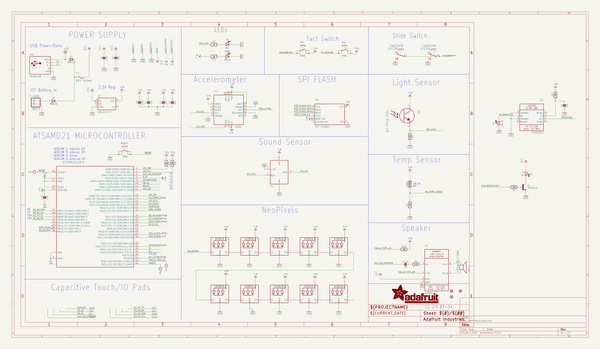
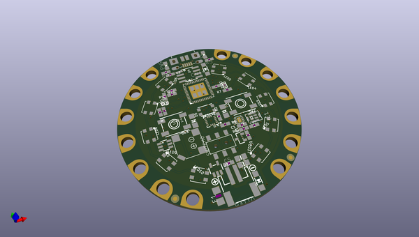
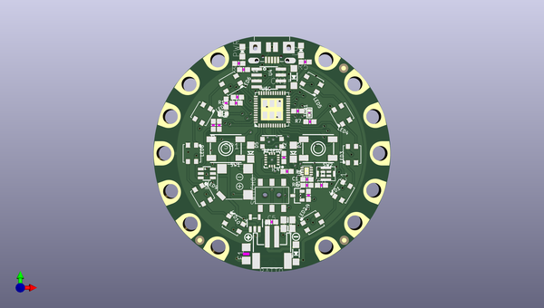
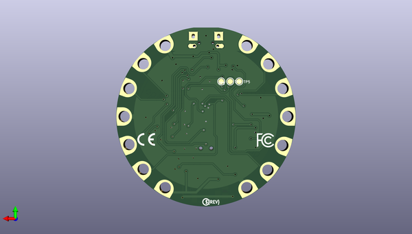

# adafruit_circuit_playground_express_pcb
 
## summary 
* id: adafruit_adafruit_circuit_playground_express_pcb_adafruit_circuit_playground_express
* user: adafruit
* name: adafruit_circuit_playground_express_pcb
* board: adafruit_circuit_playground_express
* repo: https://github.com/adafruit/Adafruit-Circuit-Playground-Express-PCB

* src_file_repo_sch: 
*
 src_file_repo_sch_link: https://github.com/adafruit/Adafruit-Circuit-Playground-Express-PCB/tree/master/
* full details link: https://github.com/oomlout/oomlout_oomp_project_bot_v_2/tree/main/projects/adafruit_adafruit_circuit_playground_express_pcb_adafruit_circuit_playground_express/current_version/working  

## schematic  
  
[schematic (pdf)](working_schematic.pdf)  

## pcb  
 
  
  
  
[board (pdf)](working.pdf)  

## working_bom
| Id | Designator | Footprint | Quantity | Designation | Supplier and ref |  | None | 
| --- | --- | --- | --- | --- | --- | --- | --- | 
| 1 | LED3,LED10,LED5,LED2,LED9,LED4,LED8,LED7,LED6,LED1 | LED3535 | 10 | WS2812B3535 |  |  | [''] | 
| 2 | IO12,RX0,GND3TAP0,SDA0,GNDTAP0,IO9,TX0,UNK3.3VTAP0,UNK3V3TAP2,IO10,GNDTAP2,D6,SCL0,VCC2 | SEWALLI | 14 | SEWTAP-ALLIGATOR |  |  | [''] | 
| 3 | R8,R9 | 0603-NO | 2 | 100 |  |  | [''] | 
| 4 | THM1 | _0402 | 1 | THERM |  |  | [''] | 
| 5 | U1 | VSOP383 | 1 | VSOP383 |  |  | [''] | 
| 6 | F1 | R1206 | 1 | 6V+ 500mA |  |  | [''] | 
| 7 | C3,C6,C2,C10,C5,C1 | 0603-NO | 6 | 1uF |  |  | [''] | 
| 8 | R7,R4,R10 | 0603-NO | 3 | 10K |  |  | [''] | 
| 9 | R3,R5 | 0603-NO | 2 | 1K |  |  | [''] | 
| 10 | U$35 | SYMBOL_PLUS | 1 |  |  |  | [''] | 
| 11 | D1,D2 | SOD-123 | 2 | MBR120 |  |  | [''] | 
| 12 | C4,C8 | 0805-NO | 2 | 10uF |  |  | [''] | 
| 13 | U$1 | SYMBOL_MINUS | 1 |  |  |  | [''] | 
| 14 | SP1 | BUZZER_SMT_7.5MM | 1 | 7.5mm SPK |  |  | [''] | 
| 15 | SW1,SW2 | EVQ-Q2_SMALLER | 2 | EVQQ |  |  | [''] | 
| 16 | U2 | ALS-PT19-315C | 1 | ALS-PT19-315C |  |  | [''] | 
| 17 | R2,R6 | 0603-NO | 2 | 10k |  |  | [''] | 
| 18 | U$6,U$3,U$2 | FIDUCIAL_1MM | 3 | FIDUCIAL_1MM |  |  | [''] | 
| 19 | U$5 | TQFN48_7MM | 1 | ATSAMD21G18MU |  |  | [''] | 
| 20 | U3 | SOT23-5 | 1 | AP2112K-3.3 |  |  | [''] | 
| 21 | CN1 | 4UCONN_20329_V2 | 1 | MicroB USB |  |  | [''] | 
| 22 | IC1 | SPK0415HM4H | 1 | MIC_PDM |  |  | [''] | 
| 23 | SWITCH0 | EG1390 | 1 | EG1390 |  |  | [''] | 
| 24 | U$16 | CPLAY_EXPRESS_FRONT_REVG | 1 |  |  |  | [''] | 
| 25 | IC2 | SOT23-6 | 1 | PAM8301 |  |  | [''] | 
| 26 | L0 | CHIPLED_0805_NOOUTLINE | 1 | RED |  |  | [''] | 
| 27 | D5 | CHIPLED_1206_NOOUTLINE | 1 | IR TX |  |  | [''] | 
| 28 | IC4 | LGA16_3X3MM | 1 | LIS3DH |  |  | [''] | 
| 29 | U4 | SOIC8_150MIL | 1 | SPI FLASH |  |  | [''] | 
| 30 | BATT0 | JSTPH2 | 1 | 3-6VDC |  |  | [''] | 
| 31 | RESET0 | BTN_KMR2_4.6X2.8 | 1 | KMR2 |  |  | [''] | 
| 32 | PWR0 | CHIPLED_0805_NOOUTLINE | 1 | GREEN |  |  | [''] | 
| 33 | D3 | CHIPLED_1206_NOOUTLINE | 1 | PIN IR |  |  | [''] | 
| 34 | Q1 | SOT23-R | 1 | mmbt2222 |  |  | [''] | 
| 35 | C9 | 0603-NO | 1 | 0.1uF |  |  | [''] | 
| 36 | R1 | 0603-NO | 1 | 47K |  |  | [''] | 
| 37 | U$7 | PCBFEAT-REV-040 | 1 |  |  |  | [''] | 
| 38 | U$46 | CPLAY_EXPRESS_BACK_REVD | 1 |  |  |  | [''] | 
| 39 | TP6,TP5,TP1 | TESTPOINT_ROUND_1.5MM | 3 |  |  |  | [''] | 
| 40 | U$4 | FLORAMED | 1 |  |  |  | [''] | 
| 41 | U$33 | SYMBOL_FCC_5MM | 1 |  |  |  | [''] | 
| 42 | U$34 | SYMBOL_CE_5MM | 1 |  |  |  | [''] | 

## bom_schematic
| Ref | Qnty | Value | Cmp name | Footprint | Description | Vendor | DNP | 
| --- | --- | --- | --- | --- | --- | --- | --- | 
| BATT0 | 1 | 3-6VDC | CON_JST_PH_2PIN | working:JSTPH2 |  |  |  | 
| C1, C2, C3, C5, C6, C10 | 6 | 1uF | CAP_CERAMIC0603_NO | working:0603-NO |  |  |  | 
| C4, C8 | 2 | 10uF | CAP_CERAMIC0805-NOOUTLINE | working:0805-NO |  |  |  | 
| C9 | 1 | 0.1uF | CAP_CERAMIC0603_NO | working:0603-NO |  |  |  | 
| CN1 | 1 | MicroB USB | USB_MICRO_20329_V2 | working:4UCONN_20329_V2 |  |  |  | 
| D1, D2 | 2 | MBR120 | DIODESOD-123 | working:SOD-123 |  |  |  | 
| D3 | 1 | PIN IR | LED1206_NOOUTLINE | working:CHIPLED_1206_NOOUTLINE |  |  |  | 
| D5 | 1 | IR TX | LED1206_NOOUTLINE | working:CHIPLED_1206_NOOUTLINE |  |  |  | 
| D6 | 1 | SEWTAP-ALLIGATOR | SEWTAP-ALLIGATOR | working:SEWALLI |  |  |  | 
| F1 | 1 | 6V+ 500mA | PTCFUSE-1206 | working:R1206 |  |  |  | 
| GND3TAP0 | 1 | SEWTAP-ALLIGATOR | SEWTAP-ALLIGATOR | working:SEWALLI |  |  |  | 
| GNDTAP0, GNDTAP2 | 2 | SEWTAP-ALLIGATOR | SEWTAP-ALLIGATOR | working:SEWALLI |  |  |  | 
| IC1 | 1 | MIC_PDM_SPK0415 | MIC_PDM_SPK0415 | working:SPK0415HM4H |  |  |  | 
| IC2 | 1 | PAM8301 | PAM8301 | working:SOT23-6 |  |  |  | 
| IC4 | 1 | LIS3DH | ACCEL_LIS3DHTR | working:LGA16_3X3MM |  |  |  | 
| IO9, IO10, IO12 | 3 | SEWTAP-ALLIGATOR | SEWTAP-ALLIGATOR | working:SEWALLI |  |  |  | 
| L0 | 1 | RED | LED0805_NOOUTLINE | working:CHIPLED_0805_NOOUTLINE |  |  |  | 
| LED1, LED2, LED3, LED4, LED5, LED6, LED7, LED8, LED9, LED10 | 10 | WS2812B3535 | WS2812B3535 | working:LED3535 |  |  |  | 
| PWR0 | 1 | GREEN | LED0805_NOOUTLINE | working:CHIPLED_0805_NOOUTLINE |  |  |  | 
| Q1 | 1 | mmbt2222 | TRANSISTOR_NPN | working:SOT23-R |  |  |  | 
| R1 | 1 | 47K | RESISTOR_0603_NOOUT | working:0603-NO |  |  |  | 
| R2, R6 | 2 | 10k | RESISTOR_0603_NOOUT | working:0603-NO |  |  |  | 
| R3, R5 | 2 | 1K | RESISTOR_0603_NOOUT | working:0603-NO |  |  |  | 
| R4, R7, R10 | 3 | 10K | RESISTOR_0603_NOOUT | working:0603-NO |  |  |  | 
| R8, R9 | 2 | 100 | RESISTOR_0603_NOOUT | working:0603-NO |  |  |  | 
| RESET0 | 1 | KMR2 | SWITCH_TACT_SMT4.6X2.8 | working:BTN_KMR2_4.6X2.8 |  |  |  | 
| RX0 | 1 | SEWTAP-ALLIGATOR | SEWTAP-ALLIGATOR | working:SEWALLI |  |  |  | 
| SCL0 | 1 | SEWTAP-ALLIGATOR | SEWTAP-ALLIGATOR | working:SEWALLI |  |  |  | 
| SDA0 | 1 | SEWTAP-ALLIGATOR | SEWTAP-ALLIGATOR | working:SEWALLI |  |  |  | 
| SP1 | 1 | SPEAKER_7.5MM | SPEAKER_7.5MM | working:BUZZER_SMT_7.5MM |  |  |  | 
| SW1, SW2 | 2 | EVQQ | SWITCH_TACT_SMT_EVQQ2_SMALL | working:EVQ-Q2_SMALLER |  |  |  | 
| SWITCH0 | 1 | EG1390 | DPDT-EG1390 | working:EG1390 |  |  |  | 
| THM1 | 1 | THERM | RESISTOR_0402 | working:_0402 |  |  |  | 
| TP1, TP5, TP6 | 3 | TESTPOINTROUND1.5MM | TESTPOINTROUND1.5MM | working:TESTPOINT_ROUND_1.5MM |  |  |  | 
| TX0 | 1 | SEWTAP-ALLIGATOR | SEWTAP-ALLIGATOR | working:SEWALLI |  |  |  | 
| U1 | 1 | VSOP383 | VSOP383 | working:VSOP383 |  |  |  | 
| U2 | 1 | ALS-PT19-315C | LIGHT_ALS-PT19-315C | working:ALS-PT19-315C |  |  |  | 
| U3 | 1 | AP2112K-3.3 | VREG_SOT23-5 | working:SOT23-5 |  |  |  | 
| U4 | 1 | SPI FLASH | SPIFLASH_SOIC8 | working:SOIC8_150MIL |  |  |  | 
| U$2, U$3, U$6 | 3 | FIDUCIAL_1MM | FIDUCIAL_1MM | working:FIDUCIAL_1MM |  |  |  | 
| U$5 | 1 | ATSAMD21G_QFN | ATSAMD21G_QFN | working:TQFN48_7MM |  |  |  | 
| UNK3.3VTAP0 | 1 | SEWTAP-ALLIGATOR | SEWTAP-ALLIGATOR | working:SEWALLI |  |  |  | 
| UNK3V3TAP2 | 1 | SEWTAP-ALLIGATOR | SEWTAP-ALLIGATOR | working:SEWALLI |  |  |  | 
| VCC2 | 1 | SEWTAP-ALLIGATOR | SEWTAP-ALLIGATOR | working:SEWALLI |  |  |  | 

