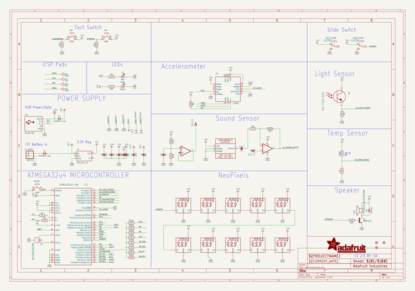
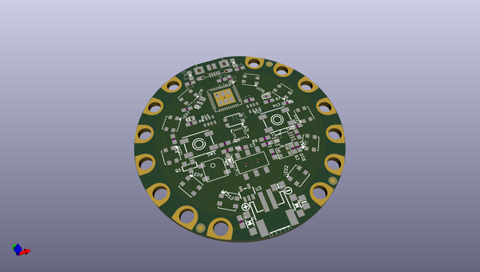
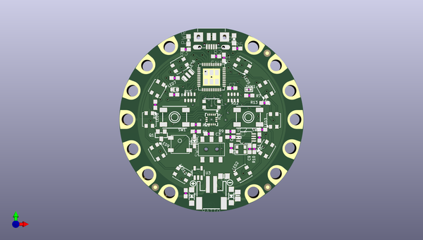
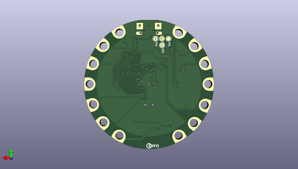

# adafruit_circuit_playground_pcb
 
## summary 
* id: adafruit_adafruit_circuit_playground_pcb_adafruit_circuit_playground
* user: adafruit
* name: adafruit_circuit_playground_pcb
* board: adafruit_circuit_playground
* repo: https://github.com/adafruit/Adafruit-Circuit-Playground-PCB

* src_file_repo_sch: 
*
 src_file_repo_sch_link: https://github.com/adafruit/Adafruit-Circuit-Playground-PCB/tree/master/
* full details link: https://github.com/oomlout/oomlout_oomp_project_bot_v_2/tree/main/projects/adafruit_adafruit_circuit_playground_pcb_adafruit_circuit_playground/current_version/working  

## schematic  
  
[schematic (pdf)](working_schematic.pdf)  

## pcb  
 
  
  
  
[board (pdf)](working.pdf)  

## working_bom
| Id | Designator | Footprint | Quantity | Designation | Supplier and ref |  | None | 
| --- | --- | --- | --- | --- | --- | --- | --- | 
| 1 | U$2,U$3,U$6 | FIDUCIAL_1MM | 3 | FIDUCIAL" |  |  | [''] | 
| 2 | UNK3.3VTAP0,IO9,UNK3V3TAP2,GND3TAP0,GNDTAP2,D6,RX0,SDA0,IO10,VCC2,GNDTAP0,IO12,TX0,SCL0 | SEWALLI | 14 | SEWTAP-ALLIGATOR |  |  | [''] | 
| 3 | LED2,LED5,LED9,LED10,LED4,LED7,LED1,LED8,LED6,LED3 | LED3535 | 10 | WS2812B3535 |  |  | [''] | 
| 4 | C4,C8 | 0805-NO | 2 | 10uF |  |  | [''] | 
| 5 | R22,R15 | RESPACK_4X0603_NO | 2 | 1M |  |  | [''] | 
| 6 | Q1 | SOT23-WIDE | 1 | MMBT2222 |  |  | [''] | 
| 7 | D4 | SOD-323 | 1 | 1N4148 |  |  | [''] | 
| 8 | CN1 | 4UCONN_20329_V2 | 1 | MicroB USB |  |  | [''] | 
| 9 | R3,R5,R8 | 0603-NO | 3 | 1K |  |  | [''] | 
| 10 | THM1 | _0402 | 1 | 10K |  |  | [''] | 
| 11 | R13,R7,R10,R4,R14,R6 | 0603-NO | 6 | 10K |  |  | [''] | 
| 12 | U$34 | CPLAYFRONT | 1 |  |  |  | [''] | 
| 13 | U2 | ALS-PT19-315C | 1 | ALS-PT19-315C |  |  | [''] | 
| 14 | SWITCH0 | EG1390 | 1 | EG1390 |  |  | [''] | 
| 15 | D2,D1 | SOD-123 | 2 | SCHOTTKY (1A) |  |  | [''] | 
| 16 | R21 | 0603-NO | 1 | 100 |  |  | [''] | 
| 17 | C7,C9,C5,C2,C3,C6 | 0603-NO | 6 | 1uF |  |  | [''] | 
| 18 | U1 | SPW2430HR5H-B | 1 | SPW2430 |  |  | [''] | 
| 19 | IC4 | LGA16_3X3MM | 1 | LIS3DH |  |  | [''] | 
| 20 | IC1 | TQFN44_7MM | 1 | ATMEGA32U4-MU |  |  | [''] | 
| 21 | RESET0 | BTN_KMR2_4.6X2.8 | 1 | KMR2 |  |  | [''] | 
| 22 | R9 | 0603-NO | 1 | 100K |  |  | [''] | 
| 23 | U3 | SOT23-5 | 1 | AP2112K-3.3 |  |  | [''] | 
| 24 | Y1 | RESONATOR-SMD | 1 | 8MHz |  |  | [''] | 
| 25 | IC2 | MSOP08 | 1 | LMV358MM |  |  | [''] | 
| 26 | R1,R2 | 0603-NO | 2 | 22 |  |  | [''] | 
| 27 | U$1 | SYMBOL_MINUS | 1 |  |  |  | [''] | 
| 28 | R11 | 0603-NO | 1 | 20K |  |  | [''] | 
| 29 | SW2,SW1 | EVQ-Q2_SMALLER | 2 | EVQQ |  |  | [''] | 
| 30 | SP1 | BUZZER_SMT_5MM | 1 | 8MM |  |  | [''] | 
| 31 | C1 | 0603-NO | 1 | 0.1uF |  |  | [''] | 
| 32 | L0 | CHIPLED_0805_NOOUTLINE | 1 | RED |  |  | [''] | 
| 33 | BATT0 | JSTPH2 | 1 | 3-6VDC |  |  | [''] | 
| 34 | U$35 | SYMBOL_PLUS | 1 |  |  |  | [''] | 
| 35 | PWR0 | CHIPLED_0805_NOOUTLINE | 1 | GREEN |  |  | [''] | 
| 36 | U$4 | FLORAMED | 1 |  |  |  | [''] | 
| 37 | TP1 | TESTPOINT_ROUND_1.5MM | 1 | MISO |  |  | [''] | 
| 38 | U$46 | CPLAYBACK | 1 |  |  |  | [''] | 
| 39 | TP2 | TESTPOINT_ROUND_1.5MM | 1 | SCK |  |  | [''] | 
| 40 | TP3 | TESTPOINT_ROUND_1.5MM | 1 | RST |  |  | [''] | 
| 41 | TP4 | TESTPOINT_ROUND_1.5MM | 1 | MOSI |  |  | [''] | 
| 42 | U$7 | PCBFEAT-REV-040 | 1 |  |  |  | [''] | 

## bom_schematic
| Ref | Qnty | Value | Cmp name | Footprint | Description | Vendor | DNP | 
| --- | --- | --- | --- | --- | --- | --- | --- | 
| BATT0 | 1 | 3-6VDC | CON_JST_PH_2PIN | working:JSTPH2 |  |  |  | 
| C1 | 1 | 0.1uF | CAP_CERAMIC0603_NO | working:0603-NO |  |  |  | 
| C2, C3, C5, C6, C7, C9 | 6 | 1uF | CAP_CERAMIC0603_NO | working:0603-NO |  |  |  | 
| C4, C8 | 2 | 10uF | CAP_CERAMIC0805-NOOUTLINE | working:0805-NO |  |  |  | 
| CN1 | 1 | MicroB USB | USB_MICRO_20329_V2 | working:4UCONN_20329_V2 |  |  |  | 
| D1, D2 | 2 | SCHOTTKY (1A) | DIODESOD-123 | working:SOD-123 |  |  |  | 
| D4 | 1 | 1N4148 | DIODESOD-323 | working:SOD-323 |  |  |  | 
| D6 | 1 | SEWTAP-ALLIGATOR | SEWTAP-ALLIGATOR | working:SEWALLI |  |  |  | 
| GND3TAP0 | 1 | SEWTAP-ALLIGATOR | SEWTAP-ALLIGATOR | working:SEWALLI |  |  |  | 
| GNDTAP0, GNDTAP2 | 2 | SEWTAP-ALLIGATOR | SEWTAP-ALLIGATOR | working:SEWALLI |  |  |  | 
| IC1 | 1 | ATMEGA32U4-MU | ATMEGA32U4-MU | working:TQFN44_7MM |  |  |  | 
| IC2 | 1 | LMV358?MM | LMV358?MM | working:MSOP08 |  |  |  | 
| IC4 | 1 | LIS3DH | ACCEL_LIS3DHTR | working:LGA16_3X3MM |  |  |  | 
| IO9, IO10, IO12 | 3 | SEWTAP-ALLIGATOR | SEWTAP-ALLIGATOR | working:SEWALLI |  |  |  | 
| L0 | 1 | RED | LED0805_NOOUTLINE | working:CHIPLED_0805_NOOUTLINE |  |  |  | 
| LED1, LED2, LED3, LED4, LED5, LED6, LED7, LED8, LED9, LED10 | 10 | WS2812B3535 | WS2812B3535 | working:LED3535 |  |  |  | 
| PWR0 | 1 | GREEN | LED0805_NOOUTLINE | working:CHIPLED_0805_NOOUTLINE |  |  |  | 
| Q1 | 1 | MMBT2222 | TRANSISTOR_NPNWIDE | working:SOT23-WIDE |  |  |  | 
| R1, R2 | 2 | 22 | RESISTOR_0603_NOOUT | working:0603-NO |  |  |  | 
| R3, R5, R8 | 3 | 1K | RESISTOR_0603_NOOUT | working:0603-NO |  |  |  | 
| R4, R6, R7, R10, R13, R14 | 6 | 10K | RESISTOR_0603_NOOUT | working:0603-NO |  |  |  | 
| R9 | 1 | 100K | RESISTOR_0603_NOOUT | working:0603-NO |  |  |  | 
| R11 | 1 | 20K | RESISTOR_0603_NOOUT | working:0603-NO |  |  |  | 
| R15, R22 | 2 | 1M | RESISTOR_4PACK_NO | working:RESPACK_4X0603_NO |  |  |  | 
| R21 | 1 | 100 | RESISTOR_0603_NOOUT | working:0603-NO |  |  |  | 
| RESET0 | 1 | KMR2 | SWITCH_TACT_SMT4.6X2.8 | working:BTN_KMR2_4.6X2.8 |  |  |  | 
| RX0 | 1 | SEWTAP-ALLIGATOR | SEWTAP-ALLIGATOR | working:SEWALLI |  |  |  | 
| SCL0 | 1 | SEWTAP-ALLIGATOR | SEWTAP-ALLIGATOR | working:SEWALLI |  |  |  | 
| SDA0 | 1 | SEWTAP-ALLIGATOR | SEWTAP-ALLIGATOR | working:SEWALLI |  |  |  | 
| SP1 | 1 | SPEAKER_BUZZER5MM | SPEAKER_BUZZER5MM | working:BUZZER_SMT_5MM |  |  |  | 
| SW1, SW2 | 2 | EVQQ | SWITCH_TACT_SMT_EVQQ2_SMALL | working:EVQ-Q2_SMALLER |  |  |  | 
| SWITCH0 | 1 | EG1390 | DPDT-EG1390 | working:EG1390 |  |  |  | 
| THM1 | 1 | 10K | RESISTOR_0402 | working:_0402 |  |  |  | 
| TP1 | 1 | MISO | TESTPOINTROUND1.5MM | working:TESTPOINT_ROUND_1.5MM |  |  |  | 
| TP2 | 1 | SCK | TESTPOINTROUND1.5MM | working:TESTPOINT_ROUND_1.5MM |  |  |  | 
| TP3 | 1 | RST | TESTPOINTROUND1.5MM | working:TESTPOINT_ROUND_1.5MM |  |  |  | 
| TP4 | 1 | MOSI | TESTPOINTROUND1.5MM | working:TESTPOINT_ROUND_1.5MM |  |  |  | 
| TX0 | 1 | SEWTAP-ALLIGATOR | SEWTAP-ALLIGATOR | working:SEWALLI |  |  |  | 
| U1 | 1 | SPW2430 | SPW2430HR5H-B | working:SPW2430HR5H-B |  |  |  | 
| U2 | 1 | ALS-PT19-315C | LIGHT_ALS-PT19-315C | working:ALS-PT19-315C |  |  |  | 
| U3 | 1 | AP2112K-3.3 | VREG_SOT23-5 | working:SOT23-5 |  |  |  | 
| U$2, U$3, U$6 | 3 | FIDUCIAL"" | FIDUCIAL{dblquote}{dblquote} | working:FIDUCIAL_1MM |  |  |  | 
| UNK3.3VTAP0 | 1 | SEWTAP-ALLIGATOR | SEWTAP-ALLIGATOR | working:SEWALLI |  |  |  | 
| UNK3V3TAP2 | 1 | SEWTAP-ALLIGATOR | SEWTAP-ALLIGATOR | working:SEWALLI |  |  |  | 
| VCC2 | 1 | SEWTAP-ALLIGATOR | SEWTAP-ALLIGATOR | working:SEWALLI |  |  |  | 
| Y1 | 1 | RESONATORSMD | RESONATORSMD | working:RESONATOR-SMD |  |  |  | 

