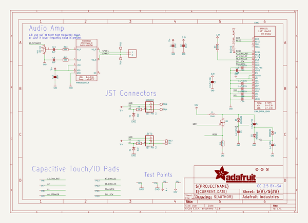
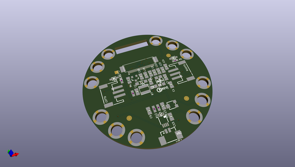
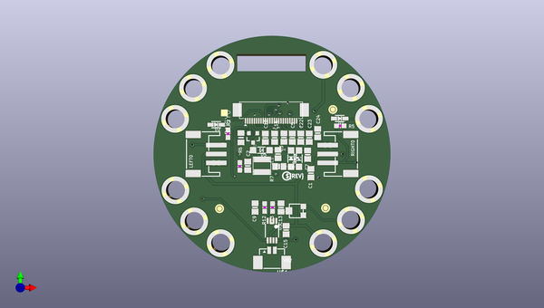
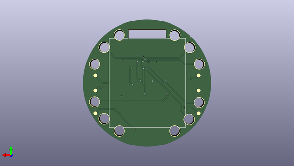

# adafruit_circuit_playground_tri_color_e_ink_gizmo_pcb
 
## summary 
* id: adafruit_adafruit_circuit_playground_tri_color_e_ink_gizmo_pcb_circuit_playground_tri_color_e_ink_gizmo
* user: adafruit
* name: adafruit_circuit_playground_tri_color_e_ink_gizmo_pcb
* board: circuit_playground_tri_color_e_ink_gizmo
* repo: https://github.com/adafruit/Adafruit-Circuit-Playground-Tri-Color-E-Ink-Gizmo-PCB

* src_file_repo_sch: 
*
 src_file_repo_sch_link: https://github.com/adafruit/Adafruit-Circuit-Playground-Tri-Color-E-Ink-Gizmo-PCB/tree/master/
* full details link: https://github.com/oomlout/oomlout_oomp_project_bot_v_2/tree/main/projects/adafruit_adafruit_circuit_playground_tri_color_e_ink_gizmo_pcb_circuit_playground_tri_color_e_ink_gizmo/current_version/working  

## schematic  
  
[schematic (pdf)](working_schematic.pdf)  

## pcb  
 
  
  
  
[board (pdf)](working.pdf)  

## working_bom
| Id | Designator | Footprint | Quantity | Designation | Supplier and ref |  | None | 
| --- | --- | --- | --- | --- | --- | --- | --- | 
| 1 | Q5 | SOT23-3 | 1 | IRLML0100 |  |  | [''] | 
| 2 | R13,R12 | 0603-NO | 2 | 100 |  |  | [''] | 
| 3 | U$7 | PCBFEAT-REV-040 | 1 |  |  |  | [''] | 
| 4 | D1,D2 | SOD-323 | 2 | 3.6V |  |  | [''] | 
| 5 | C9,C13,C24,C16 | 0805-NO | 4 | 1uF |  |  | [''] | 
| 6 | TP2,TP4,TP6,TP8,TP7,TP11,TP5,TP13,TP3,TP9,TP10,TP12 | SMT_NUT_3MM | 12 | SEWTAP_SMTNUTM3 |  |  | [''] | 
| 7 | U$2,U$6,U$3 | FIDUCIAL_1MM | 3 | FIDUCIAL_1MM |  |  | [''] | 
| 8 | LEFT0,RIGHT0 | JSTPH3 | 2 | JST PH 3 |  |  | [''] | 
| 9 | C23,C22,C6,C7 | 0805-NO | 4 | 1uF/25V |  |  | [''] | 
| 10 | C8 | 0805-NO | 1 | 10uF/25V |  |  | [''] | 
| 11 | R7 | 0603-NO | 1 | 100K |  |  | [''] | 
| 12 | C10,C5 | 0805-NO | 2 | 1uF/10V |  |  | [''] | 
| 13 | C15,C1,C2 | 0805-NO | 3 | 10uF |  |  | [''] | 
| 14 | VR2 | TRIMPOT_BOURNS_3303W | 1 | 10K trim |  |  | [''] | 
| 15 | C3 | 0805-NO | 1 | 10uF/10V+ |  |  | [''] | 
| 16 | R2,R5 | 0603-NO | 2 | 1K |  |  | [''] | 
| 17 | U$1 | 53398-0271 | 1 | CON_MOLEX_2P |  |  | [''] | 
| 18 | R6 | 0805_10MGAP | 1 | .47ohm |  |  | [''] | 
| 19 | D3,D5,D4 | SOD-123 | 3 | MBR0530 |  |  | [''] | 
| 20 | L1 | INDUCTOR_4X4MM_NR401 | 1 | 10uH |  |  | [''] | 
| 21 | BUSY0 | TP15SQ | 1 | TPTP15SQ |  |  | [''] | 
| 22 | U5 | MSOP8_0.65MM | 1 | PAM8302AASCR |  |  | [''] | 
| 23 | U$4 | EINKGIZMO_BACK | 1 |  |  |  | [''] | 
| 24 | TP18,TP14,TP17,TP16,TP15,TP1 | TESTPOINT_ROUND_1.5MM_NO | 6 |  |  |  | [''] | 
| 25 | U$8 | EINKGIZMO_FRONT | 1 |  |  |  | [''] | 
| 26 | EINK2 | EINK_154IN | 1 | EINK_24PIN_154IN |  |  | [''] | 

## bom_schematic
| Ref | Qnty | Value | Cmp name | Footprint | Description | Vendor | DNP | 
| --- | --- | --- | --- | --- | --- | --- | --- | 
| BUSY0 | 1 | TPTP15SQ | TPTP15SQ | working:TP15SQ |  |  |  | 
| C1, C2, C15 | 3 | 10uF | CAP_CERAMIC0805-NOOUTLINE | working:0805-NO |  |  |  | 
| C3 | 1 | 10uF/10V+ | CAP_CERAMIC0805-NOOUTLINE | working:0805-NO |  |  |  | 
| C5, C10 | 2 | 1uF/10V | CAP_CERAMIC0805-NOOUTLINE | working:0805-NO |  |  |  | 
| C6, C7, C22, C23 | 4 | 1uF/25V | CAP_CERAMIC0805-NOOUTLINE | working:0805-NO |  |  |  | 
| C8 | 1 | 10uF/25V | CAP_CERAMIC0805-NOOUTLINE | working:0805-NO |  |  |  | 
| C9, C13, C16, C24 | 4 | 1uF | CAP_CERAMIC0805-NOOUTLINE | working:0805-NO |  |  |  | 
| D1, D2 | 2 | 3.6V | DIODE-ZENERSOD323 | working:SOD-323 |  |  |  | 
| D3, D4, D5 | 3 | MBR0530 | DIODE-SCHOTTKYSOD-123 | working:SOD-123 |  |  |  | 
| EINK2 | 1 | EINK_24PIN_154IN | EINK_24PIN_154IN | working:EINK_154IN |  |  |  | 
| L1 | 1 | 10uH | INDUCTORNR401 | working:INDUCTOR_4X4MM_NR401 |  |  |  | 
| LEFT0 | 1 | JST PH 3 | CON_JST_PH_3PIN | working:JSTPH3 |  |  |  | 
| Q5 | 1 | IRLML2060TRPBF | IRLML2060TRPBF | working:SOT23-3 |  |  |  | 
| R2, R5 | 2 | 1K | RESISTOR_0603_NOOUT | working:0603-NO |  |  |  | 
| R6 | 1 | .47ohm | RESISTOR0805_10MGAP | working:0805_10MGAP |  |  |  | 
| R7 | 1 | 100K | RESISTOR_0603_NOOUT | working:0603-NO |  |  |  | 
| R12, R13 | 2 | 100 | RESISTOR_0603_NOOUT | working:0603-NO |  |  |  | 
| RIGHT0 | 1 | JST PH 3 | CON_JST_PH_3PIN | working:JSTPH3 |  |  |  | 
| TP1, TP14, TP15, TP16, TP17, TP18 | 6 | TESTPOINTROUND1.5MMNO | TESTPOINTROUND1.5MMNO | working:TESTPOINT_ROUND_1.5MM_NO |  |  |  | 
| TP2, TP3, TP4, TP5, TP6, TP7, TP8, TP9, TP10, TP11, TP12, TP13 | 12 | SEWTAP_SMTNUTM3 | SEWTAP_SMTNUTM3 | working:SMT_NUT_3MM |  |  |  | 
| U5 | 1 | PAM8302AASCR | AUDIOAMP_PAM8302A | working:MSOP8_0.65MM |  |  |  | 
| U$1 | 1 | CON_MOLEX_2P | CON_MOLEX_2P | working:53398-0271 |  |  |  | 
| U$2, U$3, U$6 | 3 | FIDUCIAL_1MM | FIDUCIAL_1MM | working:FIDUCIAL_1MM |  |  |  | 
| VR2 | 1 | 10K trim | TRIMPOT3303W/X | working:TRIMPOT_BOURNS_3303W |  |  |  | 

