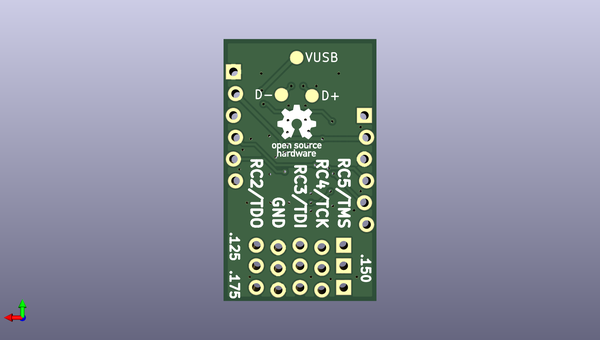

# adafruit_circuitpython_jtag
 
## summary 
* id: adafruit_adafruit_circuitpython_jtag_tinyfpga_a_programmer
* user: adafruit
* name: adafruit_circuitpython_jtag
* board: tinyfpga_a_programmer
* repo: https://github.com/adafruit/Adafruit_CircuitPython_JTAG
* src_file_repo_kicad_pcb: board/TinyFPGA-A-Programmer.kicad_pcb
* src_file_repo_kicad_pcb_link: https://github.com/adafruit/Adafruit_CircuitPython_JTAG/tree/main/board/TinyFPGA-A-Programmer.kicad_pcb

* src_file_repo_sch: board/TinyFPGA-A-Programmer.sch
*
 src_file_repo_sch_link: https://github.com/adafruit/Adafruit_CircuitPython_JTAG/tree/main/board/TinyFPGA-A-Programmer.sch
* full details link: https://github.com/oomlout/oomlout_oomp_project_bot_v_2/tree/main/projects/adafruit_adafruit_circuitpython_jtag_tinyfpga_a_programmer/current_version/working  

## schematic  
  
[schematic (pdf)](working_schematic.pdf)  

## pcb  
 
  
  
  
[board (pdf)](working.pdf)  

## working_bom
| Id | Designator | Footprint | Quantity | Designation | Supplier and ref |  | None | 
| --- | --- | --- | --- | --- | --- | --- | --- | 
| 1 | C1,C2,C4 | C_0603 | 3 | 1uF |  |  | [''] | 
| 2 | C3 | C_0603 | 1 | 100nF |  |  | [''] | 
| 3 | J2,J2,J2 | Pin_Header_Straight_1x05_Pitch2.54mm | 3 | JTAG |  |  | [''] | 
| 4 | J3 | Pin_Header_Straight_1x06_Pitch2.54mm | 1 | ICSP |  |  | [''] | 
| 5 | U1 | QFN-16-1EP_4x4mm_Pitch0.65mm | 1 | PIC16F1455-QFN16 |  |  | [''] | 
| 6 | J1 | FCI-Micro-USB | 1 | USB |  |  | [''] | 
| 7 | U2 | SOT23 | 1 | MIC5504-3.3YM5-TR |  |  | [''] | 
| 8 | J2 | Pin_Header_Straight_1x05_Pitch2.54mm_SMD | 1 | JTAG |  |  | [''] | 
| 9 | J4 | Pin_Header_Straight_1x06_Pitch2.54mm | 1 | CONN_01X06 |  |  | [''] | 

## bom_schematic
| Ref | Qnty | Value | Cmp name | Footprint | Description | Vendor | DNP | 
| --- | --- | --- | --- | --- | --- | --- | --- | 
| C1, C2, C4 | 3 | 1uF | C | Capacitors_SMD:C_0603 |  |  |  | 
| C3 | 1 | 100nF | C | Capacitors_SMD:C_0603 |  |  |  | 
| J1 | 1 | USB | USB_OTG | TinyFPGA:FCI-Micro-USB |  |  |  | 
| J2 | 1 | JTAG | CONN_01X05 | Pin_Headers:Pin_Header_Straight_1x05_Pitch2.54mm |  |  |  | 
| J3 | 1 | ICSP | CONN_01X06 | Pin_Headers:Pin_Header_Straight_1x06_Pitch2.54mm |  |  |  | 
| J4 | 1 | CONN_01X06 | CONN_01X06 | Pin_Headers:Pin_Header_Straight_1x06_Pitch2.54mm |  |  |  | 
| TP1, TP2, TP3 | 3 | TEST | TEST | Measurement_Points:Measurement_Point_Round-SMD-Pad_Big |  |  |  | 
| U1 | 1 | PIC16F1455-QFN16 | PIC16F1455-QFN16 | Housings_DFN_QFN:QFN-16-1EP_4x4mm_Pitch0.65mm |  |  |  | 
| U2 | 1 | MIC5504-3.3YM5-TR | MIC5504-3.3YM5-TR | TinyFPGA:SOT23 |  |  |  | 

