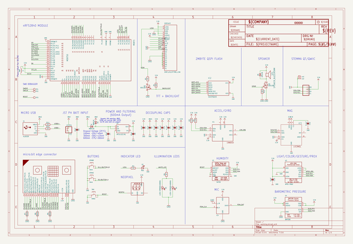
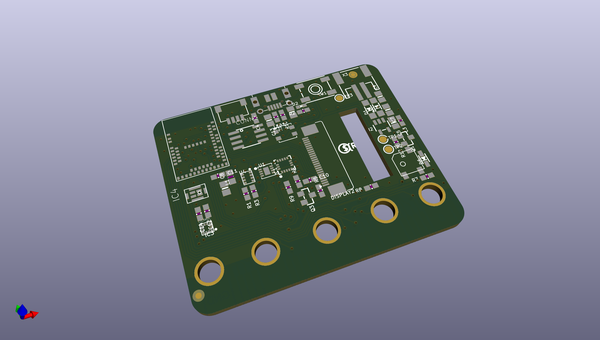
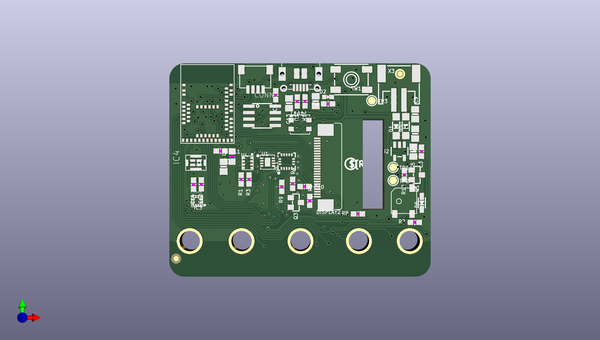
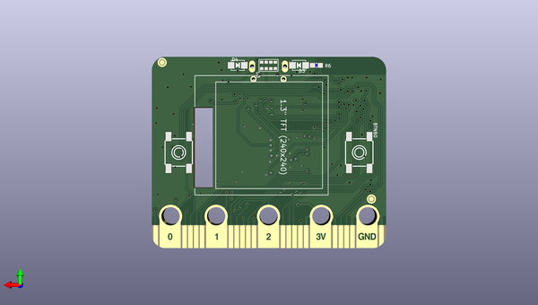

# adafruit_clue_pcb
 
## summary 
* id: adafruit_adafruit_clue_pcb_adafruit_clue_nrf52840_express
* user: adafruit
* name: adafruit_clue_pcb
* board: adafruit_clue_nrf52840_express
* repo: https://github.com/adafruit/Adafruit-CLUE-PCB

* src_file_repo_sch: 
*
 src_file_repo_sch_link: https://github.com/adafruit/Adafruit-CLUE-PCB/tree/master/
* full details link: https://github.com/oomlout/oomlout_oomp_project_bot_v_2/tree/main/projects/adafruit_adafruit_clue_pcb_adafruit_clue_nrf52840_express/current_version/working  

## schematic  
  
[schematic (pdf)](working_schematic.pdf)  

## pcb  
 
  
  
  
[board (pdf)](working.pdf)  

## working_bom
| Id | Designator | Footprint | Quantity | Designation | Supplier and ref |  | None | 
| --- | --- | --- | --- | --- | --- | --- | --- | 
| 1 | IC1 | LGA16_3X3MM | 1 | LSM6DS33 |  |  | [''] | 
| 2 | R10,R11 | 0603-NO | 2 | 22 |  |  | [''] | 
| 3 | LED1 | LED3535 | 1 | WS2812B3535 |  |  | [''] | 
| 4 | X1 | 4UCONN_20329_SLIM | 1 | 4u20329 |  |  | [''] | 
| 5 | R8,R7,R9 | 0603-NO | 3 | 1Mohm |  |  | [''] | 
| 6 | D6 | SOD-323 | 1 | 1N4148 |  |  | [''] | 
| 7 | Q1,Q3 | SOT23-WIDE | 2 | BSS138 |  |  | [''] | 
| 8 | IC4 | SPK0415HM4H | 1 | MIC_PDM |  |  | [''] | 
| 9 | R2 | 0603-NO | 1 | 1K |  |  | [''] | 
| 10 | C10,C14,C4,C12,C3,C11 | 0603-NO | 6 | 0.1uF |  |  | [''] | 
| 11 | FID1,FID2,FID4,FID3 | FIDUCIAL_1MM | 4 | FIDUCIAL_1MM |  |  | [''] | 
| 12 | U2 | SOT23-5 | 1 | AP2112(3.3V) |  |  | [''] | 
| 13 | SW1 | EVQ-Q2_SMALLER | 1 | KMR2 |  |  | [''] | 
| 14 | TP2,TP3,TP1 | TESTPOINT_ROUND_1.5MM | 3 |  |  |  | [''] | 
| 15 | D2 | CHIPLED_0603_NOOUTLINE | 1 | RED |  |  | [''] | 
| 16 | D1,D5 | SOD-123 | 2 | MBR120 |  |  | [''] | 
| 17 | C9,C13,C7,C8,C6,C5 | 0805-NO | 6 | 10uF |  |  | [''] | 
| 18 | MDBT1 | MDBT50 | 1 | MDBT50 |  |  | [''] | 
| 19 | R5,R6 | 0603-NO | 2 | 10 |  |  | [''] | 
| 20 | SP1 | BUZZER_SMT_5MM | 1 | SPEAKER_BUZZER5MM |  |  | [''] | 
| 21 | R1,R3 | 0603-NO | 2 | 4.7K |  |  | [''] | 
| 22 | U$10 | PCBFEAT-REV-056 | 1 |  |  |  | [''] | 
| 23 | U1 | SHT3X | 1 | SHT30 |  |  | [''] | 
| 24 | IC2 | SOIC8_150MIL | 1 | GD25Q16 |  |  | [''] | 
| 25 | X3 | JSTPH2 | 1 | JSTPH |  |  | [''] | 
| 26 | U$37 | CLUE_BACK | 1 |  |  |  | [''] | 
| 27 | R4,R12 | 0603-NO | 2 | 10K |  |  | [''] | 
| 28 | L1 | _0805MP | 1 | DNP |  |  | [''] | 
| 29 | CONN1 | JST_SH4 | 1 | STEMMA_I2C_QT |  |  | [''] | 
| 30 | U4 | BMP280 | 1 | BMP280 |  |  | [''] | 
| 31 | IC3 | LGA12_2X2MM | 1 | LIS3MDL |  |  | [''] | 
| 32 | DISPLAY2 | TFT_1.3IN_240X240_24P | 1 | DISP_LCD_ST7789_1.3IN |  |  | [''] | 
| 33 | U3 | APDS-9960 | 1 | APDS-9960 |  |  | [''] | 
| 34 | BTNB0,BTNA0 | 6MMX6MM_TACTILE_SMT | 2 | 6mm |  |  | [''] | 
| 35 | U$52 | CLUE_FRONT | 1 |  |  |  | [''] | 
| 36 | D4,D3 | EVERLIGHT_45-21 | 2 | L130-5780001400001 |  |  | [''] | 
| 37 | MB1 | MICROBIT_EDGE | 1 | MICRO:BIT_EDGE |  |  | [''] | 

## bom_schematic
| Ref | Qnty | Value | Cmp name | Footprint | Description | Vendor | DNP | 
| --- | --- | --- | --- | --- | --- | --- | --- | 
| BTNA0 | 1 | 6mm | SWITCH_TACT_SMT_6MM | working:6MMX6MM_TACTILE_SMT |  |  |  | 
| BTNB0 | 1 | 6mm | SWITCH_TACT_SMT_6MM | working:6MMX6MM_TACTILE_SMT |  |  |  | 
| C3, C4, C10, C11, C12, C14 | 6 | 0.1uF | CAP_CERAMIC0603_NO | working:0603-NO |  |  |  | 
| C5, C6, C7, C8, C9, C13 | 6 | 10uF | CAP_CERAMIC0805-NOOUTLINE | working:0805-NO |  |  |  | 
| CONN1 | 1 | STEMMA_I2C_QT | STEMMA_I2C_QT | working:JST_SH4 |  |  |  | 
| D1, D5 | 2 | MBR120 | DIODE-SCHOTTKYSOD-123 | working:SOD-123 |  |  |  | 
| D2 | 1 | RED | LED0603_NOOUTLINE | working:CHIPLED_0603_NOOUTLINE |  |  |  | 
| D3, D4 | 2 | L130-5780001400001 | LEDEV45-21 | working:EVERLIGHT_45-21 |  |  |  | 
| D6 | 1 | 1N4148 | DIODESOD-323 | working:SOD-323 |  |  |  | 
| DISPLAY2 | 1 | DISP_LCD_ST7789_1.3IN | DISP_LCD_ST7789_1.3IN | working:TFT_1.3IN_240X240_24P |  |  |  | 
| FID1, FID2, FID3, FID4 | 4 | FIDUCIAL_1MM | FIDUCIAL_1MM | working:FIDUCIAL_1MM |  |  |  | 
| IC1 | 1 | LSM6DS33 | LSM6DS33 | working:LGA16_3X3MM |  |  |  | 
| IC2 | 1 | GD25Q16 | SPIFLASH_8PIN | working:SOIC8_150MIL |  |  |  | 
| IC3 | 1 | LIS3MDL | LIS3MDL | working:LGA12_2X2MM |  |  |  | 
| IC4 | 1 | MIC_PDM_SPK0415 | MIC_PDM_SPK0415 | working:SPK0415HM4H |  |  |  | 
| L1 | 1 | DNP | INDUCTOR_0805MP | working:_0805MP |  |  |  | 
| LED1 | 1 | WS2812B3535 | WS2812B3535 | working:LED3535 |  |  |  | 
| MB1 | 1 | MICRO:BIT_EDGE | MICRO{colon}BIT_EDGE | working:MICROBIT_EDGE |  |  |  | 
| MDBT1 | 1 | MDBT50 | MDBT50 | working:MDBT50 |  |  |  | 
| Q1, Q3 | 2 | BSS138 | MOSFET-NWIDE | working:SOT23-WIDE |  |  |  | 
| R1, R3 | 2 | 4.7K | RESISTOR_0603_NOOUT | working:0603-NO |  |  |  | 
| R2 | 1 | 1K | RESISTOR_0603_NOOUT | working:0603-NO |  |  |  | 
| R4, R12 | 2 | 10K | RESISTOR_0603_NOOUT | working:0603-NO |  |  |  | 
| R5, R6 | 2 | 10 | RESISTOR_0603_NOOUT | working:0603-NO |  |  |  | 
| R7, R8, R9 | 3 | 1Mohm | RESISTOR_0603_NOOUT | working:0603-NO |  |  |  | 
| R10, R11 | 2 | 22 | RESISTOR_0603_NOOUT | working:0603-NO |  |  |  | 
| SP1 | 1 | SPEAKER_BUZZER5MM | SPEAKER_BUZZER5MM | working:BUZZER_SMT_5MM |  |  |  | 
| SW1 | 1 | KMR2 | SWITCH_TACT_SMT_EVQQ2_SMALL | working:EVQ-Q2_SMALLER |  |  |  | 
| TP1, TP2, TP3 | 3 | TESTPOINTROUND1.5MM | TESTPOINTROUND1.5MM | working:TESTPOINT_ROUND_1.5MM |  |  |  | 
| U1 | 1 | SHT30 | SHT3X | working:SHT3X |  |  |  | 
| U2 | 1 | AP2112(3.3V) | VREG_SOT23-5 | working:SOT23-5 |  |  |  | 
| U3 | 1 | APDS-9960 | APDS-9960 | working:APDS-9960 |  |  |  | 
| U4 | 1 | BMP280 | BMP280 | working:BMP280 |  |  |  | 
| X1 | 1 | 4u20329 | USB_SLIM | working:4UCONN_20329_SLIM |  |  |  | 
| X3 | 1 | JSTPH | CON_JST_PH_2PIN | working:JSTPH2 |  |  |  | 

