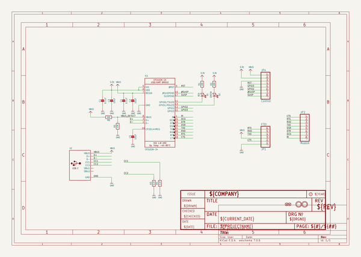
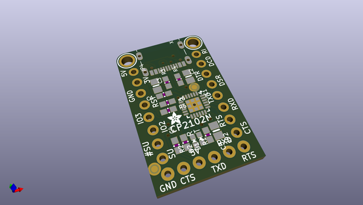
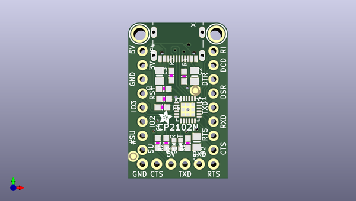
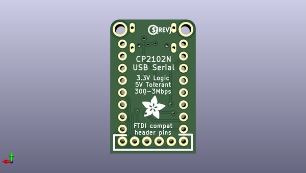

# adafruit_cp2102n_friend_pcb
 
## summary 
* id: adafruit_adafruit_cp2102n_friend_pcb_adafruit_cp2102n_friend
* user: adafruit
* name: adafruit_cp2102n_friend_pcb
* board: adafruit_cp2102n_friend
* repo: https://github.com/adafruit/Adafruit-CP2102N-Friend-PCB

* src_file_repo_sch: 
*
 src_file_repo_sch_link: https://github.com/adafruit/Adafruit-CP2102N-Friend-PCB/tree/main/
* full details link: https://github.com/oomlout/oomlout_oomp_project_bot_v_2/tree/main/projects/adafruit_adafruit_cp2102n_friend_pcb_adafruit_cp2102n_friend/current_version/working  

## schematic  
  
[schematic (pdf)](working_schematic.pdf)  

## pcb  
 
  
  
  
[board (pdf)](working.pdf)  

## working_bom
| Id | Designator | Footprint | Quantity | Designation | Supplier and ref |  | None | 
| --- | --- | --- | --- | --- | --- | --- | --- | 
| 1 | X2 | USB_C_CUSB31-CFM2AX-01-X | 1 |  |  |  | [''] | 
| 2 | R6,R2,R1 | 0603-NO | 3 | 20K |  |  | [''] | 
| 3 | R5 | 0603-NO | 1 | 47K |  |  | [''] | 
| 4 | D2 | CHIPLED_0603_NOOUTLINE | 1 | GREEN |  |  | [''] | 
| 5 | C2,C5,C3 | 0805-NO | 3 | 10uF |  |  | [''] | 
| 6 | R4,R3 | 0603-NO | 2 | 5.1K |  |  | [''] | 
| 7 | U$19,U$18 | MOUNTINGHOLE_2.0_PLATED | 2 | MOUNTINGHOLE2.0 |  |  | [''] | 
| 8 | JP1 | 1X06_ROUND_76 | 1 | FTDI |  |  | [''] | 
| 9 | D1 | CHIPLED_0603_NOOUTLINE | 1 | RED |  |  | [''] | 
| 10 | C1,C4 | 0603-NO | 2 | 0.1uF |  |  | [''] | 
| 11 | IC1 | QFN24_4MM_SMSC | 1 | CP2102N-24 |  |  | [''] | 
| 12 | FID2,FID1 | FIDUCIAL_1MM | 2 | FIDUCIAL_1MM |  |  | [''] | 
| 13 | U$8 | ADAFRUIT_2.5MM | 1 |  |  |  | [''] | 
| 14 | JP4 | 1X08_ROUND_70 | 1 | Control |  |  | [''] | 
| 15 | JP2 | 1X08_ROUND_70 | 1 | Modem |  |  | [''] | 
| 16 | U$17 | PCBFEAT-REV-040 | 1 |  |  |  | [''] | 
| 17 | U$22 | ADAFRUIT_5MM | 1 |  |  |  | [''] | 

## bom_schematic
| Ref | Qnty | Value | Cmp name | Footprint | Description | Vendor | DNP | 
| --- | --- | --- | --- | --- | --- | --- | --- | 
| C1, C4 | 2 | 0.1uF | CAP_CERAMIC0603_NO | working:0603-NO |  |  |  | 
| C2, C3, C5 | 3 | 10uF | CAP_CERAMIC0805-NOOUTLINE | working:0805-NO |  |  |  | 
| D1 | 1 | RED | LED0603_NOOUTLINE | working:CHIPLED_0603_NOOUTLINE |  |  |  | 
| D2 | 1 | GREEN | LED0603_NOOUTLINE | working:CHIPLED_0603_NOOUTLINE |  |  |  | 
| FID1, FID2 | 2 | FIDUCIAL_1MM | FIDUCIAL_1MM | working:FIDUCIAL_1MM |  |  |  | 
| IC1 | 1 | CP2102N-24 | CP2102N-24 | working:QFN24_4MM_SMSC |  |  |  | 
| JP1 | 1 | FTDI | HEADER-1X676MIL | working:1X06_ROUND_76 |  |  |  | 
| JP2 | 1 | Modem | HEADER-1X870MIL | working:1X08_ROUND_70 |  |  |  | 
| JP4 | 1 | Control | HEADER-1X870MIL | working:1X08_ROUND_70 |  |  |  | 
| R1, R2, R6 | 3 | 20K | RESISTOR_0603_NOOUT | working:0603-NO |  |  |  | 
| R3, R4 | 2 | 5.1K | RESISTOR_0603_NOOUT | working:0603-NO |  |  |  | 
| R5 | 1 | 47K | RESISTOR_0603_NOOUT | working:0603-NO |  |  |  | 
| U$18, U$19 | 2 | MOUNTINGHOLE2.0 | MOUNTINGHOLE2.0 | working:MOUNTINGHOLE_2.0_PLATED |  |  |  | 
| X2 | 1 | USB_C | USB_C | working:USB_C_CUSB31-CFM2AX-01-X |  |  |  | 

## mounting_holes
| x | y | package | value | ref | size | 
| --- | --- | --- | --- | --- | --- | 
| 13.72 | 0.0 | MOUNTINGHOLE_2.0_PLATED | MOUNTINGHOLE2.0 | U$18 | m3 | 
| 0.0 | 0.0 | MOUNTINGHOLE_2.0_PLATED | MOUNTINGHOLE2.0 | U$19 | m3 | 

