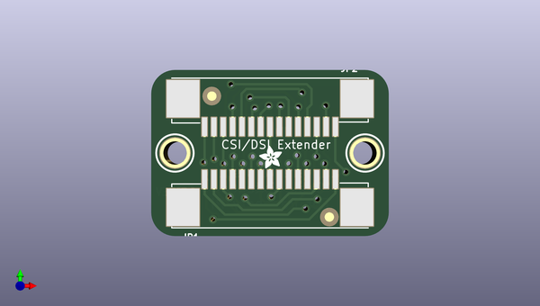

# adafruit_csi_or_dsi_cable_extender_thingy_for_raspberry_pi
 
## summary 
* id: adafruit_adafruit_csi_or_dsi_cable_extender_thingy_for_raspberry_pi_dsi_csi_extender
* user: adafruit
* name: adafruit_csi_or_dsi_cable_extender_thingy_for_raspberry_pi
* board: dsi_csi_extender
* repo: https://github.com/adafruit/Adafruit-CSI-or-DSI-Cable-Extender-Thingy-for-Raspberry-Pi

* src_file_repo_sch: 
*
 src_file_repo_sch_link: https://github.com/adafruit/Adafruit-CSI-or-DSI-Cable-Extender-Thingy-for-Raspberry-Pi/tree/master/
* full details link: https://github.com/oomlout/oomlout_oomp_project_bot_v_2/tree/main/projects/adafruit_adafruit_csi_or_dsi_cable_extender_thingy_for_raspberry_pi_dsi_csi_extender/current_version/working  

## schematic  
  
[schematic (pdf)](working_schematic.pdf)  

## pcb  
 
  
  
  
[board (pdf)](working.pdf)  

## working_bom
| Id | Designator | Footprint | Quantity | Designation | Supplier and ref |  | None | 
| --- | --- | --- | --- | --- | --- | --- | --- | 
| 1 | FID1,FID2 | FIDUCIAL_1MM | 2 | FIDUCIAL_1MM |  |  | [''] | 
| 2 | U$3,U$2 | MOUNTINGHOLE_2.5_PLATED | 2 | MOUNTINGHOLE2.5 |  |  | [''] | 
| 3 | U$4 | ADAFRUIT_2.5MM | 1 |  |  |  | [''] | 
| 4 | JP1,JP2 | FPC_15PIN_1.0MM | 2 |  |  |  | [''] | 
| 5 | U$6 | PCBFEAT-REV-040 | 1 |  |  |  | [''] | 
| 6 | U$5 | ADAFRUIT_5MM | 1 |  |  |  | [''] | 

## bom_schematic
| Ref | Qnty | Value | Cmp name | Footprint | Description | Vendor | DNP | 
| --- | --- | --- | --- | --- | --- | --- | --- | 
| FID1, FID2 | 2 | FIDUCIAL_1MM | FIDUCIAL_1MM | working:FIDUCIAL_1MM |  |  |  | 
| JP1, JP2 | 2 | HEADER-1X15_FPC1MM_PI | HEADER-1X15_FPC1MM_PI | working:FPC_15PIN_1.0MM |  |  |  | 
| U$2, U$3 | 2 | MOUNTINGHOLE2.5 | MOUNTINGHOLE2.5 | working:MOUNTINGHOLE_2.5_PLATED |  |  |  | 

## mounting_holes
| x | y | package | value | ref | size | 
| --- | --- | --- | --- | --- | --- | 
| 0.0 | 0.0 | MOUNTINGHOLE_2.5_PLATED | MOUNTINGHOLE2.5 | U$2 | m3 | 
| 20.32 | 0.0 | MOUNTINGHOLE_2.5_PLATED | MOUNTINGHOLE2.5 | U$3 | m3 | 

