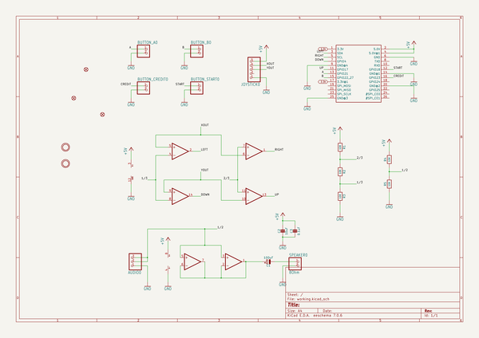
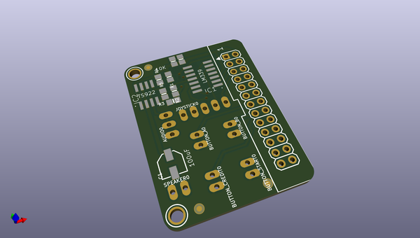
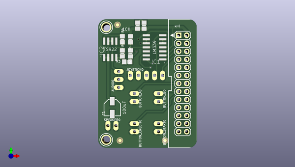
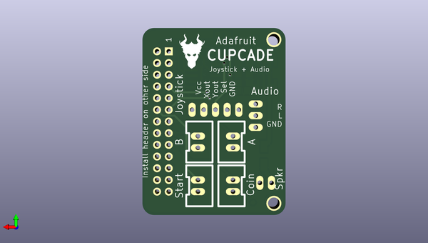

# adafruit_cupcade_adapter_pcb
 
## summary 
* id: adafruit_adafruit_cupcade_adapter_pcb_adafruit_cupcade
* user: adafruit
* name: adafruit_cupcade_adapter_pcb
* board: adafruit_cupcade
* repo: https://github.com/adafruit/Adafruit-Cupcade-Adapter-PCB

* src_file_repo_sch: 
*
 src_file_repo_sch_link: https://github.com/adafruit/Adafruit-Cupcade-Adapter-PCB/tree/master/
* full details link: https://github.com/oomlout/oomlout_oomp_project_bot_v_2/tree/main/projects/adafruit_adafruit_cupcade_adapter_pcb_adafruit_cupcade/current_version/working  

## schematic  
  
[schematic (pdf)](working_schematic.pdf)  

## pcb  
 
  
  
  
[board (pdf)](working.pdf)  

## working_bom
| Id | Designator | Footprint | Quantity | Designation | Supplier and ref |  | None | 
| --- | --- | --- | --- | --- | --- | --- | --- | 
| 1 | R1,R4,R5,R2,R3 | 0805-NO | 5 | 10K |  |  | [''] | 
| 2 | C1 | PANASONIC_C | 1 | 100uF |  |  | [''] | 
| 3 | AUDIO0 | 1X03_OVAL | 1 |  |  |  | [''] | 
| 4 | IC1 | SO14 | 1 | LM339D |  |  | [''] | 
| 5 | U$2,U$3 | MOUNTINGHOLE_2.5_PLATED | 2 | MOUNTINGHOLE2.5 |  |  | [''] | 
| 6 | IC2 | SO08 | 1 | TS922 |  |  | [''] | 
| 7 | BUTTON_CREDIT0,BUTTON_START0,BUTTON_B0,BUTTON_A0 | 1X02_OVAL | 4 |  |  |  | [''] | 
| 8 | FID1,FID2,FID3 | FIDUCIAL_1MM | 3 | FIDUCIAL" |  |  | [''] | 
| 9 | C2 | 0805-NO | 1 | 10uF |  |  | [''] | 
| 10 | JP1 | RASBERRYPI_IDC | 1 |  |  |  | [''] | 
| 11 | SPEAKER0 | 1X02_OVAL | 1 | 8Ohm |  |  | [''] | 
| 12 | C3 | 0805-NO | 1 | 0.1uF |  |  | [''] | 
| 13 | JOYSTICK0 | 1X05_OVAL | 1 |  |  |  | [''] | 
| 14 | U$1 | DRAGON_300MIL | 1 |  |  |  | [''] | 

## bom_schematic
| Ref | Qnty | Value | Cmp name | Footprint | Description | Vendor | DNP | 
| --- | --- | --- | --- | --- | --- | --- | --- | 
| AUDIO0 | 1 | HEADER-1X3 | HEADER-1X3 | working:1X03_OVAL |  |  |  | 
| BUTTON_A0 | 1 | HEADER-1X2 | HEADER-1X2 | working:1X02_OVAL |  |  |  | 
| BUTTON_B0 | 1 | HEADER-1X2 | HEADER-1X2 | working:1X02_OVAL |  |  |  | 
| BUTTON_CREDIT0 | 1 | HEADER-1X2 | HEADER-1X2 | working:1X02_OVAL |  |  |  | 
| BUTTON_START0 | 1 | HEADER-1X2 | HEADER-1X2 | working:1X02_OVAL |  |  |  | 
| C1 | 1 | 100uF | CAP_ELECTROLYTICPANASONIC_C | working:PANASONIC_C |  |  |  | 
| C2 | 1 | 10uF | CAP_CERAMIC0805-NOOUTLINE | working:0805-NO |  |  |  | 
| C3 | 1 | 0.1uF | CAP_CERAMIC0805-NOOUTLINE | working:0805-NO |  |  |  | 
| FID1, FID2, FID3 | 3 | FIDUCIAL"" | FIDUCIAL{dblquote}{dblquote} | working:FIDUCIAL_1MM |  |  |  | 
| IC1 | 1 | LM339D | LM339D | working:SO14 |  |  |  | 
| IC2 | 1 | TL072D | TL072D | working:SO08 |  |  |  | 
| JOYSTICK0 | 1 | HEADER-1X5 | HEADER-1X5 | working:1X05_OVAL |  |  |  | 
| JP1 | 1 | RASBERRYPI_IDC | RASBERRYPI_IDC | working:RASBERRYPI_IDC |  |  |  | 
| R1, R2, R3, R4, R5 | 5 | 10K | RESISTOR0805_NOOUTLINE | working:0805-NO |  |  |  | 
| SPEAKER0 | 1 | 8Ohm | HEADER-1X2 | working:1X02_OVAL |  |  |  | 
| U$2, U$3 | 2 | MOUNTINGHOLE2.5 | MOUNTINGHOLE2.5 | working:MOUNTINGHOLE_2.5_PLATED |  |  |  | 

## mounting_holes
| x | y | package | value | ref | size | 
| --- | --- | --- | --- | --- | --- | 
| 0.0 | 0.0 | MOUNTINGHOLE_2.5_PLATED | MOUNTINGHOLE2.5 | U$2 | m3 | 
| 0.0 | 35.56 | MOUNTINGHOLE_2.5_PLATED | MOUNTINGHOLE2.5 | U$3 | m3 | 

