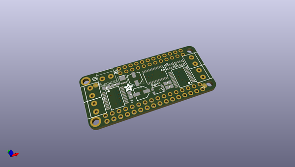

# adafruit_dc_stepper_motor_featherwing_pcb
 
## summary 
* id: adafruit_adafruit_dc_stepper_motor_featherwing_pcb_adafruit_dc_stepper_wing
* user: adafruit
* name: adafruit_dc_stepper_motor_featherwing_pcb
* board: adafruit_dc_stepper_wing
* repo: https://github.com/adafruit/Adafruit-DC-Stepper-Motor-FeatherWing-PCB

* src_file_repo_sch: 
*
 src_file_repo_sch_link: https://github.com/adafruit/Adafruit-DC-Stepper-Motor-FeatherWing-PCB/tree/master/
* full details link: https://github.com/oomlout/oomlout_oomp_project_bot_v_2/tree/main/projects/adafruit_adafruit_dc_stepper_motor_featherwing_pcb_adafruit_dc_stepper_wing/current_version/working  

## schematic  
  
[schematic (pdf)](working_schematic.pdf)  

## pcb  
 
  
  
  
[board (pdf)](working.pdf)  

## working_bom
| Id | Designator | Footprint | Quantity | Designation | Supplier and ref |  | None | 
| --- | --- | --- | --- | --- | --- | --- | --- | 
| 1 | R9,R10 | RESPACK_4X0603 | 2 | 10K |  |  | [''] | 
| 2 | C2 | 0805-NO | 1 | 0.1uF |  |  | [''] | 
| 3 | U$4,U$3 | FIDUCIAL_1MM | 2 | FIDUCIAL" |  |  | [''] | 
| 4 | C6,C10 | 0805-NO | 2 | 10uF |  |  | [''] | 
| 5 | U$2 | SYMBOL_MINUS | 1 |  |  |  | [''] | 
| 6 | R4 | 0805-NO | 1 | 1K |  |  | [''] | 
| 7 | X1,X4,X6,X2 | TERMBLOCK_1X2-3.5MM | 4 |  |  |  | [''] | 
| 8 | MS1 | FEATHERWING | 1 | FEATHERWING |  |  | [''] | 
| 9 | LED1 | CHIPLED_0805_NOOUTLINE | 1 | Green |  |  | [''] | 
| 10 | SW1 | BTN_KMR2_4.6X2.8 | 1 |  |  |  | [''] | 
| 11 | MPOWER0 | 1X2-3.5MM | 1 | 1X2-3.5MM |  |  | [''] | 
| 12 | U$5 | ADAFRUIT_3.5MM | 1 |  |  |  | [''] | 
| 13 | U2 | TSSOP28 | 1 | PCA9685 |  |  | [''] | 
| 14 | Q1 | POWERDI3333 | 1 | AON7401 |  |  | [''] | 
| 15 | C5 | PANASONIC_C | 1 | 47uF+/16v |  |  | [''] | 
| 16 | JP1 | 1X12_ROUND | 1 |  |  |  | [''] | 
| 17 | IC3,IC1 | SSOP24 | 2 | TB6612FNG |  |  | [''] | 
| 18 | JP2 | 1X16_ROUND | 1 |  |  |  | [''] | 
| 19 | C4 | PANASONIC_C | 1 | 47uF/16v |  |  | [''] | 
| 20 | U$1 | SYMBOL_PLUS | 1 |  |  |  | [''] | 
| 21 | A0,A1,A4,A3,A2 | SOLDERJUMPER_REFLOW_NOPASTE | 5 |  |  |  | [''] | 
| 22 | U$6 | FEATHERLOGO | 1 |  |  |  | [''] | 
| 23 | U$8 | PCBFEAT-REV-040 | 1 |  |  |  | [''] | 

## bom_schematic
| Ref | Qnty | Value | Cmp name | Footprint | Description | Vendor | DNP | 
| --- | --- | --- | --- | --- | --- | --- | --- | 
| A0, A1, A2, A3, A4 | 5 | SOLDERJUMPERREFLOW_NOPASTE | SOLDERJUMPERREFLOW_NOPASTE | working:SOLDERJUMPER_REFLOW_NOPASTE |  |  |  | 
| C2 | 1 | 0.1uF | CAP_CERAMIC0805-NOOUTLINE | working:0805-NO |  |  |  | 
| C4 | 1 | 47uF/16v | CAP_ELECTROLYTICPANASONIC_C | working:PANASONIC_C |  |  |  | 
| C5 | 1 | 47uF+/16v | CAP_ELECTROLYTICPANASONIC_C | working:PANASONIC_C |  |  |  | 
| C6, C10 | 2 | 10uF | CAP_CERAMIC0805-NOOUTLINE | working:0805-NO |  |  |  | 
| IC1, IC3 | 2 | TB6612FNG | TB6612FNG | working:SSOP24 |  |  |  | 
| JP1 | 1 | HEADER-1X12 | HEADER-1X12 | working:1X12_ROUND |  |  |  | 
| JP2 | 1 | HEADER-1X16ROUND | HEADER-1X16ROUND | working:1X16_ROUND |  |  |  | 
| LED1 | 1 | Green | LED0805_NOOUTLINE | working:CHIPLED_0805_NOOUTLINE |  |  |  | 
| MPOWER0 | 1 | 1X2-3.5MM | 1X2-3.5MM | working:1X2-3.5MM |  |  |  | 
| MS1 | 1 | FEATHERWING | FEATHERWING | working:FEATHERWING |  |  |  | 
| Q1 | 1 | AON7401 | MOSFET-P-POWERDI3333 | working:POWERDI3333 |  |  |  | 
| R4 | 1 | 1K | RESISTOR0805_NOOUTLINE | working:0805-NO |  |  |  | 
| R9, R10 | 2 | 10K | RESISTOR_4PACK | working:RESPACK_4X0603 |  |  |  | 
| SW1 | 1 | SWITCH_TACT_SMT4.6X2.8 | SWITCH_TACT_SMT4.6X2.8 | working:BTN_KMR2_4.6X2.8 |  |  |  | 
| U2 | 1 | PCA9685 | PCA9685 | working:TSSOP28 |  |  |  | 
| U$3, U$4 | 2 | FIDUCIAL"" | FIDUCIAL{dblquote}{dblquote} | working:FIDUCIAL_1MM |  |  |  | 
| X1, X2, X4, X6 | 4 | TERMBLOCK_1X2 | TERMBLOCK_1X2 | working:TERMBLOCK_1X2-3.5MM |  |  |  | 

