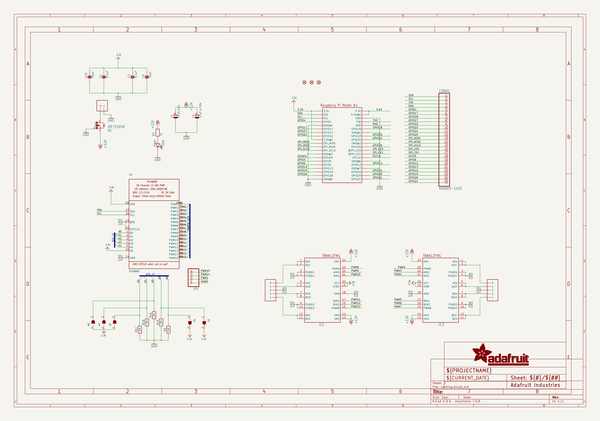
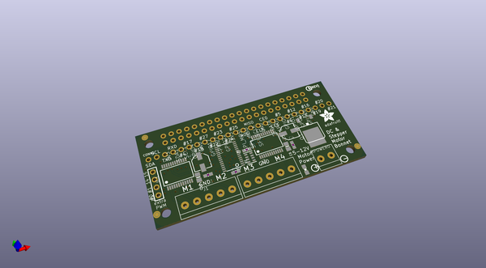
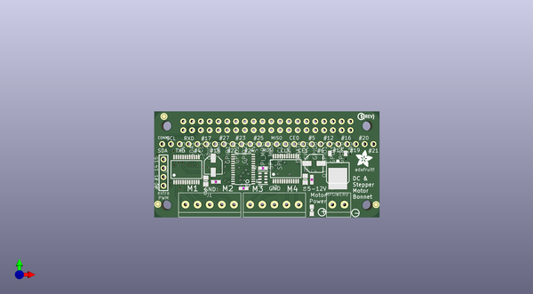
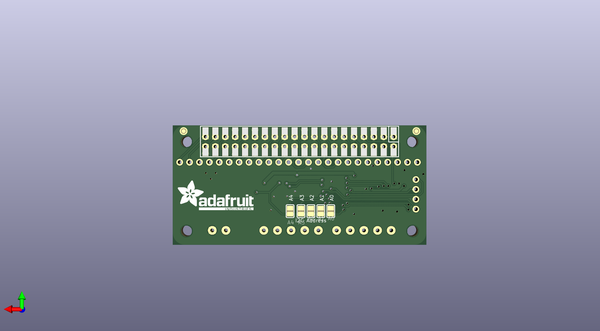

# adafruit_dc_stepper_motor_hat_pcb
 
## summary 
* id: adafruit_adafruit_dc_stepper_motor_hat_pcb_adafruit_motor_bonnet_rev_a
* user: adafruit
* name: adafruit_dc_stepper_motor_hat_pcb
* board: adafruit_motor_bonnet_rev_a
* repo: https://github.com/adafruit/Adafruit-DC-Stepper-Motor-HAT-PCB

* src_file_repo_sch: 
*
 src_file_repo_sch_link: https://github.com/adafruit/Adafruit-DC-Stepper-Motor-HAT-PCB/tree/master/
* full details link: https://github.com/oomlout/oomlout_oomp_project_bot_v_2/tree/main/projects/adafruit_adafruit_dc_stepper_motor_hat_pcb_adafruit_motor_bonnet_rev_a/current_version/working  

## schematic  
  
[schematic (pdf)](working_schematic.pdf)  

## pcb  
 
  
  
  
[board (pdf)](working.pdf)  

## working_bom
| Id | Designator | Footprint | Quantity | Designation | Supplier and ref |  | None | 
| --- | --- | --- | --- | --- | --- | --- | --- | 
| 1 | MPOWER0 | 1X2-3.5MM | 1 | 1X2-3.5MM |  |  | [''] | 
| 2 | C6,C10 | 0805-NO | 2 | 10uF |  |  | [''] | 
| 3 | Q1 | D-PAK_TO252AA | 1 | AOD417 |  |  | [''] | 
| 4 | U2 | TSSOP28 | 1 | PCA9685 |  |  | [''] | 
| 5 | RPI1 | PI_BONNET_THMSMT | 1 | RASPBERRYPI_BPLUS_BONNET_THMSMT |  |  | [''] | 
| 6 | C5 | PANASONIC_C | 1 | 47uF+/16v |  |  | [''] | 
| 7 | R2 | 0603-NO | 1 | 10K |  |  | [''] | 
| 8 | R7 | 0603-NO | 1 | 1K |  |  | [''] | 
| 9 | C3,C1 | 0603-NO | 2 | 0.1uF |  |  | [''] | 
| 10 | IC1,IC3 | SSOP24 | 2 | TB6612FNG |  |  | [''] | 
| 11 | FID2,FID1,FID3 | FIDUCIAL_1MM | 3 | FIDUCIAL_1MM |  |  | [''] | 
| 12 | LED1 | CHIPLED_0805_NOOUTLINE | 1 | Green |  |  | [''] | 
| 13 | J1,J3 | 1X05-3.5MM | 2 | 1X5 |  |  | [''] | 
| 14 | U$6 | PCBFEAT-REV-040 | 1 |  |  |  | [''] | 
| 15 | JP1 | 1X04_ROUND | 1 |  |  |  | [''] | 
| 16 | C4 | PANASONIC_C | 1 | 47uF/16v |  |  | [''] | 
| 17 | R1 | RESPACK_4X0603 | 1 | 10K |  |  | [''] | 
| 18 | CONN1 | 1X25_ROUND_70MIL | 1 | HEADER-1X25 |  |  | [''] | 
| 19 | U$51 | ADAFRUIT_5MM | 1 |  |  |  | [''] | 
| 20 | A1,A2,A3,A4,A0 | SOLDERJUMPER_REFLOW_NOPASTE | 5 |  |  |  | [''] | 
| 21 | U$8 | ADAFRUIT_TEXT_20MM | 1 |  |  |  | [''] | 

## bom_schematic
| Ref | Qnty | Value | Cmp name | Footprint | Description | Vendor | DNP | 
| --- | --- | --- | --- | --- | --- | --- | --- | 
| A0, A1, A2, A3, A4 | 5 | SOLDERJUMPERREFLOW_NOPASTE | SOLDERJUMPERREFLOW_NOPASTE | working:SOLDERJUMPER_REFLOW_NOPASTE |  |  |  | 
| C1, C3 | 2 | 0.1uF | CAP_CERAMIC0603_NO | working:0603-NO |  |  |  | 
| C4 | 1 | 47uF/16v | CAP_ELECTROLYTICPANASONIC_C | working:PANASONIC_C |  |  |  | 
| C5 | 1 | 47uF+/16v | CAP_ELECTROLYTICPANASONIC_C | working:PANASONIC_C |  |  |  | 
| C6, C10 | 2 | 10uF | CAP_CERAMIC0805-NOOUTLINE | working:0805-NO |  |  |  | 
| CONN1 | 1 | HEADER-1X25 | HEADER-1X25 | working:1X25_ROUND_70MIL |  |  |  | 
| FID1, FID2, FID3 | 3 | FIDUCIAL_1MM | FIDUCIAL_1MM | working:FIDUCIAL_1MM |  |  |  | 
| IC1, IC3 | 2 | TB6612FNG | TB6612FNG | working:SSOP24 |  |  |  | 
| J1, J3 | 2 | 1X5 | 1X5 | working:1X05-3.5MM |  |  |  | 
| JP1 | 1 | HEADER-1X4ROUND | HEADER-1X4ROUND | working:1X04_ROUND |  |  |  | 
| LED1 | 1 | Green | LED0805_NOOUTLINE | working:CHIPLED_0805_NOOUTLINE |  |  |  | 
| MPOWER0 | 1 | 1X2-3.5MM | 1X2-3.5MM | working:1X2-3.5MM |  |  |  | 
| Q1 | 1 | IRF?5305R | IRF?5305R | working:D-PAK_TO252AA |  |  |  | 
| R1 | 1 | 10K | RESISTOR_4PACK | working:RESPACK_4X0603 |  |  |  | 
| R2 | 1 | 10K | RESISTOR_0603_NOOUT | working:0603-NO |  |  |  | 
| R7 | 1 | 1K | RESISTOR_0603_NOOUT | working:0603-NO |  |  |  | 
| RPI1 | 1 | RASPBERRYPI_BPLUS_BONNET_THMSMT | RASPBERRYPI_BPLUS_BONNET_THMSMT | working:PI_BONNET_THMSMT |  |  |  | 
| U2 | 1 | PCA9685 | PCA9685 | working:TSSOP28 |  |  |  | 

