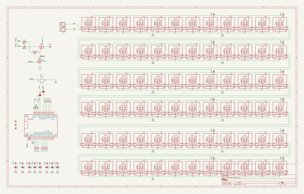
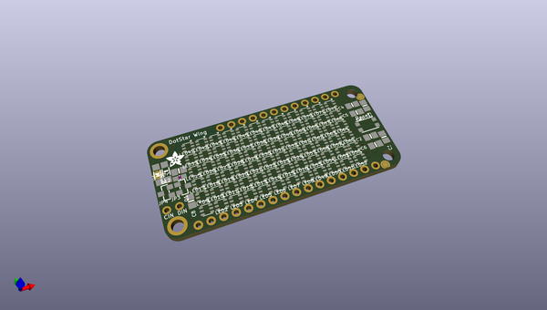
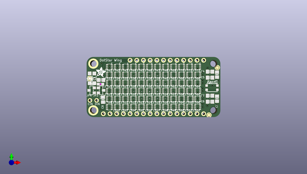
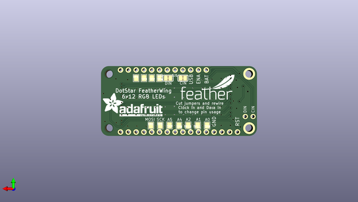

# adafruit_dotstar_featherwing_pcb
 
## summary 
* id: adafruit_adafruit_dotstar_featherwing_pcb_adafruit_dotstar_wing
* user: adafruit
* name: adafruit_dotstar_featherwing_pcb
* board: adafruit_dotstar_wing
* repo: https://github.com/adafruit/Adafruit-DotStar-FeatherWing-PCB

* src_file_repo_sch: 
*
 src_file_repo_sch_link: https://github.com/adafruit/Adafruit-DotStar-FeatherWing-PCB/tree/master/
* full details link: https://github.com/oomlout/oomlout_oomp_project_bot_v_2/tree/main/projects/adafruit_adafruit_dotstar_featherwing_pcb_adafruit_dotstar_wing/current_version/working  

## schematic  
  
[schematic (pdf)](working_schematic.pdf)  

## pcb  
 
  
  
  
[board (pdf)](working.pdf)  

## working_bom
| Id | Designator | Footprint | Quantity | Designation | Supplier and ref |  | None | 
| --- | --- | --- | --- | --- | --- | --- | --- | 
| 1 | D1,D2 | SOD-123 | 2 | MBR120 |  |  | [''] | 
| 2 | LED41,LED61,LED29,LED25,LED28,LED57,LED54,LED21,LED37,LED51,LED6,LED46,LED59,LED50,LED19,LED11,LED24,LED26,LED39,LED64,LED3,LED38,LED42,LED49,LED62,LED7,LED48,LED31,LED4,LED52,LED35,LED10,LED70,LED58,LED47,LED9,LED55,LED16,LED17,LED43,LED71,LED40,LED60,LED2,LED45,LED22,LED15,LED12,LED18,LED8,LED1,LED53,LED72,LED56,LED27,LED68,LED66,LED36,LED69,LED30,LED5,LED34,LED32,LED63,LED44,LED67,LED20,LED33,LED23,LED65,LED13,LED14 | APA102_2020 | 72 |  |  |  | [''] | 
| 3 | C3,C7,C4,C5,C6,C2,C1,C8 | 0805-NO | 8 | 10uF |  |  | [''] | 
| 4 | JP3,JP4 | 1X01_ROUND | 2 |  |  |  | [''] | 
| 5 | Q1 | SOT23-WIDE | 1 | BSS138 |  |  | [''] | 
| 6 | MS1 | FEATHERWING | 1 | FEATHERWING |  |  | [''] | 
| 7 | Q3 | SOT23-WIDE | 1 | DMG3415U-7 |  |  | [''] | 
| 8 | FID2,FID1,FID3 | FIDUCIAL_1MM | 3 | FIDUCIAL_1MM |  |  | [''] | 
| 9 | R12 | 0603-NO | 1 | 100k |  |  | [''] | 
| 10 | SW1 | BTN_KMR2_4.6X2.8 | 1 | KMR2 |  |  | [''] | 
| 11 | U$9 | ADAFRUIT_3.5MM | 1 |  |  |  | [''] | 
| 12 | TP6,TP9,TP2,TP4,TP3,TP10,TP1,TP8,TP11,TP7,TP5 | PAD-1.5X2.0 | 11 |  |  |  | [''] | 
| 13 | U$1 | ADAFRUIT_TEXT_20MM | 1 |  |  |  | [''] | 
| 14 | U$8 | FEATHERLOGO_MED | 1 |  |  |  | [''] | 
| 15 | SJ2,SJ1 | SOLDERJUMPER_CLOSEDWIRE | 2 |  |  |  | [''] | 

## bom_schematic
| Ref | Qnty | Value | Cmp name | Footprint | Description | Vendor | DNP | 
| --- | --- | --- | --- | --- | --- | --- | --- | 
| C1, C2, C3, C4, C5, C6, C7, C8 | 8 | 10uF | CAP_CERAMIC0805-NOOUTLINE | working:0805-NO |  |  |  | 
| D1, D2 | 2 | MBR120 | DIODE-SCHOTTKYSOD-123 | working:SOD-123 |  |  |  | 
| FID1, FID2, FID3 | 3 | FIDUCIAL_1MM | FIDUCIAL_1MM | working:FIDUCIAL_1MM |  |  |  | 
| JP3, JP4 | 2 | HEADER-1X1ROUND | HEADER-1X1ROUND | working:1X01_ROUND |  |  |  | 
| LED1, LED2, LED3, LED4, LED5, LED6, LED7, LED8, LED9, LED10, LED11, LED12, LED13, LED14, LED15, LED16, LED17, LED18, LED19, LED20, LED21, LED22, LED23, LED24, LED25, LED26, LED27, LED28, LED29, LED30, LED31, LED32, LED33, LED34, LED35, LED36, LED37, LED38, LED39, LED40, LED41, LED42, LED43, LED44, LED45, LED46, LED47, LED48, LED49, LED50, LED51, LED52, LED53, LED54, LED55, LED56, LED57, LED58, LED59, LED60, LED61, LED62, LED63, LED64, LED65, LED66, LED67, LED68, LED69, LED70, LED71, LED72 | 72 | APA1022020 | APA1022020 | working:APA102_2020 |  |  |  | 
| MS1 | 1 | FEATHERWING | FEATHERWING | working:FEATHERWING |  |  |  | 
| Q1 | 1 | BSS138 | MOSFET-NWIDE | working:SOT23-WIDE |  |  |  | 
| Q3 | 1 | DMG3415U-7 | MOSFET-PWIDE | working:SOT23-WIDE |  |  |  | 
| R12 | 1 | 100k | RESISTOR_0603_NOOUT | working:0603-NO |  |  |  | 
| SJ1, SJ2 | 2 | SOLDERJUMPERCLOSED | SOLDERJUMPERCLOSED | working:SOLDERJUMPER_CLOSEDWIRE |  |  |  | 
| SW1 | 1 | KMR2 | SWITCH_TACT_SMT4.6X2.8 | working:BTN_KMR2_4.6X2.8 |  |  |  | 
| TP1, TP2, TP3, TP4, TP5, TP6, TP7, TP8, TP9, TP10, TP11 | 11 | TESTPOINT1.5X2.0MM_NOCREAM | TESTPOINT1.5X2.0MM_NOCREAM | working:PAD-1.5X2.0 |  |  |  | 

