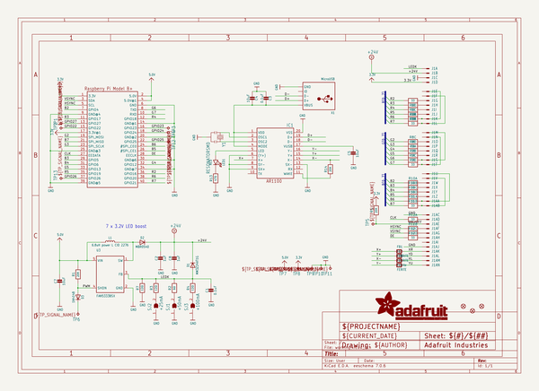
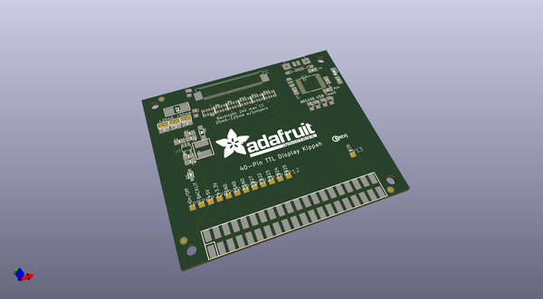
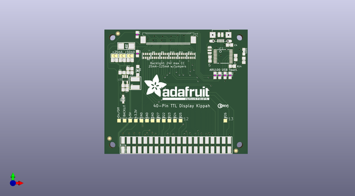
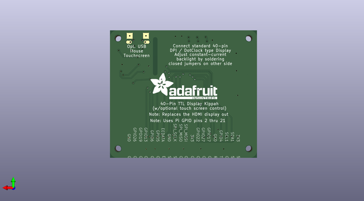

# adafruit_dpi_kippah_pcb
 
## summary 
* id: adafruit_adafruit_dpi_kippah_pcb_adafruit_dpi_kippah
* user: adafruit
* name: adafruit_dpi_kippah_pcb
* board: adafruit_dpi_kippah
* repo: https://github.com/adafruit/Adafruit-DPI-Kippah-PCB

* src_file_repo_sch: 
*
 src_file_repo_sch_link: https://github.com/adafruit/Adafruit-DPI-Kippah-PCB/tree/master/
* full details link: https://github.com/oomlout/oomlout_oomp_project_bot_v_2/tree/main/projects/adafruit_adafruit_dpi_kippah_pcb_adafruit_dpi_kippah/current_version/working  

## schematic  
  
[schematic (pdf)](working_schematic.pdf)  

## pcb  
 
  
  
  
[board (pdf)](working.pdf)  

## working_bom
| Id | Designator | Footprint | Quantity | Designation | Supplier and ref |  | None | 
| --- | --- | --- | --- | --- | --- | --- | --- | 
| 1 | FID2,FID1,FID3 | FIDUCIAL_1MM | 3 | FIDUCIAL" |  |  | [''] | 
| 2 | SJ3 | SOLDERJUMPER_ARROW_NOPASTE | 1 | +100mA |  |  | [''] | 
| 3 | TP9,TP12,TP3,TP1,TP2,TP4,TP5,TP13,TP11,TP8,TP6,TP7,TP10 | TP15SQ | 13 | TPTP15SQ |  |  | [''] | 
| 4 | R6,R11,R8,R10,R12,R9 | RESPACK_4X0603 | 6 | 33 |  |  | [''] | 
| 5 | R3,R7,R4 | 0805-NO | 3 | 12Ω |  |  | [''] | 
| 6 | IC1 | TSSOP20-5.3MMBODY | 1 | AR1100_SSOP |  |  | [''] | 
| 7 | Y1 | RESONATOR-SMD | 1 | 12MHz |  |  | [''] | 
| 8 | C7,C5,C4 | 0805-NO | 3 | 10uF |  |  | [''] | 
| 9 | U$32 | PCBFEAT-REV-040 | 1 |  |  |  | [''] | 
| 10 | U$30,U$31 | ADAFRUIT_TEXT_30MM | 2 |  |  |  | [''] | 
| 11 | FB4 | _0805MP | 1 | FERITE |  |  | [''] | 
| 12 | FB2,FB1 | _0805MP | 2 | FERRITE |  |  | [''] | 
| 13 | C3,C1 | 0805-NO | 2 | 0.1uF |  |  | [''] | 
| 14 | R5 | _0805MP | 1 | 20K |  |  | [''] | 
| 15 | R2 | 0805-NO | 1 | 6Ω |  |  | [''] | 
| 16 | R1,R14 | 0805-NO | 2 | 20K |  |  | [''] | 
| 17 | C8 | 0805-NO | 1 | 1uF |  |  | [''] | 
| 18 | C2 | _0805MP | 1 | 1uF |  |  | [''] | 
| 19 | LED1 | CHIPLED_0805_NOOUTLINE | 1 | RED |  |  | [''] | 
| 20 | D1 | SMADIODE | 1 | MM3Z24VT1G |  |  | [''] | 
| 21 | U3 | SOT23-5@1 | 1 | FAN5333BSX |  |  | [''] | 
| 22 | D2 | SOD-123 | 1 | MBR0540 |  |  | [''] | 
| 23 | J1 | 4-1734839-0 | 1 | 40PINFPCM4-1734839-0 |  |  | [''] | 
| 24 | D3 | SOD-323 | 1 | 1N4148 |  |  | [''] | 
| 25 | FB3 | _0805MP | 1 | Ferrite |  |  | [''] | 
| 26 | L1 | INDUCTOR_5X5MM_NR5040_NOTHERMALS | 1 | 6.8uH power L CID 2276 |  |  | [''] | 
| 27 | SJ1 | SOLDERJUMPER_ARROW_NOPASTE | 1 | +50mA |  |  | [''] | 
| 28 | SJ2 | SOLDERJUMPER_ARROW_NOPASTE | 1 | +25mA |  |  | [''] | 
| 29 | X1 | 4UCONN_20329 | 1 | MicroUSB |  |  | [''] | 
| 30 | R13 | 0805-NO | 1 | 470 |  |  | [''] | 
| 31 | RPI1 | PI_HAT_SMT_SLOTS | 1 | RASPBERRYPI_BPLUS-SMT+SLOTS |  |  | [''] | 

## bom_schematic
| Ref | Qnty | Value | Cmp name | Footprint | Description | Vendor | DNP | 
| --- | --- | --- | --- | --- | --- | --- | --- | 
| C1, C3 | 2 | 0.1uF | CAP_CERAMIC0805-NOOUTLINE | working:0805-NO |  |  |  | 
| C2 | 1 | 1uF | CAP_CERAMIC_0805MP | working:_0805MP |  |  |  | 
| C4, C5, C7 | 3 | 10uF | CAP_CERAMIC0805-NOOUTLINE | working:0805-NO |  |  |  | 
| C8 | 1 | 1uF | CAP_CERAMIC0805-NOOUTLINE | working:0805-NO |  |  |  | 
| D1 | 1 | MM3Z24VT1G | DIODESMA | working:SMADIODE |  |  |  | 
| D2 | 1 | MBR0540 | DIODESOD-123 | working:SOD-123 |  |  |  | 
| D3 | 1 | 1N4148 | DIODESOD-323 | working:SOD-323 |  |  |  | 
| FB1, FB2 | 2 | FERRITE | FERRITE_0805MP | working:_0805MP |  |  |  | 
| FB3 | 1 | Ferrite | FERRITE_0805MP | working:_0805MP |  |  |  | 
| FB4 | 1 | FERITE | FERRITE_0805MP | working:_0805MP |  |  |  | 
| FID1, FID2, FID3 | 3 | FIDUCIAL"" | FIDUCIAL{dblquote}{dblquote} | working:FIDUCIAL_1MM |  |  |  | 
| IC1 | 1 | AR1100_SSOP | AR1100_SSOP | working:TSSOP20-5.3MMBODY |  |  |  | 
| J1 | 1 | 40PINFPC4-1734839-0 | 40PINFPC4-1734839-0 | working:4-1734839-0 |  |  |  | 
| L1 | 1 | 6.8uH power L CID 2276 | INDUCTORNR5040 | working:INDUCTOR_5X5MM_NR5040_NOTHERMALS |  |  |  | 
| LED1 | 1 | RED | LED0805_NOOUTLINE | working:CHIPLED_0805_NOOUTLINE |  |  |  | 
| R1, R14 | 2 | 20K | RESISTOR0805_NOOUTLINE | working:0805-NO |  |  |  | 
| R2 | 1 | 6Ω | RESISTOR0805_NOOUTLINE | working:0805-NO |  |  |  | 
| R3, R4, R7 | 3 | 12Ω | RESISTOR0805_NOOUTLINE | working:0805-NO |  |  |  | 
| R5 | 1 | 20K | RESISTOR_0805MP | working:_0805MP |  |  |  | 
| R6, R8, R9, R10, R11, R12 | 6 | 33 | RESISTOR_4PACK | working:RESPACK_4X0603 |  |  |  | 
| R13 | 1 | 470 | RESISTOR0805_NOOUTLINE | working:0805-NO |  |  |  | 
| RPI1 | 1 | RASPBERRYPI_BPLUS-SMT+SLOTS | RASPBERRYPI_BPLUS-SMT+SLOTS | working:PI_HAT_SMT_SLOTS |  |  |  | 
| SJ1 | 1 | +50mA | SOLDERJUMPER | working:SOLDERJUMPER_ARROW_NOPASTE |  |  |  | 
| SJ2 | 1 | +25mA | SOLDERJUMPER | working:SOLDERJUMPER_ARROW_NOPASTE |  |  |  | 
| SJ3 | 1 | +100mA | SOLDERJUMPER | working:SOLDERJUMPER_ARROW_NOPASTE |  |  |  | 
| TP1, TP2, TP3, TP4, TP5, TP6, TP7, TP8, TP9, TP10, TP11, TP12, TP13 | 13 | TPTP15SQ | TPTP15SQ | working:TP15SQ |  |  |  | 
| U3 | 1 | FAN5333BSX | FAN5331 | working:SOT23-5@1 |  |  |  | 
| X1 | 1 | MicroUSB | USBMICRO_20329 | working:4UCONN_20329 |  |  |  | 
| Y1 | 1 | RESONATORSMD | RESONATORSMD | working:RESONATOR-SMD |  |  |  | 

