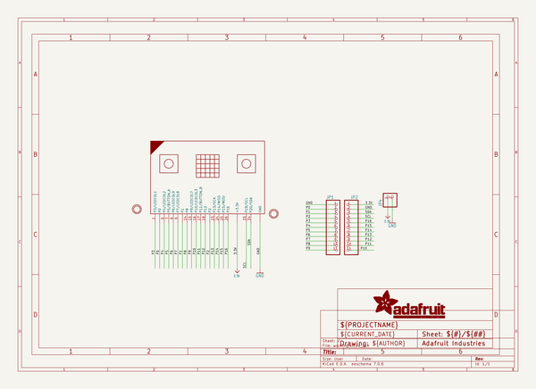
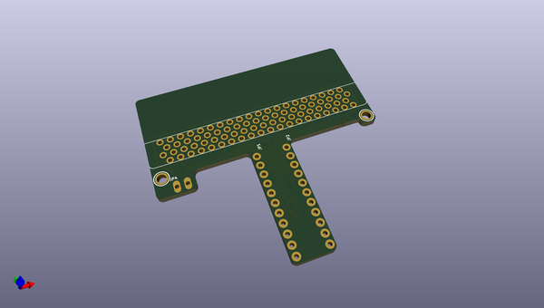
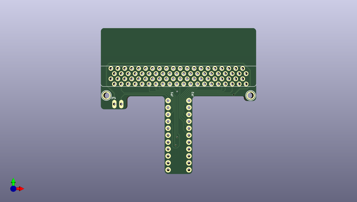
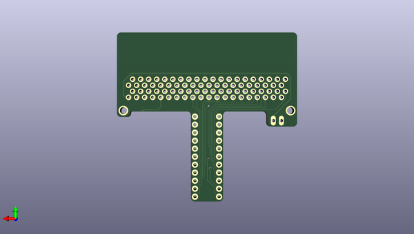

# adafruit_dragontail_for_micro_bit_pcb
 
## summary 
* id: adafruit_adafruit_dragontail_for_micro_bit_pcb_adafruit_dragontail
* user: adafruit
* name: adafruit_dragontail_for_micro_bit_pcb
* board: adafruit_dragontail
* repo: https://github.com/adafruit/Adafruit-DragonTail-for-micro-bit-PCB

* src_file_repo_sch: 
*
 src_file_repo_sch_link: https://github.com/adafruit/Adafruit-DragonTail-for-micro-bit-PCB/tree/master/
* full details link: https://github.com/oomlout/oomlout_oomp_project_bot_v_2/tree/main/projects/adafruit_adafruit_dragontail_for_micro_bit_pcb_adafruit_dragontail/current_version/working  

## schematic  
  
[schematic (pdf)](working_schematic.pdf)  

## pcb  
 
  
  
  
[board (pdf)](working.pdf)  

## working_bom
| Id | Designator | Footprint | Quantity | Designation | Supplier and ref |  | None | 
| --- | --- | --- | --- | --- | --- | --- | --- | 
| 1 | JP1,JP2 | 1X11_ROUND_76 | 2 |  |  |  | [''] | 
| 2 | JP4 | 1X02_OVAL | 1 |  |  |  | [''] | 
| 3 | U$6 | TBREADBIT_TOP | 1 |  |  |  | [''] | 
| 4 | U$10,U$9 | MOUNTINGHOLE_2.0_PLATED | 2 | MOUNTINGHOLE2.0 |  |  | [''] | 
| 5 | MB1 | 2X20_CARDEDGE_RA | 1 | MICRO:BIT_RA |  |  | [''] | 
| 6 | U$3 | TBREADBIT_BOT | 1 |  |  |  | [''] | 

## bom_schematic
| Ref | Qnty | Value | Cmp name | Footprint | Description | Vendor | DNP | 
| --- | --- | --- | --- | --- | --- | --- | --- | 
| JP1, JP2 | 2 | HEADER-1X1176MIL | HEADER-1X1176MIL | working:1X11_ROUND_76 |  |  |  | 
| JP4 | 1 | HEADER-1X2 | HEADER-1X2 | working:1X02_OVAL |  |  |  | 
| MB1 | 1 | MICRO:BIT_RA | MICRO{colon}BIT_RA | working:2X20_CARDEDGE_RA |  |  |  | 
| U$9, U$10 | 2 | MOUNTINGHOLE2.0 | MOUNTINGHOLE2.0 | working:MOUNTINGHOLE_2.0_PLATED |  |  |  | 

## mounting_holes
| x | y | package | value | ref | size | 
| --- | --- | --- | --- | --- | --- | 
| 52.83200000000001 | 0.0 | MOUNTINGHOLE_2.0_PLATED | MOUNTINGHOLE2.0 | U$9 | m3 | 
| 0.0 | 0.0 | MOUNTINGHOLE_2.0_PLATED | MOUNTINGHOLE2.0 | U$10 | m3 | 

