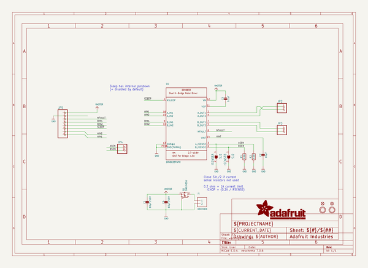
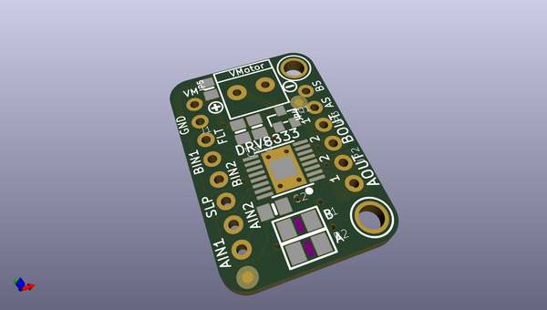
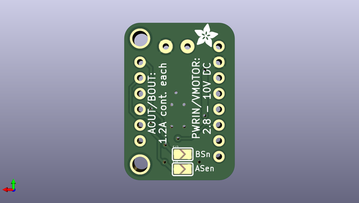

# adafruit_drv8833_motor_driver_breakout_pcb
 
## summary 
* id: adafruit_adafruit_drv8833_motor_driver_breakout_pcb_adafruit_drv8833
* user: adafruit
* name: adafruit_drv8833_motor_driver_breakout_pcb
* board: adafruit_drv8833
* repo: https://github.com/adafruit/Adafruit-DRV8833-Motor-Driver-Breakout-PCB

* src_file_repo_sch: 
*
 src_file_repo_sch_link: https://github.com/adafruit/Adafruit-DRV8833-Motor-Driver-Breakout-PCB/tree/master/
* full details link: https://github.com/oomlout/oomlout_oomp_project_bot_v_2/tree/main/projects/adafruit_adafruit_drv8833_motor_driver_breakout_pcb_adafruit_drv8833/current_version/working  

## schematic  
  
[schematic (pdf)](working_schematic.pdf)  

## pcb  
 
  
  
  
[board (pdf)](working.pdf)  

## working_bom
| Id | Designator | Footprint | Quantity | Designation | Supplier and ref |  | None | 
| --- | --- | --- | --- | --- | --- | --- | --- | 
| 1 | J1 | TERMBLOCK_1X2-3.5MM | 1 | VMOTORIN |  |  | [''] | 
| 2 | JP2,JP3,JP4 | 1X02_ROUND | 3 |  |  |  | [''] | 
| 3 | R2,R1 | _1206 | 2 | 0.2Ω |  |  | [''] | 
| 4 | JP5 | 1X08_ROUND_70 | 1 |  |  |  | [''] | 
| 5 | U$13,U$14 | MOUNTINGHOLE_2.5_PLATED | 2 | MOUNTINGHOLE2.5 |  |  | [''] | 
| 6 | C3 | 0805-NO | 1 | 0.1uF |  |  | [''] | 
| 7 | U$15 | SYMBOL_PLUS | 1 |  |  |  | [''] | 
| 8 | U1 | HTSSOP16 | 1 | DRV8833PWPR |  |  | [''] | 
| 9 | C4,C1 | 0805-NO | 2 | 10µF/16V |  |  | [''] | 
| 10 | FID1,FID2 | FIDUCIAL_1MM | 2 | FIDUCIAL" |  |  | [''] | 
| 11 | Q1 | SOT23-WIDE | 1 | DMG3415U |  |  | [''] | 
| 12 | U$16 | SYMBOL_MINUS | 1 |  |  |  | [''] | 
| 13 | C2 | 0805-NO | 1 | 10µF |  |  | [''] | 
| 14 | SJ2 | SOLDERJUMPER_ARROW_NOPASTE | 1 | ISENSEB |  |  | [''] | 
| 15 | SJ1 | SOLDERJUMPER_ARROW_NOPASTE | 1 | ISENSEA |  |  | [''] | 
| 16 | U$17 | ADAFRUIT_3.5MM | 1 |  |  |  | [''] | 

## bom_schematic
| Ref | Qnty | Value | Cmp name | Footprint | Description | Vendor | DNP | 
| --- | --- | --- | --- | --- | --- | --- | --- | 
| C1, C4 | 2 | 10µF/16V | CAP_CERAMIC0805-NOOUTLINE | working:0805-NO |  |  |  | 
| C2 | 1 | 10µF | CAP_CERAMIC0805-NOOUTLINE | working:0805-NO |  |  |  | 
| C3 | 1 | 0.1uF | CAP_CERAMIC0805-NOOUTLINE | working:0805-NO |  |  |  | 
| FID1, FID2 | 2 | FIDUCIAL"" | FIDUCIAL{dblquote}{dblquote} | working:FIDUCIAL_1MM |  |  |  | 
| J1 | 1 | VMOTORIN | TERMBLOCK_1X2 | working:TERMBLOCK_1X2-3.5MM |  |  |  | 
| JP2, JP3, JP4 | 3 | HEADER-1X2ROUND | HEADER-1X2ROUND | working:1X02_ROUND |  |  |  | 
| JP5 | 1 | HEADER-1X870MIL | HEADER-1X870MIL | working:1X08_ROUND_70 |  |  |  | 
| Q1 | 1 | DMG3415U | MOSFET-PWIDE | working:SOT23-WIDE |  |  |  | 
| R1, R2 | 2 | 0.2Ω | RESISTOR_1206 | working:_1206 |  |  |  | 
| SJ1 | 1 | ISENSEA | SOLDERJUMPER | working:SOLDERJUMPER_ARROW_NOPASTE |  |  |  | 
| SJ2 | 1 | ISENSEB | SOLDERJUMPER | working:SOLDERJUMPER_ARROW_NOPASTE |  |  |  | 
| U1 | 1 | DRV8833PWPR | DRV8833 | working:HTSSOP16 |  |  |  | 
| U$13, U$14 | 2 | MOUNTINGHOLE2.5 | MOUNTINGHOLE2.5 | working:MOUNTINGHOLE_2.5_PLATED |  |  |  | 

## mounting_holes
| x | y | package | value | ref | size | 
| --- | --- | --- | --- | --- | --- | 
| 0.0 | 20.320000000000007 | MOUNTINGHOLE_2.5_PLATED | MOUNTINGHOLE2.5 | U$13 | m3 | 
| 0.0 | 0.0 | MOUNTINGHOLE_2.5_PLATED | MOUNTINGHOLE2.5 | U$14 | m3 | 

