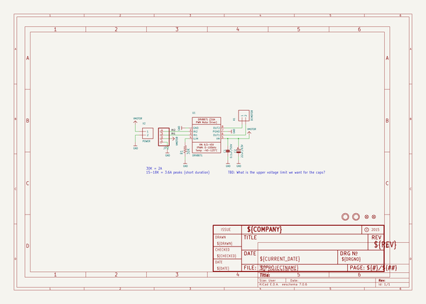
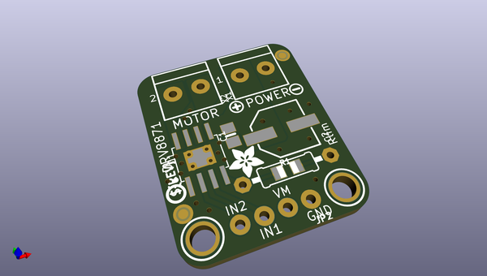
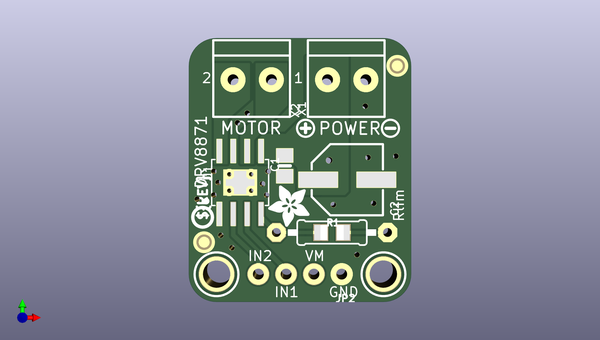
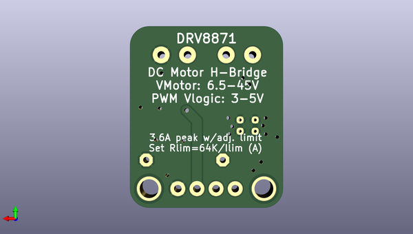

# adafruit_drv8871_breakout_pcb
 
## summary 
* id: adafruit_adafruit_drv8871_breakout_pcb_adafruit_drv8871
* user: adafruit
* name: adafruit_drv8871_breakout_pcb
* board: adafruit_drv8871
* repo: https://github.com/adafruit/Adafruit-DRV8871-Breakout-PCB

* src_file_repo_sch: 
*
 src_file_repo_sch_link: https://github.com/adafruit/Adafruit-DRV8871-Breakout-PCB/tree/master/
* full details link: https://github.com/oomlout/oomlout_oomp_project_bot_v_2/tree/main/projects/adafruit_adafruit_drv8871_breakout_pcb_adafruit_drv8871/current_version/working  

## schematic  
  
[schematic (pdf)](working_schematic.pdf)  

## pcb  
 
  
  
  
[board (pdf)](working.pdf)  

## working_bom
| Id | Designator | Footprint | Quantity | Designation | Supplier and ref |  | None | 
| --- | --- | --- | --- | --- | --- | --- | --- | 
| 1 | U$10,U$9 | MOUNTINGHOLE_2.5_PLATED | 2 | MOUNTINGHOLE2.5 |  |  | [''] | 
| 2 | U$14 | ADAFRUIT_3.5MM | 1 |  |  |  | [''] | 
| 3 | U$15 | PCBFEAT-REV-040 | 1 |  |  |  | [''] | 
| 4 | U1 | HSOP8 | 1 | DRV8871 |  |  | [''] | 
| 5 | JP2 | 1X04_ROUND_76 | 1 |  |  |  | [''] | 
| 6 | U$11 | SYMBOL_PLUS | 1 |  |  |  | [''] | 
| 7 | X1 | TERMBLOCK_1X2-3.5MM | 1 | DCMOTOR |  |  | [''] | 
| 8 | U$12 | SYMBOL_MINUS | 1 |  |  |  | [''] | 
| 9 | C2 | PANASONIC_D | 1 | 22uF/63V |  |  | [''] | 
| 10 | C1 | 0805-NO | 1 | 0.1uF/50V |  |  | [''] | 
| 11 | FID1,FID2 | FIDUCIAL_1MM | 2 | FIDUCIAL" |  |  | [''] | 
| 12 | R1 | 0805-THM | 1 | 30K |  |  | [''] | 
| 13 | X2 | TERMBLOCK_1X2-3.5MM | 1 | POWER |  |  | [''] | 

## bom_schematic
| Ref | Qnty | Value | Cmp name | Footprint | Description | Vendor | DNP | 
| --- | --- | --- | --- | --- | --- | --- | --- | 
| C1 | 1 | 0.1uF/50V | CAP_CERAMIC0805-NOOUTLINE | working:0805-NO |  |  |  | 
| C2 | 1 | 22uF/63V | CAP_ELECTROLYTICPANASONIC_D | working:PANASONIC_D |  |  |  | 
| FID1, FID2 | 2 | FIDUCIAL"" | FIDUCIAL{dblquote}{dblquote} | working:FIDUCIAL_1MM |  |  |  | 
| JP2 | 1 | HEADER-1X476MIL | HEADER-1X476MIL | working:1X04_ROUND_76 |  |  |  | 
| R1 | 1 | 30K | FLIPFLOP-RES | working:0805-THM |  |  |  | 
| U1 | 1 | DRV8871 | DRV8871 | working:HSOP8 |  |  |  | 
| U$9, U$10 | 2 | MOUNTINGHOLE2.5 | MOUNTINGHOLE2.5 | working:MOUNTINGHOLE_2.5_PLATED |  |  |  | 
| X1 | 1 | DCMOTOR | TERMBLOCK_1X2 | working:TERMBLOCK_1X2-3.5MM |  |  |  | 
| X2 | 1 | POWER | TERMBLOCK_1X2 | working:TERMBLOCK_1X2-3.5MM |  |  |  | 

## mounting_holes
| x | y | package | value | ref | size | 
| --- | --- | --- | --- | --- | --- | 
| 0.0 | 0.0 | MOUNTINGHOLE_2.5_PLATED | MOUNTINGHOLE2.5 | U$9 | m3 | 
| 15.24 | 0.0 | MOUNTINGHOLE_2.5_PLATED | MOUNTINGHOLE2.5 | U$10 | m3 | 

