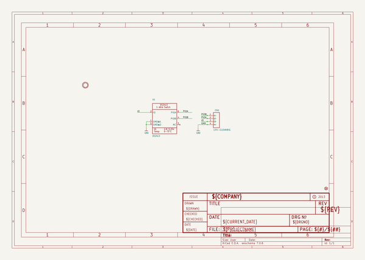
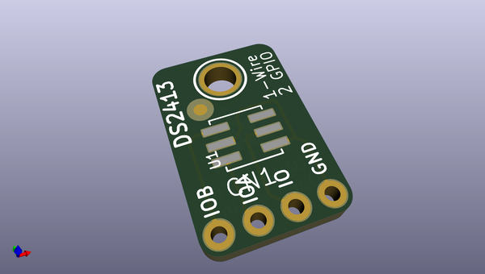
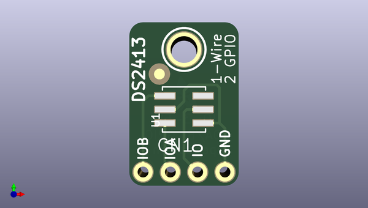
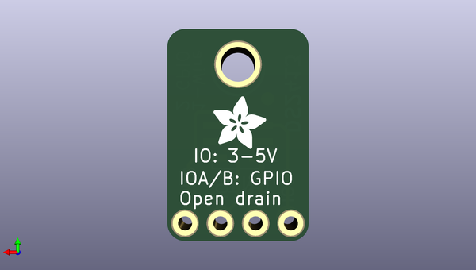

# adafruit_ds2413_pcb
 
## summary 
* id: adafruit_adafruit_ds2413_pcb_adafruit_ds2413
* user: adafruit
* name: adafruit_ds2413_pcb
* board: adafruit_ds2413
* repo: https://github.com/adafruit/Adafruit-DS2413-PCB

* src_file_repo_sch: 
*
 src_file_repo_sch_link: https://github.com/adafruit/Adafruit-DS2413-PCB/tree/master/
* full details link: https://github.com/oomlout/oomlout_oomp_project_bot_v_2/tree/main/projects/adafruit_adafruit_ds2413_pcb_adafruit_ds2413/current_version/working  

## schematic  
  
[schematic (pdf)](working_schematic.pdf)  

## pcb  
 
  
  
  
[board (pdf)](working.pdf)  

## working_bom
| Id | Designator | Footprint | Quantity | Designation | Supplier and ref |  | None | 
| --- | --- | --- | --- | --- | --- | --- | --- | 
| 1 | CN1 | 1X04-CLEANBIG | 1 | 1X4-CLEANBIG |  |  | [''] | 
| 2 | FID1 | FIDUCIAL_1MM | 1 | FIDUCIAL" |  |  | [''] | 
| 3 | U1 | DS2413_TSOC6L | 1 | DS2413 |  |  | [''] | 
| 4 | U$4 | MOUNTINGHOLE_2.5_PLATED | 1 | MOUNTINGHOLE2.5 |  |  | [''] | 
| 5 | U$3 | ADAFRUIT_3.5MM | 1 |  |  |  | [''] | 

## bom_schematic
| Ref | Qnty | Value | Cmp name | Footprint | Description | Vendor | DNP | 
| --- | --- | --- | --- | --- | --- | --- | --- | 
| CN1 | 1 | 1X4-CLEANBIG | 1X4-CLEANBIG | working:1X04-CLEANBIG |  |  |  | 
| FID1 | 1 | FIDUCIAL"" | FIDUCIAL{dblquote}{dblquote} | working:FIDUCIAL_1MM |  |  |  | 
| U1 | 1 | DS2413 | DS2413TSOC | working:DS2413_TSOC6L |  |  |  | 
| U$4 | 1 | MOUNTINGHOLE2.5 | MOUNTINGHOLE2.5 | working:MOUNTINGHOLE_2.5_PLATED |  |  |  | 

## mounting_holes
| x | y | package | value | ref | size | 
| --- | --- | --- | --- | --- | --- | 
| 0.0 | 0.0 | MOUNTINGHOLE_2.5_PLATED | MOUNTINGHOLE2.5 | U$4 | m3 | 

