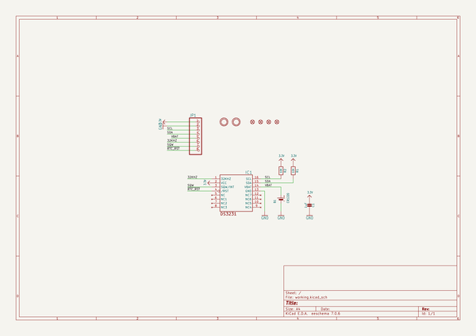
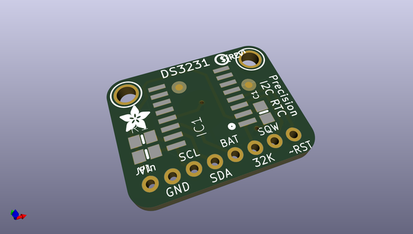
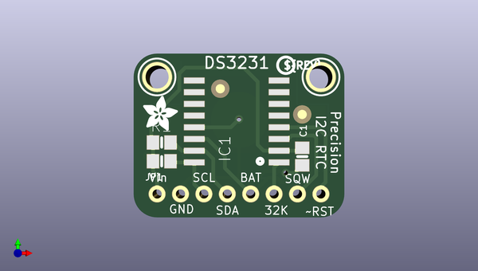
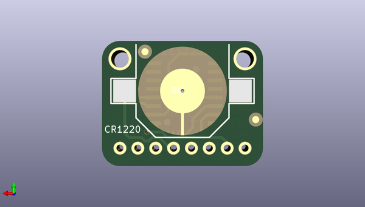

# adafruit_ds3231_precision_rtc_breakout_pcb
 
## summary 
* id: adafruit_adafruit_ds3231_precision_rtc_breakout_pcb_adafruit_ds3231_rtc_breakout
* user: adafruit
* name: adafruit_ds3231_precision_rtc_breakout_pcb
* board: adafruit_ds3231_rtc_breakout
* repo: https://github.com/adafruit/Adafruit-DS3231-Precision-RTC-Breakout-PCB

* src_file_repo_sch: 
*
 src_file_repo_sch_link: https://github.com/adafruit/Adafruit-DS3231-Precision-RTC-Breakout-PCB/tree/master/
* full details link: https://github.com/oomlout/oomlout_oomp_project_bot_v_2/tree/main/projects/adafruit_adafruit_ds3231_precision_rtc_breakout_pcb_adafruit_ds3231_rtc_breakout/current_version/working  

## schematic  
  
[schematic (pdf)](working_schematic.pdf)  

## pcb  
 
  
  
  
[board (pdf)](working.pdf)  

## working_bom
| Id | Designator | Footprint | Quantity | Designation | Supplier and ref |  | None | 
| --- | --- | --- | --- | --- | --- | --- | --- | 
| 1 | FID1,FID3,FID2,FID4 | FIDUCIAL_1MM | 4 | FIDUCIAL" |  |  | [''] | 
| 2 | U$9 | PCBFEAT-REV-040 | 1 |  |  |  | [''] | 
| 3 | U$8 | ADAFRUIT_3.5MM | 1 |  |  |  | [''] | 
| 4 | R1,R2 | 0805-NO | 2 | 10K |  |  | [''] | 
| 5 | JP1 | 1X08_ROUND_70 | 1 |  |  |  | [''] | 
| 6 | U$7,U$6 | MOUNTINGHOLE_2.5_PLATED | 2 | MOUNTINGHOLE2.5 |  |  | [''] | 
| 7 | IC1 | SO16W | 1 | DS3231/SO |  |  | [''] | 
| 8 | C1 | 0805-NO | 1 | 1uF |  |  | [''] | 
| 9 | B1 | CR1220 | 1 | CR1220 |  |  | [''] | 

## bom_schematic
| Ref | Qnty | Value | Cmp name | Footprint | Description | Vendor | DNP | 
| --- | --- | --- | --- | --- | --- | --- | --- | 
| B1 | 1 | CR1220 | BATTERYCR1220_SMT | working:CR1220 |  |  |  | 
| C1 | 1 | 1uF | CAP_CERAMIC0805-NOOUTLINE | working:0805-NO |  |  |  | 
| FID1, FID2, FID3, FID4 | 4 | FIDUCIAL"" | FIDUCIAL{dblquote}{dblquote} | working:FIDUCIAL_1MM |  |  |  | 
| IC1 | 1 | DS3231/SO | DS3231/SO | working:SO16W |  |  |  | 
| JP1 | 1 | HEADER-1X870MIL | HEADER-1X870MIL | working:1X08_ROUND_70 |  |  |  | 
| R1, R2 | 2 | 10K | RESISTOR0805_NOOUTLINE | working:0805-NO |  |  |  | 
| U$6, U$7 | 2 | MOUNTINGHOLE2.5 | MOUNTINGHOLE2.5 | working:MOUNTINGHOLE_2.5_PLATED |  |  |  | 

## mounting_holes
| x | y | package | value | ref | size | 
| --- | --- | --- | --- | --- | --- | 
| 17.78 | 0.0 | MOUNTINGHOLE_2.5_PLATED | MOUNTINGHOLE2.5 | U$6 | m3 | 
| 0.0 | 0.0 | MOUNTINGHOLE_2.5_PLATED | MOUNTINGHOLE2.5 | U$7 | m3 | 

