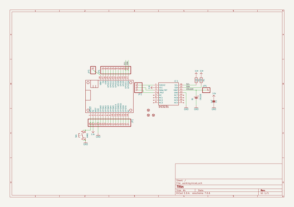
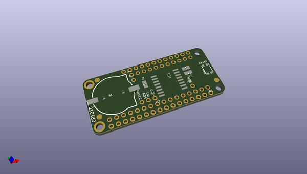
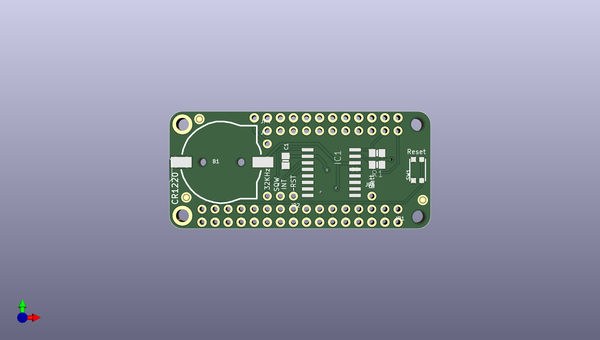
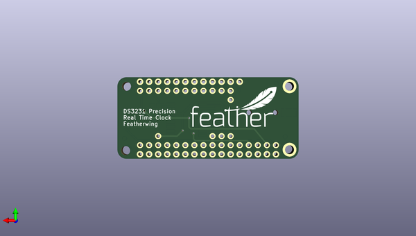

# adafruit_ds3231_precision_rtc_featherwing_pcb
 
## summary 
* id: adafruit_adafruit_ds3231_precision_rtc_featherwing_pcb_adafruit_ds3231_rtc_featherwing
* user: adafruit
* name: adafruit_ds3231_precision_rtc_featherwing_pcb
* board: adafruit_ds3231_rtc_featherwing
* repo: https://github.com/adafruit/Adafruit-DS3231-Precision-RTC-FeatherWing-PCB

* src_file_repo_sch: 
*
 src_file_repo_sch_link: https://github.com/adafruit/Adafruit-DS3231-Precision-RTC-FeatherWing-PCB/tree/master/
* full details link: https://github.com/oomlout/oomlout_oomp_project_bot_v_2/tree/main/projects/adafruit_adafruit_ds3231_precision_rtc_featherwing_pcb_adafruit_ds3231_rtc_featherwing/current_version/working  

## schematic  
  
[schematic (pdf)](working_schematic.pdf)  

## pcb  
 
  
  
  
[board (pdf)](working.pdf)  

## working_bom
| Id | Designator | Footprint | Quantity | Designation | Supplier and ref |  | None | 
| --- | --- | --- | --- | --- | --- | --- | --- | 
| 1 | JP3,JP5 | 1X01_ROUND | 2 |  |  |  | [''] | 
| 2 | JP4 | 1X11_ROUND | 1 |  |  |  | [''] | 
| 3 | R1,R2 | 0805-NO | 2 | 10K |  |  | [''] | 
| 4 | JP2 | 1X03_ROUND | 1 |  |  |  | [''] | 
| 5 | FID1,FID2,FID3 | FIDUCIAL_1MM | 3 | FIDUCIAL" |  |  | [''] | 
| 6 | B1 | CR1220-2 | 1 | CR1220 |  |  | [''] | 
| 7 | MS1 | MICROSHIELD_DIM | 1 | MICROSHIELD_NODIM |  |  | [''] | 
| 8 | IC1 | SO16W | 1 | DS3231/SO |  |  | [''] | 
| 9 | JP1 | 1X16_ROUND | 1 |  |  |  | [''] | 
| 10 | SW1 | BTN_KMR2_4.6X2.8 | 1 | KMR2 |  |  | [''] | 
| 11 | C1 | 0805-NO | 1 | 1uF |  |  | [''] | 
| 12 | U$6 | FEATHERLOGO | 1 |  |  |  | [''] | 

## bom_schematic
| Ref | Qnty | Value | Cmp name | Footprint | Description | Vendor | DNP | 
| --- | --- | --- | --- | --- | --- | --- | --- | 
| B1 | 1 | CR1220 | BATTERYCR1220_2 | working:CR1220-2 |  |  |  | 
| C1 | 1 | 1uF | CAP_CERAMIC0805-NOOUTLINE | working:0805-NO |  |  |  | 
| FID1, FID2, FID3 | 3 | FIDUCIAL"" | FIDUCIAL{dblquote}{dblquote} | working:FIDUCIAL_1MM |  |  |  | 
| IC1 | 1 | DS3231/SO | DS3231/SO | working:SO16W |  |  |  | 
| JP1 | 1 | HEADER-1X16ROUND | HEADER-1X16ROUND | working:1X16_ROUND |  |  |  | 
| JP2 | 1 | HEADER-1X3ROUND | HEADER-1X3ROUND | working:1X03_ROUND |  |  |  | 
| JP3, JP5 | 2 | HEADER-1X1ROUND | HEADER-1X1ROUND | working:1X01_ROUND |  |  |  | 
| JP4 | 1 | HEADER-1X11 | HEADER-1X11 | working:1X11_ROUND |  |  |  | 
| MS1 | 1 | MICROSHIELD_NODIM | MICROSHIELD_NODIM | working:MICROSHIELD_DIM |  |  |  | 
| R1, R2 | 2 | 10K | RESISTOR0805_NOOUTLINE | working:0805-NO |  |  |  | 
| SW1 | 1 | KMR2 | SWITCH_TACT_SMT4.6X2.8 | working:BTN_KMR2_4.6X2.8 |  |  |  | 

