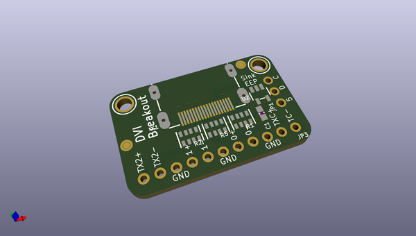

# adafruit_dvi_breakout_board_pcb
 
## summary 
* id: adafruit_adafruit_dvi_breakout_board_pcb_adafruit_dvi_breakout_board
* user: adafruit
* name: adafruit_dvi_breakout_board_pcb
* board: adafruit_dvi_breakout_board
* repo: https://github.com/adafruit/Adafruit-DVI-Breakout-Board-PCB

* src_file_repo_sch: 
*
 src_file_repo_sch_link: https://github.com/adafruit/Adafruit-DVI-Breakout-Board-PCB/tree/main/
* full details link: https://github.com/oomlout/oomlout_oomp_project_bot_v_2/tree/main/projects/adafruit_adafruit_dvi_breakout_board_pcb_adafruit_dvi_breakout_board/current_version/working  

## schematic  
  
[schematic (pdf)](working_schematic.pdf)  

## pcb  
 
  
  
  
[board (pdf)](working.pdf)  

## working_bom
| Id | Designator | Footprint | Quantity | Designation | Supplier and ref |  | None | 
| --- | --- | --- | --- | --- | --- | --- | --- | 
| 1 | U$33,U$32 | MOUNTINGHOLE_2.5_PLATED | 2 | MOUNTINGHOLE2.5 |  |  | [''] | 
| 2 | U2 | SOT23-5 | 1 | 24LC02BT-I/OT |  |  | [''] | 
| 3 | R2,R5 | RESPACK_4X0603 | 2 | 220 |  |  | [''] | 
| 4 | JP3 | 1X11_ROUND | 1 |  |  |  | [''] | 
| 5 | X1 | HDMI_MOLEX_47151-0001 | 1 | 47151-0001 |  |  | [''] | 
| 6 | R1 | RESPACK_4X0603 | 1 | 10K |  |  | [''] | 
| 7 | C1 | 0603-NO | 1 | 1uF |  |  | [''] | 
| 8 | JP1 | 1X03_ROUND | 1 |  |  |  | [''] | 
| 9 | FID2,FID1 | FIDUCIAL_1MM | 2 | FIDUCIAL_1MM |  |  | [''] | 
| 10 | U$73 | PCBFEAT-REV-040 | 1 |  |  |  | [''] | 
| 11 | U$6 | ADAFRUIT_5MM | 1 |  |  |  | [''] | 

## bom_schematic
| Ref | Qnty | Value | Cmp name | Footprint | Description | Vendor | DNP | 
| --- | --- | --- | --- | --- | --- | --- | --- | 
| C1 | 1 | 1uF | CAP_CERAMIC0603_NO | working:0603-NO |  |  |  | 
| FID1, FID2 | 2 | FIDUCIAL_1MM | FIDUCIAL_1MM | working:FIDUCIAL_1MM |  |  |  | 
| JP1 | 1 | HEADER-1X3ROUND | HEADER-1X3ROUND | working:1X03_ROUND |  |  |  | 
| JP3 | 1 | HEADER-1X11 | HEADER-1X11 | working:1X11_ROUND |  |  |  | 
| R1 | 1 | 10K | RESISTOR_4PACK | working:RESPACK_4X0603 |  |  |  | 
| R2, R5 | 2 | 220 | RESISTOR_4PACK | working:RESPACK_4X0603 |  |  |  | 
| U2 | 1 | 24LC02BT-I/OT | EEPROM_I2C_MCP24AA32 | working:SOT23-5 |  |  |  | 
| U$32, U$33 | 2 | MOUNTINGHOLE2.5 | MOUNTINGHOLE2.5 | working:MOUNTINGHOLE_2.5_PLATED |  |  |  | 
| X1 | 1 | 47151-0001 | HDMI_MOLEX_47151 | working:HDMI_MOLEX_47151-0001 |  |  |  | 

## mounting_holes
| x | y | package | value | ref | size | 
| --- | --- | --- | --- | --- | --- | 
| 0.0 | 0.0 | MOUNTINGHOLE_2.5_PLATED | MOUNTINGHOLE2.5 | U$32 | m3 | 
| 25.4 | 0.0 | MOUNTINGHOLE_2.5_PLATED | MOUNTINGHOLE2.5 | U$33 | m3 | 

