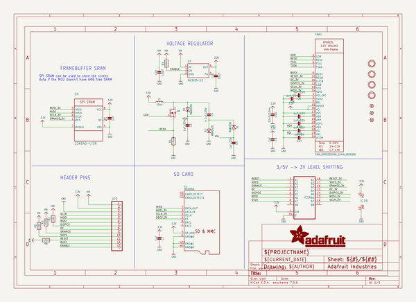
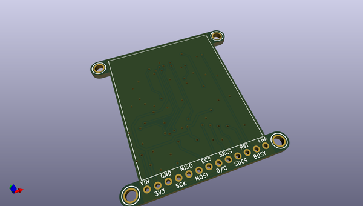
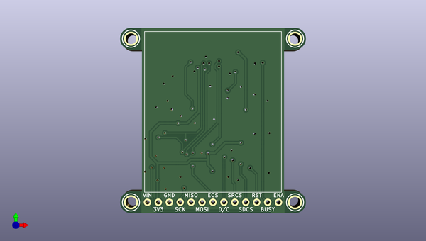
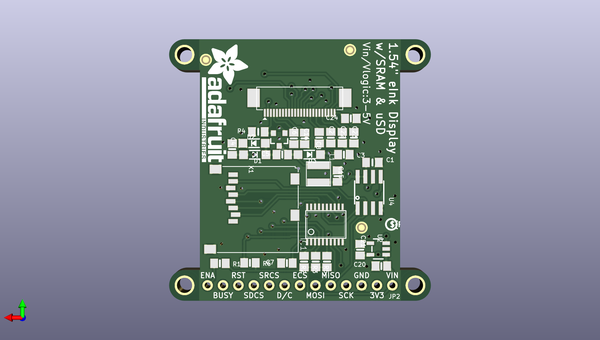

# adafruit_e_paper_display_breakout_pcbs
 
## summary 
* id: adafruit_adafruit_e_paper_display_breakout_pcbs_adafruit_2_13in_tri_color_eink_with_eyespi
* user: adafruit
* name: adafruit_e_paper_display_breakout_pcbs
* board: adafruit_2_13in_tri_color_eink_with_eyespi
* repo: https://github.com/adafruit/Adafruit-E-Paper-Display-Breakout-PCBs

* src_file_repo_sch: 
*
 src_file_repo_sch_link: https://github.com/adafruit/Adafruit-E-Paper-Display-Breakout-PCBs/tree/master/
* full details link: https://github.com/oomlout/oomlout_oomp_project_bot_v_2/tree/main/projects/adafruit_adafruit_e_paper_display_breakout_pcbs_adafruit_2_13in_tri_color_eink_with_eyespi/current_version/working  

## schematic  
  
[schematic (pdf)](working_schematic.pdf)  

## pcb  
 
  
  
  
[board (pdf)](working.pdf)  

## working_bom
| Id | Designator | Footprint | Quantity | Designation | Supplier and ref |  | None | 
| --- | --- | --- | --- | --- | --- | --- | --- | 
| 1 | U$6,U$3,U$4,U$5 | MOUNTINGHOLE_2.5_PLATED | 4 | MOUNTINGHOLE2.5 |  |  | [''] | 
| 2 | EINK1 | EINK_154IN | 1 | EINK_EPD0231EINK_154IN_200X200 |  |  | [''] | 
| 3 | JP2 | 1X13_ROUND_70 | 1 |  |  |  | [''] | 
| 4 | C8,C7 | 0805-NO | 2 | 1uF |  |  | [''] | 
| 5 | C3,C22,C23,C16,C4 | 0805-NO | 5 | 1uF/25V |  |  | [''] | 
| 6 | C20,C21 | 0805-NO | 2 | 10µF |  |  | [''] | 
| 7 | IC1 | TSSOP20 | 1 | 74LVC245PW |  |  | [''] | 
| 8 | D2,D3,D1 | SOD-123 | 3 | MBR0530 |  |  | [''] | 
| 9 | R1,R3,R5,R6,R2 | 0805-NO | 5 | 100K |  |  | [''] | 
| 10 | FID2,FID3,FID1 | FIDUCIAL_1MM | 3 | FIDUCIAL_1MM |  |  | [''] | 
| 11 | C15 | 0805-NO | 1 | 10uF/10V+ |  |  | [''] | 
| 12 | R4 | 0805_10MGAP | 1 | 0.47ohm |  |  | [''] | 
| 13 | Q5 | SOT23-3 | 1 | IRLML0100 |  |  | [''] | 
| 14 | U2 | SOT23-5 | 1 | MIC5225-3.3 |  |  | [''] | 
| 15 | L1 | INDUCTOR_4X4MM_NR401 | 1 | 10uH |  |  | [''] | 
| 16 | C2,C6 | 0805-NO | 2 | 1uF/10V |  |  | [''] | 
| 17 | U$9 | PCBFEAT-REV-040 | 1 |  |  |  | [''] | 
| 18 | C1 | 0805_10MGAP | 1 | 1uF |  |  | [''] | 
| 19 | U$28 | ADAFRUIT_TEXT_20MM | 1 |  |  |  | [''] | 
| 20 | C24 | 0805-NO | 1 | 1uF/6V |  |  | [''] | 
| 21 | U4 | SOIC8_150MIL | 1 | 23K640-I/SN |  |  | [''] | 
| 22 | C5 | 0805-NO | 1 | 4.7uF/25V |  |  | [''] | 
| 23 | X1 | MICROSD | 1 | MICROSD |  |  | [''] | 

## bom_schematic
| Ref | Qnty | Value | Cmp name | Footprint | Description | Vendor | DNP | 
| --- | --- | --- | --- | --- | --- | --- | --- | 
| C1 | 1 | 1uF | CAP_CERAMIC0805_10MGAP | working:0805_10MGAP |  |  |  | 
| C2, C6 | 2 | 1uF/10V | CAP_CERAMIC0805-NOOUTLINE | working:0805-NO |  |  |  | 
| C3, C4, C16, C22, C23 | 5 | 1uF/25V | CAP_CERAMIC0805-NOOUTLINE | working:0805-NO |  |  |  | 
| C5 | 1 | 4.7uF/25V | CAP_CERAMIC0805-NOOUTLINE | working:0805-NO |  |  |  | 
| C7, C8 | 2 | 1uF | CAP_CERAMIC0805-NOOUTLINE | working:0805-NO |  |  |  | 
| C15 | 1 | 10uF/10V+ | CAP_CERAMIC0805-NOOUTLINE | working:0805-NO |  |  |  | 
| C20, C21 | 2 | 10µF | CAP_CERAMIC0805-NOOUTLINE | working:0805-NO |  |  |  | 
| C24 | 1 | 1uF/6V | CAP_CERAMIC0805-NOOUTLINE | working:0805-NO |  |  |  | 
| D1, D2, D3 | 3 | MBR0530 | DIODE-SCHOTTKYSOD-123 | working:SOD-123 |  |  |  | 
| EINK1 | 1 | EINK_EPD0231EINK_154IN_200X200 | EINK_EPD0231EINK_154IN_200X200 | working:EINK_154IN |  |  |  | 
| FID1, FID2, FID3 | 3 | FIDUCIAL_1MM | FIDUCIAL_1MM | working:FIDUCIAL_1MM |  |  |  | 
| IC1 | 1 | 74245TSSOP20 | 74245TSSOP20 | working:TSSOP20 |  |  |  | 
| JP2 | 1 | HEADER-1X13 | HEADER-1X13 | working:1X13_ROUND_70 |  |  |  | 
| L1 | 1 | 10uH | INDUCTORNR401 | working:INDUCTOR_4X4MM_NR401 |  |  |  | 
| Q5 | 1 | IRLML2060TRPBF | IRLML2060TRPBF | working:SOT23-3 |  |  |  | 
| R1, R2, R3, R5, R6 | 5 | 100K | RESISTOR0805_NOOUTLINE | working:0805-NO |  |  |  | 
| R4 | 1 | 0.47ohm | RESISTOR0805_10MGAP | working:0805_10MGAP |  |  |  | 
| U2 | 1 | MIC5225-3.3 | VREG_SOT23-5 | working:SOT23-5 |  |  |  | 
| U4 | 1 | 23K640-I/SN | SRAM_SPI_SOIC8 | working:SOIC8_150MIL |  |  |  | 
| U$3, U$4, U$5, U$6 | 4 | MOUNTINGHOLE2.5 | MOUNTINGHOLE2.5 | working:MOUNTINGHOLE_2.5_PLATED |  |  |  | 
| X1 | 1 | MICROSD | MICROSD | working:MICROSD |  |  |  | 

## mounting_holes
| x | y | package | value | ref | size | 
| --- | --- | --- | --- | --- | --- | 
| 0.0 | 0.0 | MOUNTINGHOLE_2.5_PLATED | MOUNTINGHOLE2.5 | U$3 | m3 | 
| 38.099999999999994 | 0.0 | MOUNTINGHOLE_2.5_PLATED | MOUNTINGHOLE2.5 | U$4 | m3 | 
| 0.0 | 38.10000000000001 | MOUNTINGHOLE_2.5_PLATED | MOUNTINGHOLE2.5 | U$5 | m3 | 
| 38.099999999999994 | 38.10000000000001 | MOUNTINGHOLE_2.5_PLATED | MOUNTINGHOLE2.5 | U$6 | m3 | 

