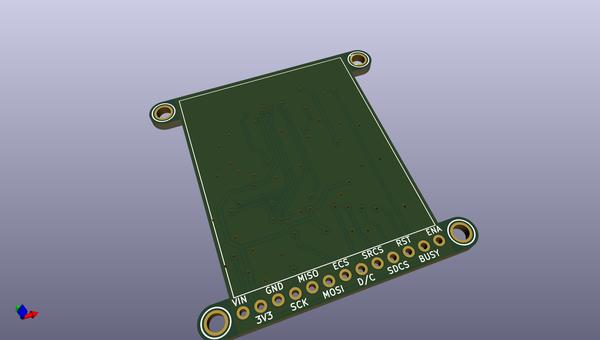
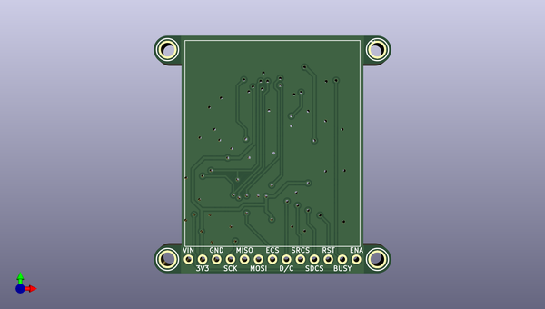
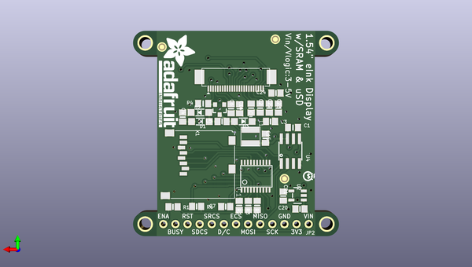

# adafruit_e_paper_display_breakout_pcbs
 
## summary 
* id: adafruit_adafruit_e_paper_display_breakout_pcbs_adafruit_2_7in_tri_color_eink_display
* user: adafruit
* name: adafruit_e_paper_display_breakout_pcbs
* board: adafruit_2_7in_tri_color_eink_display
* repo: https://github.com/adafruit/Adafruit-E-Paper-Display-Breakout-PCBs

* src_file_repo_sch: 
*
 src_file_repo_sch_link: https://github.com/adafruit/Adafruit-E-Paper-Display-Breakout-PCBs/tree/master/
* full details link: https://github.com/oomlout/oomlout_oomp_project_bot_v_2/tree/main/projects/adafruit_adafruit_e_paper_display_breakout_pcbs_adafruit_2_7in_tri_color_eink_display/current_version/working  

## pcb  
 
  
  
  
[board (pdf)](working.pdf)  

## working_bom
| Id | Designator | Footprint | Quantity | Designation | Supplier and ref |  | None | 
| --- | --- | --- | --- | --- | --- | --- | --- | 
| 1 | EINK1 | EINK_154IN | 1 | EINK_EPD0231EINK_154IN_200X200 |  |  | [''] | 
| 2 | U$3,U$4,U$6,U$5 | MOUNTINGHOLE_2.5_PLATED | 4 | MOUNTINGHOLE2.5 |  |  | [''] | 
| 3 | C1 | 0805_10MGAP | 1 | 1uF |  |  | [''] | 
| 4 | C22,C23,C4,C16,C3 | 0805-NO | 5 | 1uF/25V |  |  | [''] | 
| 5 | FID2,FID3,FID1 | FIDUCIAL_1MM | 3 | FIDUCIAL_1MM |  |  | [''] | 
| 6 | D3,D2,D1 | SOD-123 | 3 | MBR0530 |  |  | [''] | 
| 7 | R5,R2,R3,R6,R1 | 0805-NO | 5 | 100K |  |  | [''] | 
| 8 | IC1 | TSSOP20 | 1 | 74LVC245PW |  |  | [''] | 
| 9 | C6,C2 | 0805-NO | 2 | 1uF/10V |  |  | [''] | 
| 10 | L1 | INDUCTOR_4X4MM_NR401 | 1 | 10uH |  |  | [''] | 
| 11 | C15 | 0805-NO | 1 | 10uF/10V+ |  |  | [''] | 
| 12 | C24 | 0805-NO | 1 | 1uF/6V |  |  | [''] | 
| 13 | C8,C7 | 0805-NO | 2 | 1uF |  |  | [''] | 
| 14 | C20,C21 | 0805-NO | 2 | 10µF |  |  | [''] | 
| 15 | X1 | MICROSD | 1 | MICROSD |  |  | [''] | 
| 16 | U$28 | ADAFRUIT_TEXT_20MM | 1 |  |  |  | [''] | 
| 17 | R4 | 0805_10MGAP | 1 | 0.47ohm |  |  | [''] | 
| 18 | C5 | 0805-NO | 1 | 4.7uF/25V |  |  | [''] | 
| 19 | U$9 | PCBFEAT-REV-040 | 1 |  |  |  | [''] | 
| 20 | JP2 | 1X13_ROUND_70 | 1 |  |  |  | [''] | 
| 21 | U4 | SOIC8_150MIL | 1 | 23K640-I/SN |  |  | [''] | 
| 22 | U2 | SOT23-5 | 1 | MIC5225-3.3 |  |  | [''] | 
| 23 | Q5 | SOT23-3 | 1 | IRLML0100 |  |  | [''] | 

## mounting_holes
| x | y | package | value | ref | size | 
| --- | --- | --- | --- | --- | --- | 
| 0.0 | 0.0 | MOUNTINGHOLE_2.5_PLATED | MOUNTINGHOLE2.5 | U$3 | m3 | 
| 38.099999999999994 | 0.0 | MOUNTINGHOLE_2.5_PLATED | MOUNTINGHOLE2.5 | U$4 | m3 | 
| 0.0 | 38.10000000000001 | MOUNTINGHOLE_2.5_PLATED | MOUNTINGHOLE2.5 | U$5 | m3 | 
| 38.099999999999994 | 38.10000000000001 | MOUNTINGHOLE_2.5_PLATED | MOUNTINGHOLE2.5 | U$6 | m3 | 

