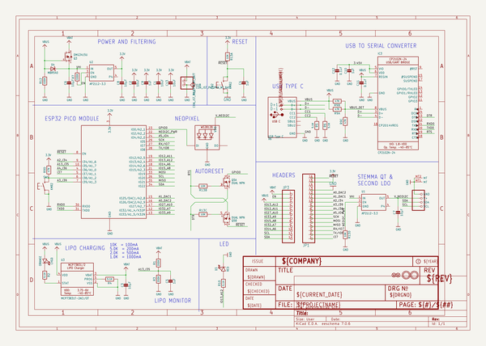

# adafruit_esp32_feather_v2_pcb
 
## summary 
* id: adafruit_adafruit_esp32_feather_v2_pcb_adafruit_esp32_feather_v2
* user: adafruit
* name: adafruit_esp32_feather_v2_pcb
* board: adafruit_esp32_feather_v2
* repo: https://github.com/adafruit/Adafruit-ESP32-Feather-V2-PCB

* src_file_repo_sch: 
*
 src_file_repo_sch_link: https://github.com/adafruit/Adafruit-ESP32-Feather-V2-PCB/tree/main/
* full details link: https://github.com/oomlout/oomlout_oomp_project_bot_v_2/tree/main/projects/adafruit_adafruit_esp32_feather_v2_pcb_adafruit_esp32_feather_v2/current_version/working  

## schematic  
  
[schematic (pdf)](working_schematic.pdf)  

## pcb  
 
  
  
  
[board (pdf)](working.pdf)  

## working_bom
| Id | Designator | Footprint | Quantity | Designation | Supplier and ref |  | None | 
| --- | --- | --- | --- | --- | --- | --- | --- | 
| 1 | LED1 | LED3535 | 1 | WS2812B3535 |  |  | [''] | 
| 2 | R9 | RESPACK_4X0603 | 1 | 47K |  |  | [''] | 
| 3 | D4 | SOD-123 | 1 | MBR540 |  |  | [''] | 
| 4 | R3,R1 | 0603-NO | 2 | 200K |  |  | [''] | 
| 5 | R4,R2,R5,R6,R10 | 0603-NO | 5 | 5.1K |  |  | [''] | 
| 6 | U$34,U$35 | FIDUCIAL_1MM | 2 | FIDUCIAL_1MM |  |  | [''] | 
| 7 | C1,C2,C13 | 0805-NO | 3 | 10uF |  |  | [''] | 
| 8 | JP1 | 1X16_ROUND | 1 |  |  |  | [''] | 
| 9 | U$31,U$32 | MOUNTINGHOLE_2.5_PLATED | 2 | MOUNTINGHOLE2.5 |  |  | [''] | 
| 10 | CHG0 | CHIPLED_0603_NOOUTLINE | 1 | ORANGE |  |  | [''] | 
| 11 | U2,U1 | SOT23-5 | 2 | AP2112-3.3 |  |  | [''] | 
| 12 | C8,C3,C7,C6 | 0805-NO | 4 | 10µF |  |  | [''] | 
| 13 | C5,C4,C9,C10 | 0603-NO | 4 | 1uF |  |  | [''] | 
| 14 | Q5 | SOT363 | 1 | DUAL NPN |  |  | [''] | 
| 15 | @HOLE0,@HOLE1 |  | 2 |  |  |  | [''] | 
| 16 | U$14 | ADAFRUIT_2.5MM | 1 |  |  |  | [''] | 
| 17 | JP3 | 1X12_ROUND | 1 |  |  |  | [''] | 
| 18 | D3 | CHIPLED_0603_NOOUTLINE | 1 | RED |  |  | [''] | 
| 19 | U$15 | ADAFRUIT_3.5MM | 1 |  |  |  | [''] | 
| 20 | R7,R12 | 0603-NO | 2 | 100K |  |  | [''] | 
| 21 | CONN1 | JST_SH4_RA | 1 | STEMMA_I2C_QTRA |  |  | [''] | 
| 22 | X6 | USB_C_CUSB31-CFM2AX-01-X | 1 | USB Type C |  |  | [''] | 
| 23 | SW1,SW2 | BTN_KMR2_4.6X2.8 | 2 | KMR2 |  |  | [''] | 
| 24 | IC3 | QFN24_4MM_SMSC | 1 | CP2102N-24 |  |  | [''] | 
| 25 | Q3 | SOT23-R | 1 | DMG3415U |  |  | [''] | 
| 26 | R13 | RESPACK_4X0603 | 1 | 10K |  |  | [''] | 
| 27 | C12,C11 | 0603-NO | 2 | 0.1uF |  |  | [''] | 
| 28 | X3 | ESP32-PICO-MINI | 1 | ESP32-PICO-MINI-02MINI |  |  | [''] | 
| 29 | U3 | SOT23-5 | 1 | MCP73831T-2ACI/OT |  |  | [''] | 
| 30 | X1 | JSTPH2_BATT | 1 | JSTPH |  |  | [''] | 
| 31 | D+1,D-1 | B1,27 | 2 | TPB1,27 |  |  | [''] | 
| 32 | U$43 | HUZZAH32 | 1 |  |  |  | [''] | 
| 33 | U$7 | ADAFRUIT_5MM | 1 |  |  |  | [''] | 
| 34 | U$13 | PCBFEAT-REV-040 | 1 |  |  |  | [''] | 
| 35 | U$9 | FEATHERLOGO_MED | 1 |  |  |  | [''] | 

## bom_schematic
| Ref | Qnty | Value | Cmp name | Footprint | Description | Vendor | DNP | 
| --- | --- | --- | --- | --- | --- | --- | --- | 
| C1, C2, C13 | 3 | 10uF | CAP_CERAMIC0805-NOOUTLINE | working:0805-NO |  |  |  | 
| C3, C6, C7, C8 | 4 | 10µF | CAP_CERAMIC0805-NOOUTLINE | working:0805-NO |  |  |  | 
| C4, C5, C9, C10 | 4 | 1uF | CAP_CERAMIC0603_NO | working:0603-NO |  |  |  | 
| C11, C12 | 2 | 0.1uF | CAP_CERAMIC0603_NO | working:0603-NO |  |  |  | 
| CHG0 | 1 | ORANGE | LED0603_NOOUTLINE | working:CHIPLED_0603_NOOUTLINE |  |  |  | 
| CONN1 | 1 | STEMMA_I2C_QTRA | STEMMA_I2C_QTRA | working:JST_SH4_RA |  |  |  | 
| D3 | 1 | RED | LED0603_NOOUTLINE | working:CHIPLED_0603_NOOUTLINE |  |  |  | 
| D4 | 1 | MBR540 | DIODE-SCHOTTKYSOD-123 | working:SOD-123 |  |  |  | 
| D+1 | 1 | TPB1,27 | TPB1,27 | working:B1,27 |  |  |  | 
| D-1 | 1 | TPB1,27 | TPB1,27 | working:B1,27 |  |  |  | 
| IC3 | 1 | CP2102N-24 | CP2102N-24 | working:QFN24_4MM_SMSC |  |  |  | 
| JP1 | 1 | HEADER-1X16ROUND | HEADER-1X16ROUND | working:1X16_ROUND |  |  |  | 
| JP3 | 1 | HEADER-1X12 | HEADER-1X12 | working:1X12_ROUND |  |  |  | 
| LED1 | 1 | WS2812B3535 | WS2812B3535 | working:LED3535 |  |  |  | 
| Q3 | 1 | DMG3415U | MOSFET-P | working:SOT23-R |  |  |  | 
| Q5 | 1 | DUAL NPN | MOSFET-N_DUAL | working:SOT363 |  |  |  | 
| R1, R3 | 2 | 200K | RESISTOR_0603_NOOUT | working:0603-NO |  |  |  | 
| R2, R4, R5, R6, R10 | 5 | 5.1K | RESISTOR_0603_NOOUT | working:0603-NO |  |  |  | 
| R7, R12 | 2 | 100K | RESISTOR_0603_NOOUT | working:0603-NO |  |  |  | 
| R9 | 1 | 47K | RESISTOR_4PACK | working:RESPACK_4X0603 |  |  |  | 
| R13 | 1 | 10K | RESISTOR_4PACK | working:RESPACK_4X0603 |  |  |  | 
| SW1, SW2 | 2 | KMR2 | SWITCH_TACT_SMT4.6X2.8 | working:BTN_KMR2_4.6X2.8 |  |  |  | 
| U1, U2 | 2 | AP2112-3.3 | VREG_SOT23-5 | working:SOT23-5 |  |  |  | 
| U3 | 1 | MCP73831T-2ACI/OT | MCP73831/2 | working:SOT23-5 |  |  |  | 
| U$31, U$32 | 2 | MOUNTINGHOLE2.5 | MOUNTINGHOLE2.5 | working:MOUNTINGHOLE_2.5_PLATED |  |  |  | 
| U$34, U$35 | 2 | FIDUCIAL_1MM | FIDUCIAL_1MM | working:FIDUCIAL_1MM |  |  |  | 
| X1 | 1 | CON_JST_PH_2PIN_MT_BATT | CON_JST_PH_2PIN_MT_BATT | working:JSTPH2_BATT |  |  |  | 
| X3 | 1 | ESP32-PICO-MINI-02MINI | ESP32-PICO-MINI-02MINI | working:ESP32-PICO-MINI |  |  |  | 
| X6 | 1 | USB Type C | USB_C | working:USB_C_CUSB31-CFM2AX-01-X |  |  |  | 

## mounting_holes
| x | y | package | value | ref | size | 
| --- | --- | --- | --- | --- | --- | 
| 0.0 | 17.78 | MOUNTINGHOLE_2.5_PLATED | MOUNTINGHOLE2.5 | U$31 | m3 | 
| 0.0 | 0.0 | MOUNTINGHOLE_2.5_PLATED | MOUNTINGHOLE2.5 | U$32 | m3 | 

