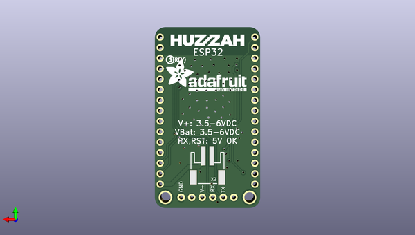

# adafruit_esp32_huzzah_breakout_pcb
 
## summary 
* id: adafruit_adafruit_esp32_huzzah_breakout_pcb_adafruit_esp32_huzzah_breakout
* user: adafruit
* name: adafruit_esp32_huzzah_breakout_pcb
* board: adafruit_esp32_huzzah_breakout
* repo: https://github.com/adafruit/Adafruit-ESP32-HUZZAH-Breakout-PCB

* src_file_repo_sch: 
*
 src_file_repo_sch_link: https://github.com/adafruit/Adafruit-ESP32-HUZZAH-Breakout-PCB/tree/master/
* full details link: https://github.com/oomlout/oomlout_oomp_project_bot_v_2/tree/main/projects/adafruit_adafruit_esp32_huzzah_breakout_pcb_adafruit_esp32_huzzah_breakout/current_version/working  

## schematic  
  
[schematic (pdf)](working_schematic.pdf)  

## pcb  
 
  
  
  
[board (pdf)](working.pdf)  

## working_bom
| Id | Designator | Footprint | Quantity | Designation | Supplier and ref |  | None | 
| --- | --- | --- | --- | --- | --- | --- | --- | 
| 1 | U$3 | ADAFRUIT_2.5MM | 1 |  |  |  | [''] | 
| 2 | C2,C1,C4,C3 | 0805-NO | 4 | 10uF |  |  | [''] | 
| 3 | FID1,FID3 | FIDUCIAL_1MM | 2 | FIDUCIAL_1MM |  |  | [''] | 
| 4 | D6,D5 | SOD-123 | 2 | MBR120 |  |  | [''] | 
| 5 | JP1 | 1X06_ROUND_70 | 1 | FTDI |  |  | [''] | 
| 6 | U$15,U$16 | MOUNTINGHOLE_2.5_PLATED | 2 | MOUNTINGHOLE2.5 |  |  | [''] | 
| 7 | JP2,JP5 | 1X15_ROUND_70 | 2 |  |  |  | [''] | 
| 8 | D1,D2 | SOD-323 | 2 | 1n4148 |  |  | [''] | 
| 9 | C5 | 0805-NO | 1 | 1uF |  |  | [''] | 
| 10 | R2 | 0603-NO | 1 | 1K |  |  | [''] | 
| 11 | SW2,SW1 | BTN_KMR2_4.6X2.8 | 2 | KMR2 |  |  | [''] | 
| 12 | D3 | CHIPLED_0805_NOOUTLINE | 1 | RED |  |  | [''] | 
| 13 | R4 | 0603-NO | 1 | 10K |  |  | [''] | 
| 14 | U1 | SOT23-5 | 1 | AP2112-3.3 |  |  | [''] | 
| 15 | X1 | WROOM32 | 1 | ESP32_WROOM32 |  |  | [''] | 
| 16 | U$12 | ADAFRUIT_TEXT_20MM | 1 |  |  |  | [''] | 
| 17 | U$2 | HUZZAHLOGO | 1 |  |  |  | [''] | 
| 18 | X2 | JSTPH2 | 1 | JSTPH |  |  | [''] | 
| 19 | U$13 | PCBFEAT-REV-040 | 1 |  |  |  | [''] | 

## bom_schematic
| Ref | Qnty | Value | Cmp name | Footprint | Description | Vendor | DNP | 
| --- | --- | --- | --- | --- | --- | --- | --- | 
| C1, C2, C3, C4 | 4 | 10uF | CAP_CERAMIC0805-NOOUTLINE | working:0805-NO |  |  |  | 
| C5 | 1 | 1uF | CAP_CERAMIC0805-NOOUTLINE | working:0805-NO |  |  |  | 
| D1, D2 | 2 | 1n4148 | DIODESOD-323 | working:SOD-323 |  |  |  | 
| D3 | 1 | RED | LED0805_NOOUTLINE | working:CHIPLED_0805_NOOUTLINE |  |  |  | 
| D5, D6 | 2 | MBR120 | DIODE-SCHOTTKYSOD-123 | working:SOD-123 |  |  |  | 
| FID1, FID3 | 2 | FIDUCIAL_1MM | FIDUCIAL_1MM | working:FIDUCIAL_1MM |  |  |  | 
| JP1 | 1 | FTDI | HEADER-1X670MIL | working:1X06_ROUND_70 |  |  |  | 
| JP2, JP5 | 2 | HEADER-1X15 | HEADER-1X15 | working:1X15_ROUND_70 |  |  |  | 
| R2 | 1 | 1K | RESISTOR_0603_NOOUT | working:0603-NO |  |  |  | 
| R4 | 1 | 10K | RESISTOR_0603_NOOUT | working:0603-NO |  |  |  | 
| SW1, SW2 | 2 | KMR2 | SWITCH_TACT_SMT4.6X2.8 | working:BTN_KMR2_4.6X2.8 |  |  |  | 
| U1 | 1 | AP2112-3.3 | VREG_SOT23-5 | working:SOT23-5 |  |  |  | 
| U$15, U$16 | 2 | MOUNTINGHOLE2.5 | MOUNTINGHOLE2.5 | working:MOUNTINGHOLE_2.5_PLATED |  |  |  | 
| X1 | 1 | ESP32_WROOM32 | ESP32_WROOM32 | working:WROOM32 |  |  |  | 
| X2 | 1 | JSTPH | CON_JST_PH_2PIN | working:JSTPH2 |  |  |  | 

## mounting_holes
| x | y | package | value | ref | size | 
| --- | --- | --- | --- | --- | --- | 
| 0.0 | 0.0 | MOUNTINGHOLE_2.5_PLATED | MOUNTINGHOLE2.5 | U$15 | m3 | 
| 20.32 | 0.0 | MOUNTINGHOLE_2.5_PLATED | MOUNTINGHOLE2.5 | U$16 | m3 | 

