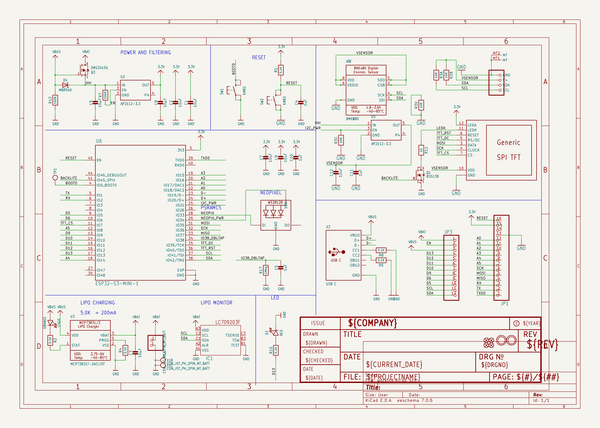
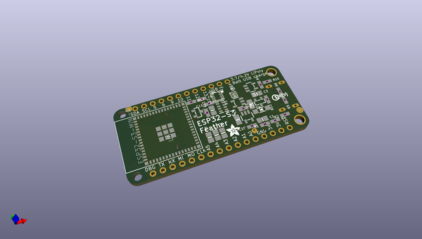
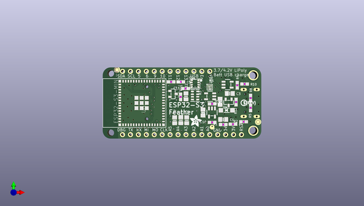
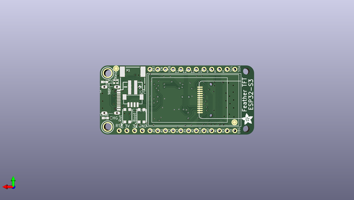

# adafruit_esp32_s3_tft_feather_pcb
 
## summary 
* id: adafruit_adafruit_esp32_s3_tft_feather_pcb_adafruit_esp32_s3_tft_feather
* user: adafruit
* name: adafruit_esp32_s3_tft_feather_pcb
* board: adafruit_esp32_s3_tft_feather
* repo: https://github.com/adafruit/Adafruit-ESP32-S3-TFT-Feather-PCB

* src_file_repo_sch: 
*
 src_file_repo_sch_link: https://github.com/adafruit/Adafruit-ESP32-S3-TFT-Feather-PCB/tree/main/
* full details link: https://github.com/oomlout/oomlout_oomp_project_bot_v_2/tree/main/projects/adafruit_adafruit_esp32_s3_tft_feather_pcb_adafruit_esp32_s3_tft_feather/current_version/working  

## schematic  
  
[schematic (pdf)](working_schematic.pdf)  

## pcb  
 
  
  
  
[board (pdf)](working.pdf)  

## working_bom
| Id | Designator | Footprint | Quantity | Designation | Supplier and ref |  | None | 
| --- | --- | --- | --- | --- | --- | --- | --- | 
| 1 | U3 | SOT23-5 | 1 | MCP73831T-2ACI/OT |  |  | [''] | 
| 2 | U2,U5 | SOT23-5 | 2 | AP2112-3.3 |  |  | [''] | 
| 3 | C2,C12,C7,C1,C9 | 0805-NO | 5 | 10uF |  |  | [''] | 
| 4 | C11,C5,C4,C10 | 0603-NO | 4 | 1uF |  |  | [''] | 
| 5 | R17 | 0603-NO | 1 | 1Meg |  |  | [''] | 
| 6 | U4 | BME280 | 1 | BME280 |  |  | [''] | 
| 7 | R4,R10,R2,R5,R1,R8 | 0603-NO | 6 | 5.1K |  |  | [''] | 
| 8 | U$7 | PCBFEAT-REV-040 | 1 |  |  |  | [''] | 
| 9 | R3 | RESPACK_4X0603 | 1 | 10K |  |  | [''] | 
| 10 | IC1 | WLCSP9 | 1 | LC709203F/MH |  |  | [''] | 
| 11 | R12,R7 | 0603-NO | 2 | 100K |  |  | [''] | 
| 12 | Q3 | SOT23-R | 1 | DMG3415U |  |  | [''] | 
| 13 | U$56,U$55,U$35,U$34 | FIDUCIAL_1MM | 4 | FIDUCIAL_1MM |  |  | [''] | 
| 14 | IC2 | BME680 | 1 | BME680 |  |  | [''] | 
| 15 | TP1 | TESTPOINT_ROUND_1.5MM_NO | 1 |  |  |  | [''] | 
| 16 | Q1 | SOT23-R | 1 | BSS138 |  |  | [''] | 
| 17 | D4 | SOD-123 | 1 | MBR540 |  |  | [''] | 
| 18 | @HOLE1,@HOLE0 |  | 2 |  |  |  | [''] | 
| 19 | C3,C6,C8 | 0805-NO | 3 | 10µF |  |  | [''] | 
| 20 | R11 | 0603-NO | 1 | 22 |  |  | [''] | 
| 21 | U6 | QFN60_ESP32-S2-MINI-1_EXP | 1 | ESP32-S3-MINI-1 |  |  | [''] | 
| 22 | U$54,U$9 | ADAFRUIT_3.5MM | 2 |  |  |  | [''] | 
| 23 | JP3 | 1X12_ROUND_MIN | 1 |  |  |  | [''] | 
| 24 | D3 | CHIPLED_0603_NOOUTLINE | 1 | RED |  |  | [''] | 
| 25 | CHG0 | CHIPLED_0603_NOOUTLINE | 1 | ORANGE |  |  | [''] | 
| 26 | X1 | JSTPH2_BATT | 1 | JSTPH |  |  | [''] | 
| 27 | DISP1 | TFT_1.14IN_240X135_WRAPUNDER | 1 | DISP_LCD_GENERIC_SPI_1.14IN_240X135_WRAPUNDER |  |  | [''] | 
| 28 | X3 | USB_C_CUSB31-CFM2AX-01-X | 1 | USB C |  |  | [''] | 
| 29 | SW2,SW1 | BTN_KMR2_4.6X2.8 | 2 | KMR2 |  |  | [''] | 
| 30 | U$32,U$31 | MOUNTINGHOLE_2.5_PLATED | 2 | MOUNTINGHOLE2.5 |  |  | [''] | 
| 31 | LED1 | SK6805_1515 | 1 | WS2812B_SK6805_1515 |  |  | [''] | 
| 32 | JP1 | 1X16_ROUND_MIN | 1 |  |  |  | [''] | 
| 33 | CONN1 | JST_SH4_RA | 1 | STEMMA_I2C_QTRA |  |  | [''] | 

## bom_schematic
| Ref | Qnty | Value | Cmp name | Footprint | Description | Vendor | DNP | 
| --- | --- | --- | --- | --- | --- | --- | --- | 
| C1, C2, C7, C9, C12 | 5 | 10uF | CAP_CERAMIC0805-NOOUTLINE | working:0805-NO |  |  |  | 
| C3, C6, C8 | 3 | 10µF | CAP_CERAMIC0805-NOOUTLINE | working:0805-NO |  |  |  | 
| C4, C5, C10, C11 | 4 | 1uF | CAP_CERAMIC0603_NO | working:0603-NO |  |  |  | 
| CHG0 | 1 | ORANGE | LED0603_NOOUTLINE | working:CHIPLED_0603_NOOUTLINE |  |  |  | 
| CONN1 | 1 | STEMMA_I2C_QTRA | STEMMA_I2C_QTRA | working:JST_SH4_RA |  |  |  | 
| D3 | 1 | RED | LED0603_NOOUTLINE | working:CHIPLED_0603_NOOUTLINE |  |  |  | 
| D4 | 1 | MBR540 | DIODE-SCHOTTKYSOD-123 | working:SOD-123 |  |  |  | 
| DISP1 | 1 | DISP_LCD_GENERIC_SPI_1.14IN_240X135_WRAPUNDER | DISP_LCD_GENERIC_SPI_1.14IN_240X135_WRAPUNDER | working:TFT_1.14IN_240X135_WRAPUNDER |  |  |  | 
| IC1 | 1 | LC709203F/MH | LC709203F/MH | working:WLCSP9 |  |  |  | 
| IC2 | 1 | BME680 | BME680 | working:BME680 |  |  |  | 
| JP1 | 1 | HEADER-1X16_MIN | HEADER-1X16_MIN | working:1X16_ROUND_MIN |  |  |  | 
| JP3 | 1 | HEADER-1X12_MIN | HEADER-1X12_MIN | working:1X12_ROUND_MIN |  |  |  | 
| LED1 | 1 | WS2812B_SK6805_1515 | WS2812B_SK6805_1515 | working:SK6805_1515 |  |  |  | 
| Q1 | 1 | BSS138 | MOSFET-NREFLOW | working:SOT23-R |  |  |  | 
| Q3 | 1 | DMG3415U | MOSFET-P | working:SOT23-R |  |  |  | 
| R1, R2, R4, R5, R8, R10 | 6 | 5.1K | RESISTOR_0603_NOOUT | working:0603-NO |  |  |  | 
| R3 | 1 | 10K | RESISTOR_4PACK | working:RESPACK_4X0603 |  |  |  | 
| R7, R12 | 2 | 100K | RESISTOR_0603_NOOUT | working:0603-NO |  |  |  | 
| R11 | 1 | 22 | RESISTOR_0603_NOOUT | working:0603-NO |  |  |  | 
| R17 | 1 | 1Meg | RESISTOR_0603_NOOUT | working:0603-NO |  |  |  | 
| SW1, SW2 | 2 | KMR2 | SWITCH_TACT_SMT4.6X2.8 | working:BTN_KMR2_4.6X2.8 |  |  |  | 
| TP1 | 1 | TESTPOINTROUND1.5MMNO | TESTPOINTROUND1.5MMNO | working:TESTPOINT_ROUND_1.5MM_NO |  |  |  | 
| U2, U5 | 2 | AP2112-3.3 | VREG_SOT23-5 | working:SOT23-5 |  |  |  | 
| U3 | 1 | MCP73831T-2ACI/OT | MCP73831/2 | working:SOT23-5 |  |  |  | 
| U4 | 1 | BME280 | BME280 | working:BME280 |  |  |  | 
| U6 | 1 | ESP32-S3-MINI-1 | ESP32-S3-MINI-1 | working:QFN60_ESP32-S2-MINI-1_EXP |  |  |  | 
| U$31, U$32 | 2 | MOUNTINGHOLE2.5 | MOUNTINGHOLE2.5 | working:MOUNTINGHOLE_2.5_PLATED |  |  |  | 
| U$34, U$35, U$55, U$56 | 4 | FIDUCIAL_1MM | FIDUCIAL_1MM | working:FIDUCIAL_1MM |  |  |  | 
| X1 | 1 | CON_JST_PH_2PIN_MT_BATT | CON_JST_PH_2PIN_MT_BATT | working:JSTPH2_BATT |  |  |  | 
| X3 | 1 | USB C | USB_C | working:USB_C_CUSB31-CFM2AX-01-X |  |  |  | 

