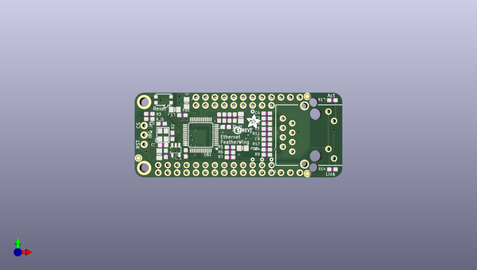

# adafruit_ethernet_featherwing_pcb
 
## summary 
* id: adafruit_adafruit_ethernet_featherwing_pcb_adafruit_ethernet_featherwing
* user: adafruit
* name: adafruit_ethernet_featherwing_pcb
* board: adafruit_ethernet_featherwing
* repo: https://github.com/adafruit/Adafruit-Ethernet-FeatherWing-PCB

* src_file_repo_sch: 
*
 src_file_repo_sch_link: https://github.com/adafruit/Adafruit-Ethernet-FeatherWing-PCB/tree/master/
* full details link: https://github.com/oomlout/oomlout_oomp_project_bot_v_2/tree/main/projects/adafruit_adafruit_ethernet_featherwing_pcb_adafruit_ethernet_featherwing/current_version/working  

## schematic  
  
[schematic (pdf)](working_schematic.pdf)  

## pcb  
 
  
  
  
[board (pdf)](working.pdf)  

## working_bom
| Id | Designator | Footprint | Quantity | Designation | Supplier and ref |  | None | 
| --- | --- | --- | --- | --- | --- | --- | --- | 
| 1 | C14,C11,C12 | 0805-NO | 3 | 10uF |  |  | [''] | 
| 2 | FB2,FB1 | 0805-NO | 2 | ferrite |  |  | [''] | 
| 3 | C1,C2 | 0603-NO | 2 | 22pF |  |  | [''] | 
| 4 | U$1 | LQFP48 | 1 | W5500 |  |  | [''] | 
| 5 | JP1 | 1X03_ROUND_76 | 1 |  |  |  | [''] | 
| 6 | SW1 | BTN_KMR2_4.6X2.8 | 1 | KMR2 |  |  | [''] | 
| 7 | FID2,FID1,FID3 | FIDUCIAL_1MM | 3 | FIDUCIAL" |  |  | [''] | 
| 8 | R2 | 0603-NO | 1 | 1M |  |  | [''] | 
| 9 | U$45 | PCBFEAT-REV-040 | 1 |  |  |  | [''] | 
| 10 | R8,R15,R6,R7,R3,R5 | 0603-NO | 6 | 10K |  |  | [''] | 
| 11 | R12 | 0603-NO | 1 | 10 |  |  | [''] | 
| 12 | C10,C7,C15,C13,C8,C9 | 0603-NO | 6 | 0.1uF |  |  | [''] | 
| 13 | C3,C4 | 0603-NO | 2 | 6.8nF |  |  | [''] | 
| 14 | R4,R9,R11,R10 | 0603-NO | 4 | 49.9 |  |  | [''] | 
| 15 | R14,R13 | 0603-NO | 2 | 470 |  |  | [''] | 
| 16 | X1 | RJ45_PULSEJACK | 1 | RB1-125BAG1A |  |  | [''] | 
| 17 | MS1 | FEATHERWING_NODIM | 1 | FEATHERWING_NODIM |  |  | [''] | 
| 18 | U$49 | ADAFRUIT_3.5MM | 1 |  |  |  | [''] | 
| 19 | R1 | 0603-NO | 1 | 12.4K |  |  | [''] | 
| 20 | Y1 | CRYSTAL_3.2X2.5 | 1 | 25MHz |  |  | [''] | 
| 21 | JP2 | 1X13_ROUND_70 | 1 |  |  |  | [''] | 
| 22 | JP4 | 1X09_ROUND_70 | 1 |  |  |  | [''] | 
| 23 | C5,C6 | 0603-NO | 2 | 10nF |  |  | [''] | 
| 24 | IC1 | SOT23-5L | 1 | 74AHC1G125 |  |  | [''] | 
| 25 | SJ3,SJ2,SJ1 | SOLDERJUMPER_REFLOW_NOPASTE | 3 |  |  |  | [''] | 
| 26 | SJ4 | SOLDERJUMPER_CLOSEDWIRE | 1 |  |  |  | [''] | 
| 27 | U$48 | FEATHERLOGO_MED | 1 |  |  |  | [''] | 

## bom_schematic
| Ref | Qnty | Value | Cmp name | Footprint | Description | Vendor | DNP | 
| --- | --- | --- | --- | --- | --- | --- | --- | 
| C1, C2 | 2 | 22pF | CAP_CERAMIC0603_NO | working:0603-NO |  |  |  | 
| C3, C4 | 2 | 6.8nF | CAP_CERAMIC0603_NO | working:0603-NO |  |  |  | 
| C5, C6 | 2 | 10nF | CAP_CERAMIC0603_NO | working:0603-NO |  |  |  | 
| C7, C8, C9, C10, C13, C15 | 6 | 0.1uF | CAP_CERAMIC0603_NO | working:0603-NO |  |  |  | 
| C11, C12, C14 | 3 | 10uF | CAP_CERAMIC0805-NOOUTLINE | working:0805-NO |  |  |  | 
| FB1, FB2 | 2 | ferrite | FERRITE-0805NO | working:0805-NO |  |  |  | 
| FID1, FID2, FID3 | 3 | FIDUCIAL"" | FIDUCIAL{dblquote}{dblquote} | working:FIDUCIAL_1MM |  |  |  | 
| IC1 | 1 | 74AHC1G125 | 74AHC1G125 | working:SOT23-5L |  |  |  | 
| JP1 | 1 | HEADER-1X376MIL | HEADER-1X376MIL | working:1X03_ROUND_76 |  |  |  | 
| JP2 | 1 | HEADER-1X13 | HEADER-1X13 | working:1X13_ROUND_70 |  |  |  | 
| JP4 | 1 | HEADER-1X970MIL | HEADER-1X970MIL | working:1X09_ROUND_70 |  |  |  | 
| MS1 | 1 | FEATHERWING_NODIM | FEATHERWING_NODIM | working:FEATHERWING_NODIM |  |  |  | 
| R1 | 1 | 12.4K | RESISTOR_0603_NOOUT | working:0603-NO |  |  |  | 
| R2 | 1 | 1M | RESISTOR_0603_NOOUT | working:0603-NO |  |  |  | 
| R3, R5, R6, R7, R8, R15 | 6 | 10K | RESISTOR_0603_NOOUT | working:0603-NO |  |  |  | 
| R4, R9, R10, R11 | 4 | 49.9 | RESISTOR_0603_NOOUT | working:0603-NO |  |  |  | 
| R12 | 1 | 10 | RESISTOR_0603_NOOUT | working:0603-NO |  |  |  | 
| R13, R14 | 2 | 470 | RESISTOR_0603_NOOUT | working:0603-NO |  |  |  | 
| SJ1, SJ2, SJ3 | 3 | SOLDERJUMPERREFLOW_NOPASTE | SOLDERJUMPERREFLOW_NOPASTE | working:SOLDERJUMPER_REFLOW_NOPASTE |  |  |  | 
| SJ4 | 1 | SOLDERJUMPERCLOSED | SOLDERJUMPERCLOSED | working:SOLDERJUMPER_CLOSEDWIRE |  |  |  | 
| SW1 | 1 | KMR2 | SWITCH_TACT_SMT4.6X2.8 | working:BTN_KMR2_4.6X2.8 |  |  |  | 
| U$1 | 1 | W5500 | WIZNET_W5500 | working:LQFP48 |  |  |  | 
| X1 | 1 | RB1-125BAG1A | RJ45J0026D21BNL | working:RJ45_PULSEJACK |  |  |  | 
| Y1 | 1 | 25MHz | CRYSTAL3.2X2.5 | working:CRYSTAL_3.2X2.5 |  |  |  | 

