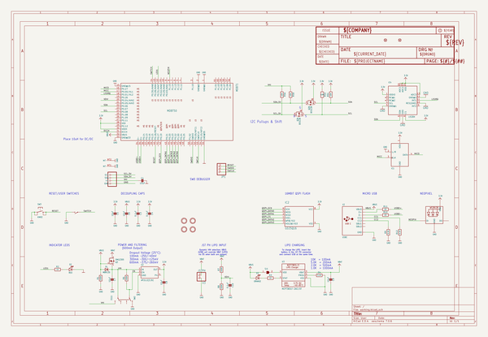
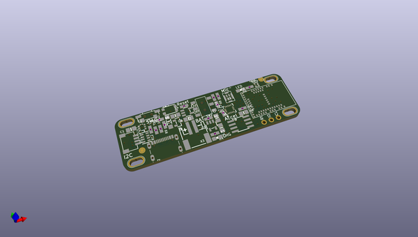
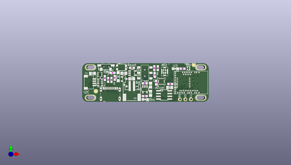
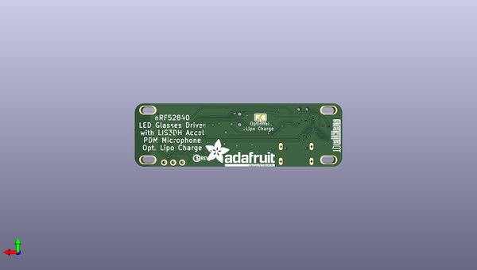

# adafruit_eyelights_led_glasses_and_driver_pcb
 
## summary 
* id: adafruit_adafruit_eyelights_led_glasses_and_driver_pcb_adafruit_eyelights_led_glasses
* user: adafruit
* name: adafruit_eyelights_led_glasses_and_driver_pcb
* board: adafruit_eyelights_led_glasses
* repo: https://github.com/adafruit/Adafruit-EyeLights-LED-Glasses-and-Driver-PCB

* src_file_repo_sch: 
*
 src_file_repo_sch_link: https://github.com/adafruit/Adafruit-EyeLights-LED-Glasses-and-Driver-PCB/tree/main/
* full details link: https://github.com/oomlout/oomlout_oomp_project_bot_v_2/tree/main/projects/adafruit_adafruit_eyelights_led_glasses_and_driver_pcb_adafruit_eyelights_led_glasses/current_version/working  

## schematic  
  
[schematic (pdf)](working_schematic.pdf)  

## pcb  
 
  
  
  
[board (pdf)](working.pdf)  

## working_bom
| Id | Designator | Footprint | Quantity | Designation | Supplier and ref |  | None | 
| --- | --- | --- | --- | --- | --- | --- | --- | 
| 1 | C10,C3,C4 | 0603-NO | 3 | 0.1uF |  |  | [''] | 
| 2 | R10,R11 | 0603-NO | 2 | 22 |  |  | [''] | 
| 3 | C7,C9,C6,C8,C5,C1 | 0805-NO | 6 | 10uF |  |  | [''] | 
| 4 | IC1 | SPK0415HM4H | 1 | MIC_PDM_SPK0415 |  |  | [''] | 
| 5 | SW1 | SPST_TACTILE_RA | 1 | TACT_RA |  |  | [''] | 
| 6 | FID2,FID1 | FIDUCIAL_1MM | 2 | FIDUCIAL_1MM |  |  | [''] | 
| 7 | D3 | CHIPLED_0805_NOOUTLINE | 1 | ORANGE |  |  | [''] | 
| 8 | U$16,U$14,U$10,U$12 | SLOT_4MM_PLATED | 4 | MOUNTINGHOLE_SLOT4MM |  |  | [''] | 
| 9 | SW2 | EG1390 | 1 | EG11 |  |  | [''] | 
| 10 | IC2 | SOIC8_150MIL | 1 | GD25Q16 |  |  | [''] | 
| 11 | R7,R1,R8,R6 | 0603-NO | 4 | 100K |  |  | [''] | 
| 12 | SW3 | BTN_KMR2_4.6X2.8 | 1 | KMR2 |  |  | [''] | 
| 13 | R2,R3 | 0603-NO | 2 | 1K |  |  | [''] | 
| 14 | X2 | USB_C_CUSB31-CFM2AX-01-X | 1 | USBC |  |  | [''] | 
| 15 | U3 | SOT23-5 | 1 | MCP73831T-2ACI/OT |  |  | [''] | 
| 16 | LED1 | SK6805_1515 | 1 | WS2812B_SK6805_1515 |  |  | [''] | 
| 17 | R12,R9,R4 | 0603-NO | 3 | 5.1K |  |  | [''] | 
| 18 | D2 | CHIPLED_0805_NOOUTLINE | 1 | RED |  |  | [''] | 
| 19 | JP1 | 1X03_ROUND | 1 |  |  |  | [''] | 
| 20 | CONN1 | JST_SH4 | 1 | STEMMA_I2C_QT |  |  | [''] | 
| 21 | IC4 | LGA16_3X3MM | 1 | LIS3DH |  |  | [''] | 
| 22 | Q3 | SOT23-R | 1 | DMG2305 |  |  | [''] | 
| 23 | Q2 | SOT363 | 1 | BSS138 |  |  | [''] | 
| 24 | R5 | RESPACK_4X0603 | 1 | 10K |  |  | [''] | 
| 25 | U2 | SOT23-5 | 1 | AP2112(3.3V) |  |  | [''] | 
| 26 | MDBT1 | MDBT50 | 1 | MDBT50 |  |  | [''] | 
| 27 | X3 | JSTPH2_BATT | 1 | JSTPH |  |  | [''] | 
| 28 | D1 | SOD-123 | 1 | MBR120 |  |  | [''] | 
| 29 | SJ1 | SOLDERJUMPER_ARROW_NOPASTE | 1 |  |  |  | [''] | 
| 30 | U$63 | PCBFEAT-REV-040 | 1 |  |  |  | [''] | 
| 31 | U$37 | ADAFRUIT_TEXT_20MM | 1 |  |  |  | [''] | 
| 32 | U$28 | STEMMAQT | 1 |  |  |  | [''] | 

## bom_schematic
| Ref | Qnty | Value | Cmp name | Footprint | Description | Vendor | DNP | 
| --- | --- | --- | --- | --- | --- | --- | --- | 
| C1, C5, C6, C7, C8, C9 | 6 | 10uF | CAP_CERAMIC0805-NOOUTLINE | working:0805-NO |  |  |  | 
| C3, C4, C10 | 3 | 0.1uF | CAP_CERAMIC0603_NO | working:0603-NO |  |  |  | 
| CONN1 | 1 | STEMMA_I2C_QT | STEMMA_I2C_QT | working:JST_SH4 |  |  |  | 
| D1 | 1 | MBR120 | DIODE-SCHOTTKYSOD-123 | working:SOD-123 |  |  |  | 
| D2 | 1 | RED | LED0805_NOOUTLINE | working:CHIPLED_0805_NOOUTLINE |  |  |  | 
| D3 | 1 | ORANGE | LED0805_NOOUTLINE | working:CHIPLED_0805_NOOUTLINE |  |  |  | 
| FID1, FID2 | 2 | FIDUCIAL_1MM | FIDUCIAL_1MM | working:FIDUCIAL_1MM |  |  |  | 
| IC1 | 1 | MIC_PDM_SPK0415 | MIC_PDM_SPK0415 | working:SPK0415HM4H |  |  |  | 
| IC2 | 1 | GD25Q16 | SPIFLASH_8PIN | working:SOIC8_150MIL |  |  |  | 
| IC4 | 1 | LIS3DH | ACCEL_LIS3DHTR | working:LGA16_3X3MM |  |  |  | 
| JP1 | 1 | HEADER-1X3ROUND | HEADER-1X3ROUND | working:1X03_ROUND |  |  |  | 
| LED1 | 1 | WS2812B_SK6805_1515 | WS2812B_SK6805_1515 | working:SK6805_1515 |  |  |  | 
| MDBT1 | 1 | MDBT50 | MDBT50 | working:MDBT50 |  |  |  | 
| Q2 | 1 | BSS138 | MOSFET-N_DUAL | working:SOT363 |  |  |  | 
| Q3 | 1 | DMG2305 | MOSFET-P | working:SOT23-R |  |  |  | 
| R1, R6, R7, R8 | 4 | 100K | RESISTOR_0603_NOOUT | working:0603-NO |  |  |  | 
| R2, R3 | 2 | 1K | RESISTOR_0603_NOOUT | working:0603-NO |  |  |  | 
| R4, R9, R12 | 3 | 5.1K | RESISTOR_0603_NOOUT | working:0603-NO |  |  |  | 
| R5 | 1 | 10K | RESISTOR_4PACK | working:RESPACK_4X0603 |  |  |  | 
| R10, R11 | 2 | 22 | RESISTOR_0603_NOOUT | working:0603-NO |  |  |  | 
| SJ1 | 1 | SOLDERJUMPER | SOLDERJUMPER | working:SOLDERJUMPER_ARROW_NOPASTE |  |  |  | 
| SW1 | 1 | TACT_RA | SWITCH_SPST_TACT_RA | working:SPST_TACTILE_RA |  |  |  | 
| SW2 | 1 | EG11 | SWITCH_DPDTEG1390 | working:EG1390 |  |  |  | 
| SW3 | 1 | KMR2 | SWITCH_TACT_SMT4.6X2.8 | working:BTN_KMR2_4.6X2.8 |  |  |  | 
| U2 | 1 | AP2112(3.3V) | VREG_SOT23-5 | working:SOT23-5 |  |  |  | 
| U3 | 1 | MCP73831T-2ACI/OT | MCP73831/2 | working:SOT23-5 |  |  |  | 
| U$10, U$12, U$14, U$16 | 4 | MOUNTINGHOLE_SLOT4MM | MOUNTINGHOLE_SLOT4MM | working:SLOT_4MM_PLATED |  |  |  | 
| X2 | 1 | USBC | USB_C | working:USB_C_CUSB31-CFM2AX-01-X |  |  |  | 
| X3 | 1 | JSTPH | CON_JST_PH_2PIN_BATT | working:JSTPH2_BATT |  |  |  | 

