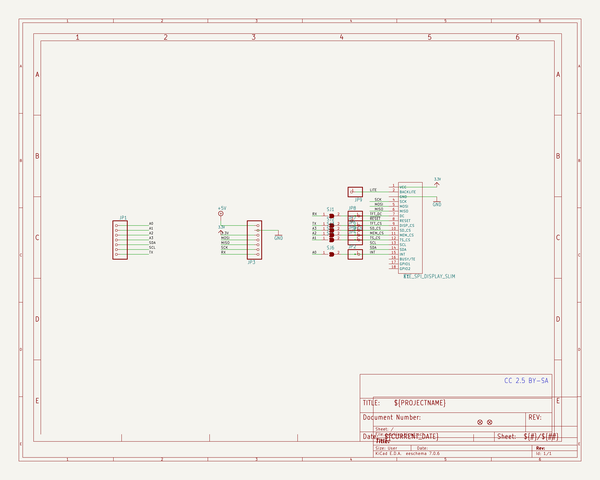
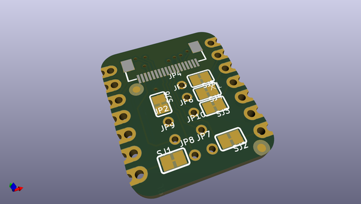
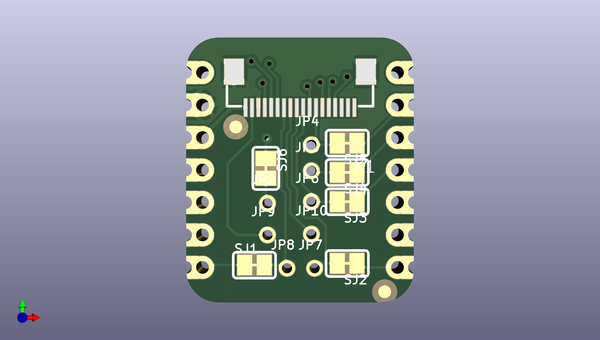
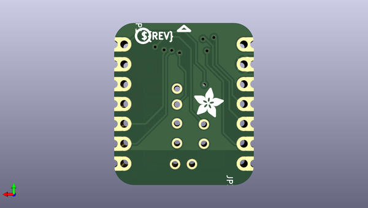

# adafruit_eyespi_bff_pcb
 
## summary 
* id: adafruit_adafruit_eyespi_bff_pcb_adafruit_eyespi_bff_pcb
* user: adafruit
* name: adafruit_eyespi_bff_pcb
* board: adafruit_eyespi_bff_pcb
* repo: https://github.com/adafruit/Adafruit-EYESPI-BFF-PCB

* src_file_repo_sch: 
*
 src_file_repo_sch_link: https://github.com/adafruit/Adafruit-EYESPI-BFF-PCB/tree/main/
* full details link: https://github.com/oomlout/oomlout_oomp_project_bot_v_2/tree/main/projects/adafruit_adafruit_eyespi_bff_pcb_adafruit_eyespi_bff_pcb/current_version/working  

## schematic  
  
[schematic (pdf)](working_schematic.pdf)  

## pcb  
 
  
  
  
[board (pdf)](working.pdf)  

## working_bom
| Id | Designator | Footprint | Quantity | Designation | Supplier and ref |  | None | 
| --- | --- | --- | --- | --- | --- | --- | --- | 
| 1 | SJ5,SJ2,SJ4,SJ3,SJ1,SJ6 | SOLDERJUMPER_CLOSEDWIRE | 6 |  |  |  | [''] | 
| 2 | PLABEL27 | PLABEL27 | 1 |  |  |  | [''] | 
| 3 | PLABEL5 | PLABEL5 | 1 |  |  |  | [''] | 
| 4 | PLABEL2 | PLABEL2 | 1 |  |  |  | [''] | 
| 5 | PLABEL26 | PLABEL26 | 1 |  |  |  | [''] | 
| 6 | PLABEL9 | PLABEL9 | 1 |  |  |  | [''] | 
| 7 | PLABEL8 | PLABEL8 | 1 |  |  |  | [''] | 
| 8 | JP2,JP6,JP8,JP5,JP4,JP7,JP10,JP9 | 1X01_2MM | 8 |  |  |  | [''] | 
| 9 | PLABEL22 | PLABEL22 | 1 |  |  |  | [''] | 
| 10 | PLABEL28 | PLABEL28 | 1 |  |  |  | [''] | 
| 11 | PLABEL1 | PLABEL1 | 1 |  |  |  | [''] | 
| 12 | U$6,U$8 | FIDUCIAL_1MM | 2 | FIDUCIAL_1MM |  |  | [''] | 
| 13 | PLABEL23 | PLABEL23 | 1 |  |  |  | [''] | 
| 14 | PLABEL25 | PLABEL25 | 1 |  |  |  | [''] | 
| 15 | PLABEL11 | PLABEL11 | 1 |  |  |  | [''] | 
| 16 | PLABEL3 | PLABEL3 | 1 |  |  |  | [''] | 
| 17 | PLABEL13 | PLABEL13 | 1 |  |  |  | [''] | 
| 18 | PLABEL14 | PLABEL14 | 1 |  |  |  | [''] | 
| 19 | PLABEL7 | PLABEL7 | 1 |  |  |  | [''] | 
| 20 | PLABEL20 | PLABEL20 | 1 |  |  |  | [''] | 
| 21 | PLABEL21 | PLABEL21 | 1 |  |  |  | [''] | 
| 22 | X1 | EYE_SPI_DISPLAY_SLIM | 1 | EYE_SPI_DISPLAY_SLIM |  |  | [''] | 
| 23 | PLABEL12 | PLABEL12 | 1 |  |  |  | [''] | 
| 24 | PLABEL10 | PLABEL10 | 1 |  |  |  | [''] | 
| 25 | PLABEL24 | PLABEL24 | 1 |  |  |  | [''] | 
| 26 | PLABEL4 | PLABEL4 | 1 |  |  |  | [''] | 
| 27 | PLABEL6 | PLABEL6 | 1 |  |  |  | [''] | 
| 28 | JP3,JP1 | 1X07_CASTEL | 2 |  |  |  | [''] | 
| 29 | U$3 | PCBFEAT-REV-040 | 1 |  |  |  | [''] | 
| 30 | PLABEL31 | PLABEL31 | 1 |  |  |  | [''] | 
| 31 | PLABEL29 | PLABEL29 | 1 |  |  |  | [''] | 
| 32 | PLABEL32 | PLABEL32 | 1 |  |  |  | [''] | 
| 33 | PLABEL19 | PLABEL19 | 1 |  |  |  | [''] | 
| 34 | PLABEL35 | PLABEL35 | 1 |  |  |  | [''] | 
| 35 | PLABEL30 | PLABEL30 | 1 |  |  |  | [''] | 
| 36 | PLABEL34 | PLABEL34 | 1 |  |  |  | [''] | 
| 37 | PLABEL36 | PLABEL36 | 1 |  |  |  | [''] | 
| 38 | PLABEL33 | PLABEL33 | 1 |  |  |  | [''] | 
| 39 | PLABEL37 | PLABEL37 | 1 |  |  |  | [''] | 
| 40 | U$2 | ADAFRUIT_3.5MM | 1 |  |  |  | [''] | 

## bom_schematic
| Ref | Qnty | Value | Cmp name | Footprint | Description | Vendor | DNP | 
| --- | --- | --- | --- | --- | --- | --- | --- | 
| JP1, JP3 | 2 | HEADER-1X7_CASTEL | HEADER-1X7_CASTEL | working:1X07_CASTEL |  |  |  | 
| JP2, JP4, JP5, JP6, JP7, JP8, JP9, JP10 | 8 | HEADER-1X12MM | HEADER-1X12MM | working:1X01_2MM |  |  |  | 
| SJ1, SJ2, SJ3, SJ4, SJ5, SJ6 | 6 | SOLDERJUMPER_CLOSED | SOLDERJUMPER_CLOSED | working:SOLDERJUMPER_CLOSEDWIRE |  |  |  | 
| U$6, U$8 | 2 | FIDUCIAL_1MM | FIDUCIAL_1MM | working:FIDUCIAL_1MM |  |  |  | 
| X1 | 1 | EYE_SPI_DISPLAY_SLIM | EYE_SPI_DISPLAY_SLIM | working:EYE_SPI_DISPLAY_SLIM |  |  |  | 

