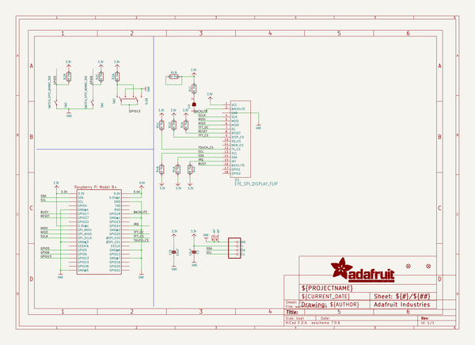
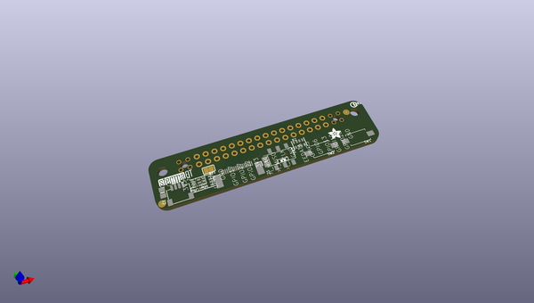
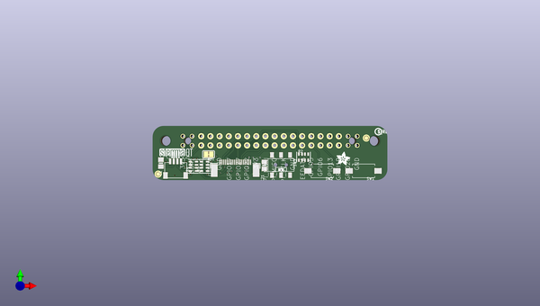
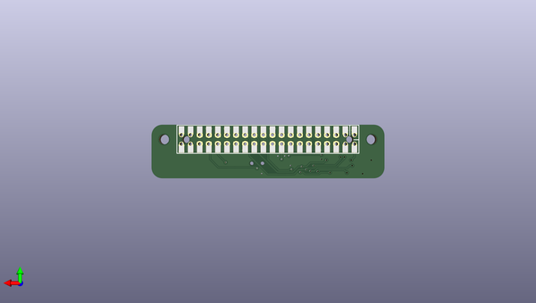

# adafruit_eyespi_pi_beret_pcb
 
## summary 
* id: adafruit_adafruit_eyespi_pi_beret_pcb_adafruit_eyespi_pi_beret
* user: adafruit
* name: adafruit_eyespi_pi_beret_pcb
* board: adafruit_eyespi_pi_beret
* repo: https://github.com/adafruit/Adafruit-EYESPI-Pi-Beret-PCB

* src_file_repo_sch: 
*
 src_file_repo_sch_link: https://github.com/adafruit/Adafruit-EYESPI-Pi-Beret-PCB/tree/main/
* full details link: https://github.com/oomlout/oomlout_oomp_project_bot_v_2/tree/main/projects/adafruit_adafruit_eyespi_pi_beret_pcb_adafruit_eyespi_pi_beret/current_version/working  

## schematic  
  
[schematic (pdf)](working_schematic.pdf)  

## pcb  
 
  
  
  
[board (pdf)](working.pdf)  

## working_bom
| Id | Designator | Footprint | Quantity | Designation | Supplier and ref |  | None | 
| --- | --- | --- | --- | --- | --- | --- | --- | 
| 1 | U$9 | PCBFEAT-REV-040 | 1 |  |  |  | [''] | 
| 2 | R4,R1,R2 | RESPACK_4X0603 | 3 | 10K Pack |  |  | [''] | 
| 3 | @HOLE0,@HOLE1 |  | 2 |  |  |  | [''] | 
| 4 | PLABEL0 | PLABEL0 | 1 |  |  |  | [''] | 
| 5 | X1 | EYE_SPI_DISPLAY_BOTCONTACT | 1 | EYE_SPI_DISPLAY_FLIP |  |  | [''] | 
| 6 | CONN2 | JST_SH4 | 1 | STEMMA_I2C_QT |  |  | [''] | 
| 7 | FID4,FID1 | FIDUCIAL_1MM | 2 | FIDUCIAL_1MM |  |  | [''] | 
| 8 | SW1,SW2 | TACTILE_3X6MM | 2 | SWITCH_SPST_NOMNT_3X6 |  |  | [''] | 
| 9 | PLABEL3 | PLABEL3 | 1 |  |  |  | [''] | 
| 10 | PLABEL2 | PLABEL2 | 1 |  |  |  | [''] | 
| 11 | PLABEL1 | PLABEL1 | 1 |  |  |  | [''] | 
| 12 | PLABEL4 | PLABEL4 | 1 |  |  |  | [''] | 
| 13 | SW3 | EG1390 | 1 | SLIDE |  |  | [''] | 
| 14 | SJ1 | SOLDERJUMPER_CLOSEDWIRE | 1 |  |  |  | [''] | 
| 15 | RPI2 | RASPI_2X20_THMSMT | 1 | RASPBERRYPI_BPLUS_2X20_THMSMT |  |  | [''] | 
| 16 | U$24 | ADAFRUIT_3.5MM | 1 |  |  |  | [''] | 
| 17 | C1,C21 | 0805-NO | 2 | 10uF |  |  | [''] | 
| 18 | U$30 | STEMMAQT | 1 |  |  |  | [''] | 
| 19 | PLABEL6 | PLABEL6 | 1 |  |  |  | [''] | 
| 20 | PLABEL5 | PLABEL5 | 1 |  |  |  | [''] | 

## bom_schematic
| Ref | Qnty | Value | Cmp name | Footprint | Description | Vendor | DNP | 
| --- | --- | --- | --- | --- | --- | --- | --- | 
| C1, C21 | 2 | 10uF | CAP_CERAMIC0805-NOOUTLINE | working:0805-NO |  |  |  | 
| CONN2 | 1 | STEMMA_I2C_QT | STEMMA_I2C_QT | working:JST_SH4 |  |  |  | 
| FID1, FID4 | 2 | FIDUCIAL_1MM | FIDUCIAL_1MM | working:FIDUCIAL_1MM |  |  |  | 
| R1, R2, R4 | 3 | 10K Pack | RESISTOR_4PACK | working:RESPACK_4X0603 |  |  |  | 
| RPI2 | 1 | RASPBERRYPI_BPLUS_2X20_THMSMT | RASPBERRYPI_BPLUS_2X20_THMSMT | working:RASPI_2X20_THMSMT |  |  |  | 
| SJ1 | 1 | SOLDERJUMPERCLOSED | SOLDERJUMPERCLOSED | working:SOLDERJUMPER_CLOSEDWIRE |  |  |  | 
| SW1, SW2 | 2 | SWITCH_SPST_NOMNT_3X6 | SWITCH_SPST_NOMNT_3X6 | working:TACTILE_3X6MM |  |  |  | 
| SW3 | 1 | SLIDE | SWITCH_DPDTEG1390 | working:EG1390 |  |  |  | 
| X1 | 1 | EYE_SPI_DISPLAY_FLIP | EYE_SPI_DISPLAY_FLIP | working:EYE_SPI_DISPLAY_BOTCONTACT |  |  |  | 

