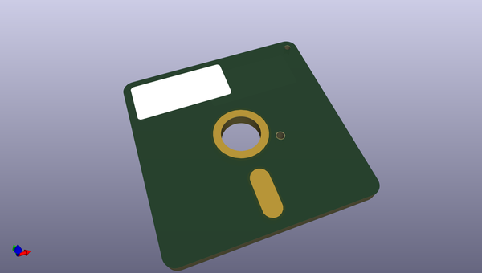
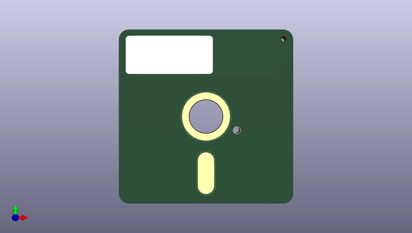
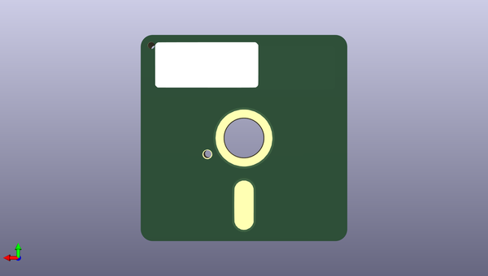

# adafruit_learning_system_guides
 
## summary 
* id: adafruit_adafruit_learning_system_guides_525floppy
* user: adafruit
* name: adafruit_learning_system_guides
* board: 525floppy
* repo: https://github.com/adafruit/Adafruit_Learning_System_Guides
* src_file_repo_kicad_pcb: PCB_Art_Jewelry/525floppy.kicad_pcb
* src_file_repo_kicad_pcb_link: https://github.com/adafruit/Adafruit_Learning_System_Guides/tree/main/PCB_Art_Jewelry/525floppy.kicad_pcb

* src_file_repo_sch: 
*
 src_file_repo_sch_link: https://github.com/adafruit/Adafruit_Learning_System_Guides/tree/main/
* full details link: https://github.com/oomlout/oomlout_oomp_project_bot_v_2/tree/main/projects/adafruit_adafruit_learning_system_guides_525floppy/current_version/working  

## pcb  
 
  
  
  
[board (pdf)](working.pdf)  

## working_bom
| Id | Designator | Footprint | Quantity | Designation | Supplier and ref |  | None | 
| --- | --- | --- | --- | --- | --- | --- | --- | 
| 1 | REF** | 5.25 Floppy Final | 1 | 5.25 Floppy Final |  |  | [''] | 

