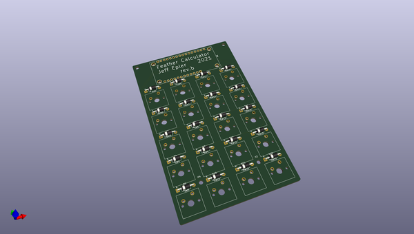
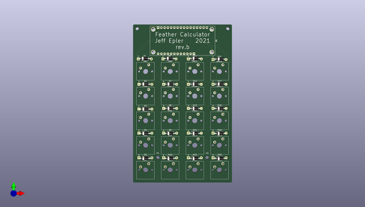
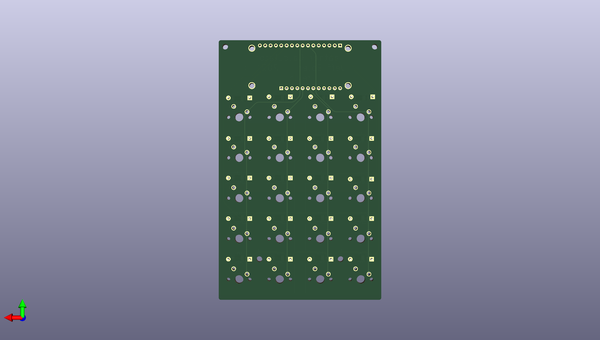

# adafruit_learning_system_guides
 
## summary 
* id: adafruit_adafruit_learning_system_guides_calculator2
* user: adafruit
* name: adafruit_learning_system_guides
* board: calculator2
* repo: https://github.com/adafruit/Adafruit_Learning_System_Guides
* src_file_repo_kicad_pcb: CircuitPython_KeyPad_Calculator/design-files/pcb/calculator2/calculator2-rounded.kicad_pcb
* src_file_repo_kicad_pcb_link: https://github.com/adafruit/Adafruit_Learning_System_Guides/tree/main/CircuitPython_KeyPad_Calculator/design-files/pcb/calculator2/calculator2-rounded.kicad_pcb

* src_file_repo_sch: 
*
 src_file_repo_sch_link: https://github.com/adafruit/Adafruit_Learning_System_Guides/tree/main/
* full details link: https://github.com/oomlout/oomlout_oomp_project_bot_v_2/tree/main/projects/adafruit_adafruit_learning_system_guides_calculator2/current_version/working  

## pcb  
 
  
  
  
[board (pdf)](working.pdf)  

## working_bom
| Id | Designator | Footprint | Quantity | Designation | Supplier and ref |  | None | 
| --- | --- | --- | --- | --- | --- | --- | --- | 
| 1 | U1 | ADAFRUIT_FEATHER | 1 | ADAFRUIT_FEATHER |  |  | [''] | 
| 2 | D1,D2,D3,D4,D5,D6,D7,D8,D9,D10,D11,D12,D13,D14,D15,D16,D17,D18,D19,D20 | D_DO-41_SOD81_P10.16mm_Horizontal | 20 | D |  |  | [''] | 
| 3 | SW1,SW2,SW3,SW4,SW5,SW6,SW7,SW8,SW9,SW10,SW11,SW12,SW13,SW14,SW15,SW16,SW17,SW18,SW19,SW20 | SW_Cherry_MX_1.00u_PCB | 20 | SW_Push |  |  | [''] | 

