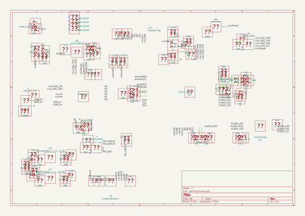
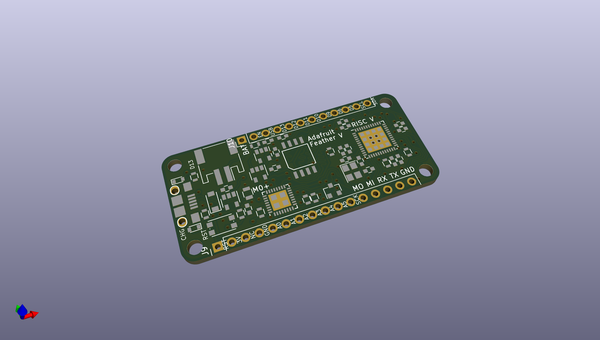
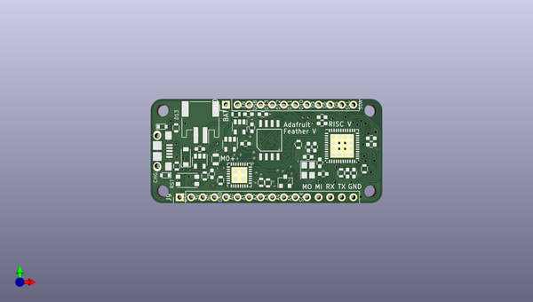
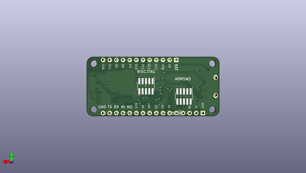

# feather_risc_v_pcb
 
## summary 
* id: adafruit_feather_risc_v_pcb_feather_five
* user: adafruit
* name: feather_risc_v_pcb
* board: feather_five
* repo: https://github.com/adafruit/Feather-RISC-V-PCB
* src_file_repo_kicad_pcb: feather_five.kicad_pcb
* src_file_repo_kicad_pcb_link: https://github.com/adafruit/Feather-RISC-V-PCB/tree/master/feather_five.kicad_pcb

* src_file_repo_sch: feather_five.sch
*
 src_file_repo_sch_link: https://github.com/adafruit/Feather-RISC-V-PCB/tree/master/feather_five.sch
* full details link: https://github.com/oomlout/oomlout_oomp_project_bot_v_2/tree/main/projects/adafruit_feather_risc_v_pcb_feather_five/current_version/working  

## schematic  
  
[schematic (pdf)](working_schematic.pdf)  

## pcb  
 
  
  
  
[board (pdf)](working.pdf)  

## working_bom
| Id | Designator | Footprint | Quantity | Designation | Supplier and ref |  | None | 
| --- | --- | --- | --- | --- | --- | --- | --- | 
| 1 | U1 | QFN-48-1EP_7x7mm_Pitch0.5mm | 1 | E310-G000 |  |  | [''] | 
| 2 | U2 | SOIC-8 | 1 | IS25LPXXX |  |  | [''] | 
| 3 | U5 | QFN-32-1EP_5x5mm_Pitch0.5mm | 1 | SAMD21E |  |  | [''] | 
| 4 | D1 | D_SOD-123 | 1 | MBR120 |  |  | [''] | 
| 5 | J2 | JST_PH_S2B-PH-SM4-TB_02x2.00mm_Angled | 1 | CONN_01X02 |  |  | [''] | 
| 6 | J1 | Mini-USB-B-OshPark | 1 | USB_OTG |  |  | [''] | 
| 7 | J6,J5,J4,J3 | MountingHole_2.7mm_M2.5 | 4 | CONN_01X01 |  |  | [''] | 
| 8 | R8,R5,R10 | R_0603 | 3 | 1k |  |  | [''] | 
| 9 | R4,R3,R2,R11 | R_0603 | 4 | 100k |  |  | [''] | 
| 10 | R1 | R_0603 | 1 | 100 |  |  | [''] | 
| 11 | Y1 | Crystal_SMD_TXC_7M-4pin_3.2x2.5mm | 1 | Crystal_GND24_Small |  |  | [''] | 
| 12 | C20,C19,C16,C14,C4 | C_0603 | 5 | 10uF |  |  | [''] | 
| 13 | C18 | C_0603 | 1 | 1uF |  |  | [''] | 
| 14 | C13,C12,C11,C10,C9,C8,C7,C6,C5 | C_0603 | 9 | .1uF |  |  | [''] | 
| 15 | C3,C2 | C_0603 | 2 | 12pF |  |  | [''] | 
| 16 | D2 | D_0603 | 1 | Yellow |  |  | [''] | 
| 17 | D3 | D_0603 | 1 | Red |  |  | [''] | 
| 18 | R7,R6 | R_0603 | 2 | 4.7k |  |  | [''] | 
| 19 | U6 | SOT-23-5 | 1 | MCP73831 |  |  | [''] | 
| 20 | U4 | SOT-23-5 | 1 | SPX3819M5-L-1-8/TR |  |  | [''] | 
| 21 | U3 | SOT-23-5 | 1 | SPX3819M5-L-3-3/TR |  |  | [''] | 
| 22 | SW1 | SW_SPST_KMR2 | 1 | SW_Push |  |  | [''] | 
| 23 | R9 | R_0805 | 1 | 10k |  |  | [''] | 
| 24 | D4 | D_SOT-23_ANK | 1 | D_Small |  |  | [''] | 
| 25 | J9 | Pin_Header_Straight_1x16_Pitch2.54mm | 1 | FeatherBottom |  |  | [''] | 
| 26 | J10 | Pin_Header_Straight_1x12_Pitch2.54mm | 1 | FeatherTop |  |  | [''] | 
| 27 | J8,J7 | Pin_Header_Straight_2x05_Pitch1.27mm_SMD | 2 | CONN_02X05 |  |  | [''] | 

## bom_schematic
no data

## mounting_holes
| x | y | package | value | ref | size | 
| --- | --- | --- | --- | --- | --- | 
| 45.719999999999985 | 0.0 | MountingHole_2.7mm_M2.5 | CONN_01X01 | J3 | m3 | 
| 45.719999999999985 | 17.78 | MountingHole_2.7mm_M2.5 | CONN_01X01 | J4 | m3 | 
| 0.0 | 0.0 | MountingHole_2.7mm_M2.5 | CONN_01X01 | J5 | m3 | 
| 0.0 | 17.78 | MountingHole_2.7mm_M2.5 | CONN_01X01 | J6 | m3 | 

