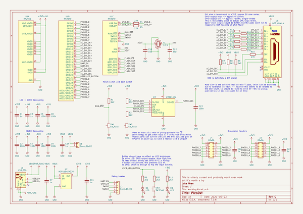
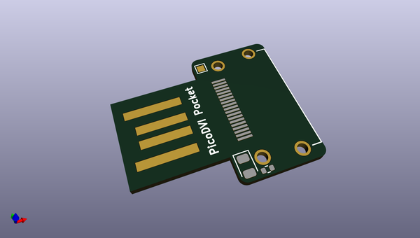
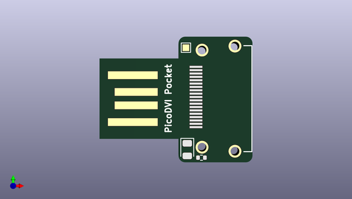
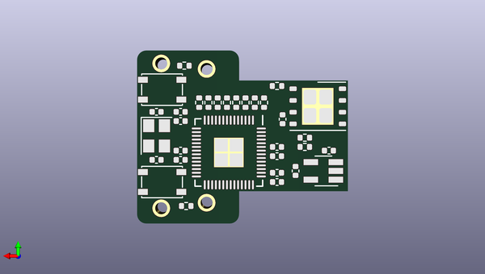

# picodvi
 
## summary 
* id: adafruit_picodvi_picodvi
* user: adafruit
* name: picodvi
* board: picodvi
* repo: https://github.com/adafruit/PicoDVI
* src_file_repo_kicad_pcb: hardware/mini_board/picodvi.kicad_pcb
* src_file_repo_kicad_pcb_link: https://github.com/adafruit/PicoDVI/tree/master/hardware/mini_board/picodvi.kicad_pcb
* src_file_repo_kicad_sch: hardware/mini_board/picodvi.kicad_sch
* src_file_repo_kicad_sch_link: https://github.com/adafruit/PicoDVI/tree/master/hardware/mini_board/picodvi.kicad_sch

* src_file_repo_sch: hardware/mini_board/picodvi.sch
*
 src_file_repo_sch_link: https://github.com/adafruit/PicoDVI/tree/master/hardware/mini_board/picodvi.sch
* full details link: https://github.com/oomlout/oomlout_oomp_project_bot_v_2/tree/main/projects/adafruit_picodvi_picodvi/current_version/working  

## schematic  
  
[schematic (pdf)](working_schematic.pdf)  

## pcb  
 
  
  
  
[board (pdf)](working.pdf)  

## working_bom
| Id | Designator | Footprint | Quantity | Designation | Supplier and ref |  | None | 
| --- | --- | --- | --- | --- | --- | --- | --- | 
| 1 | R6,R1,R2 | R_0402_1005Metric | 3 | 2k2 |  |  | [''] | 
| 2 | D1 | LED_0805_2012Metric | 1 | LED |  |  | [''] | 
| 3 | J5 | HDMI-SS-53000 | 1 | NOT_HDMI_A |  |  | [''] | 
| 4 | TP1 | TestPoint_Pad_1.0x1.0mm | 1 | TestPoint |  |  | [''] | 
| 5 | J1 | USB_A_PLUG_PCB | 1 | USB_A |  |  | [''] | 
| 6 | U1 | QFN-56_EP_7x7_Pitch0.4mm | 1 | RP2040 |  |  | [''] | 
| 7 | C13,C6,C2,C8,C9,C5,C4 | C_0402_1005Metric | 7 | 100n |  |  | [''] | 
| 8 | R3,R12,R18,R17,R16,R19,R15,R13,R14 | R_0402_1005Metric | 9 | 270 |  |  | [''] | 
| 9 | C7,C3,C11,C1 | C_0402_1005Metric | 4 | 1u |  |  | [''] | 
| 10 | SW2,SW1 | SW_SPST_PTS815 | 2 | SW_Push |  |  | [''] | 
| 11 | Y1 | Crystal_SMD_3225-4Pin_3.2x2.5mm | 1 | 12 M |  |  | [''] | 
| 12 | R4,R5 | R_0402_1005Metric | 2 | 27R |  |  | [''] | 
| 13 | U2 | SOT-23-5_HandSoldering | 1 | NCP115ASN330 |  |  | [''] | 
| 14 | C10,C12 | C_0402_1005Metric | 2 | 10p |  |  | [''] | 
| 15 | U3 | WSON-8-1EP_6x5mm_P1.27mm_EP3.4x4mm | 1 | W25Q16JV |  |  | [''] | 

## bom_schematic
| Ref | Qnty | Value | Cmp name | Footprint | Description | Vendor | DNP | 
| --- | --- | --- | --- | --- | --- | --- | --- | 
| C1, C3, C7, C11, C22, C23, C24 | 7 | 1u | C | Capacitor_SMD:C_0402_1005Metric | Unpolarized capacitor |  |  | 
| C2, C4, C5, C6, C8, C9, C13 | 7 | 100n | C | Capacitor_SMD:C_0402_1005Metric | Unpolarized capacitor |  |  | 
| C10, C12 | 2 | 10p | C | Capacitor_SMD:C_0402_1005Metric | Unpolarized capacitor |  |  | 
| D1, D2 | 2 | LED | LED | LED_SMD:LED_0805_2012Metric | Light emitting diode |  |  | 
| J1 | 1 | USB_OTG | USB_OTG-Connector | Connector_USB:USB_Micro-B_Molex-105017-0001 |  |  |  | 
| J2 | 1 | Conn_01x05 | Conn_01x05 | picodvi:PinHeader_1x05_P2.54mm_Vertical | Generic connector, single row, 01x05, script generated (kicad-library-utils/schlib/autogen/connector/) |  |  | 
| J3, J4 | 2 | 02x06 | Conn_02x06_Odd_Even | picodvi:PinHeader_2x06_P2.54mm_Horizontal | Generic connector, double row, 02x06, odd/even pin numbering scheme (row 1 odd numbers, row 2 even numbers), script generated (kicad-library-utils/schlib/autogen/connector/) |  |  | 
| J5 | 1 | NOT_HDMI_A | HDMI_A | picodvi:HDMI-SS-53000 | HDMI type A connector |  |  | 
| J6 | 1 | Conn_01x02 | Conn_01x02 | Connector_PinHeader_2.54mm:PinHeader_1x02_P2.54mm_Vertical | Generic connector, single row, 01x02, script generated (kicad-library-utils/schlib/autogen/connector/) |  |  | 
| R1, R3, R6, R7, R8, R9, R11, R20 | 8 | 2k2 | R | Resistor_SMD:R_0402_1005Metric | Resistor |  |  | 
| R2 | 1 | DNF | R | Resistor_SMD:R_0402_1005Metric | Resistor |  |  | 
| R4, R5 | 2 | 27R | R | Resistor_SMD:R_0402_1005Metric | Resistor |  |  | 
| R10, R12, R13, R14, R15, R16, R17, R18, R19 | 9 | 270 | R | Resistor_SMD:R_0402_1005Metric | Resistor |  |  | 
| SW1, SW2, SW3 | 3 | SW_Push | SW_Push | picodvi:SW_SPST_PTS815 | Push button switch, generic, two pins |  |  | 
| U1 | 1 | RP2040 | Pico2040 | picodvi:QFN-56_EP_7x7_Pitch0.4mm |  |  |  | 
| U2 | 1 | NCP115ASN330 | NCP115ASN330 | Package_TO_SOT_SMD:SOT-23-5_HandSoldering |  |  |  | 
| U3 | 1 | W25Q16JV | AT25SF081-XMHD-X-Memory_Flash | Package_SON:WSON-8-1EP_6x5mm_P1.27mm_EP3.4x4mm |  |  |  | 
| Y1 | 1 | 12 M | Crystal_GND24 | Crystal:Crystal_SMD_3225-4Pin_3.2x2.5mm | Four pin crystal, GND on pins 2 and 4 |  |  | 

