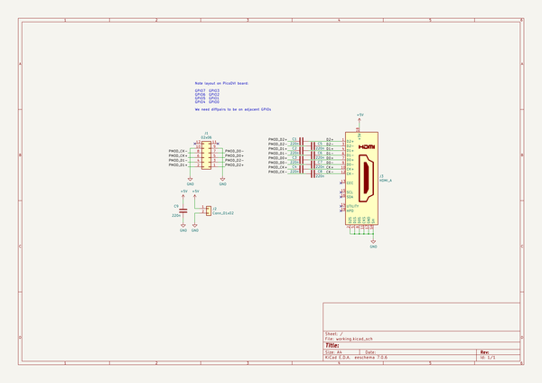
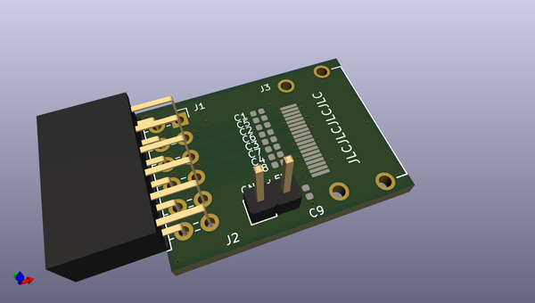
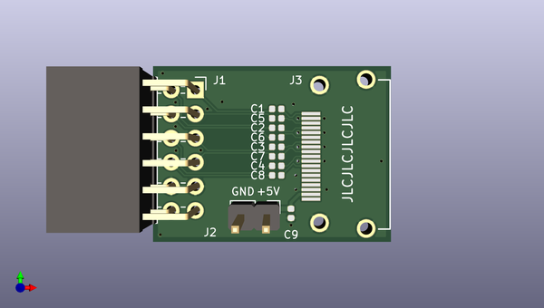
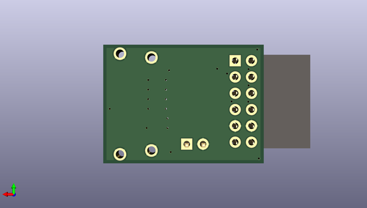

# picodvi
 
## summary 
* id: adafruit_picodvi_picodvi_pmod
* user: adafruit
* name: picodvi
* board: picodvi_pmod
* repo: https://github.com/adafruit/PicoDVI
* src_file_repo_kicad_pcb: hardware/pmod_hdmi/picodvi_pmod.kicad_pcb
* src_file_repo_kicad_pcb_link: https://github.com/adafruit/PicoDVI/tree/master/hardware/pmod_hdmi/picodvi_pmod.kicad_pcb
* src_file_repo_kicad_sch: hardware/mini_board/picodvi.kicad_sch
* src_file_repo_kicad_sch_link: https://github.com/adafruit/PicoDVI/tree/master/hardware/mini_board/picodvi.kicad_sch

* src_file_repo_sch: hardware/pmod_hdmi/picodvi_pmod.sch
*
 src_file_repo_sch_link: https://github.com/adafruit/PicoDVI/tree/master/hardware/pmod_hdmi/picodvi_pmod.sch
* full details link: https://github.com/oomlout/oomlout_oomp_project_bot_v_2/tree/main/projects/adafruit_picodvi_picodvi_pmod/current_version/working  

## schematic  
  
[schematic (pdf)](working_schematic.pdf)  

## pcb  
 
  
  
  
[board (pdf)](working.pdf)  

## working_bom
| Id | Designator | Footprint | Quantity | Designation | Supplier and ref |  | None | 
| --- | --- | --- | --- | --- | --- | --- | --- | 
| 1 | C2,C3,C4,C5,C6,C7,C8,C9,C1 | C_0402_1005Metric | 9 | 220n |  |  | [''] | 
| 2 | J2 | PinHeader_1x02_P2.54mm_Vertical | 1 | Conn_01x02 |  |  | [''] | 
| 3 | J1 | PinSocket_2x06_P2.54mm_Horizontal | 1 | 02x06 |  |  | [''] | 
| 4 | J3 | HDMI-SS-53000 | 1 | HDMI_A |  |  | [''] | 

## bom_schematic
| Ref | Qnty | Value | Cmp name | Footprint | Description | Vendor | DNP | 
| --- | --- | --- | --- | --- | --- | --- | --- | 
| C1, C2, C3, C4, C5, C6, C7, C8, C9 | 9 | 220n | C | Capacitor_SMD:C_0402_1005Metric | Unpolarized capacitor |  |  | 
| J1 | 1 | 02x06 | Conn_02x06_Odd_Even | Connector_PinSocket_2.54mm:PinSocket_2x06_P2.54mm_Horizontal | Generic connector, double row, 02x06, odd/even pin numbering scheme (row 1 odd numbers, row 2 even numbers), script generated (kicad-library-utils/schlib/autogen/connector/) |  |  | 
| J2 | 1 | Conn_01x02 | Conn_01x02 | Connector_PinHeader_2.54mm:PinHeader_1x02_P2.54mm_Vertical | Generic connector, single row, 01x02, script generated (kicad-library-utils/schlib/autogen/connector/) |  |  | 
| J3 | 1 | HDMI_A | HDMI_A | picodvi:HDMI-SS-53000 | HDMI type A connector |  |  | 

