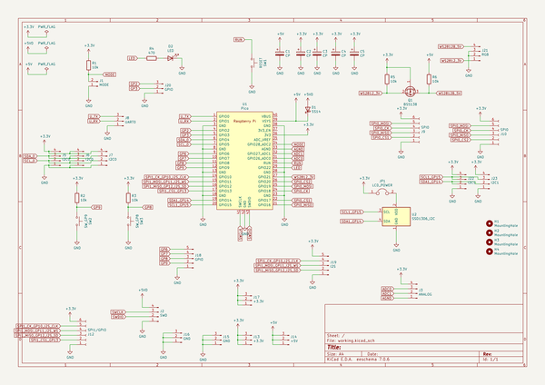
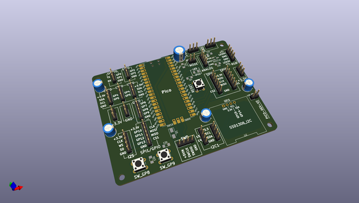
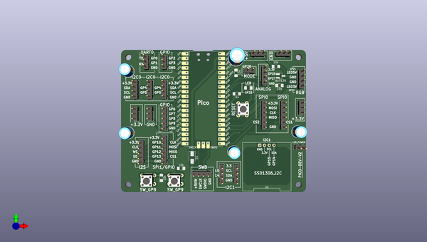
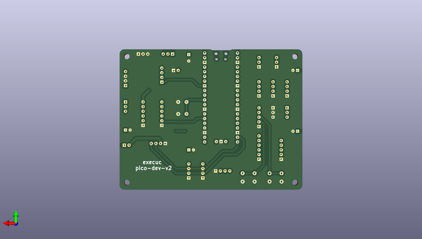

# u2if
 
## summary 
* id: adafruit_u2if_pico_dev
* user: adafruit
* name: u2if
* board: pico_dev
* repo: https://github.com/adafruit/u2if
* src_file_repo_kicad_pcb: board/pico-dev-v2/pico-dev.kicad_pcb
* src_file_repo_kicad_pcb_link: https://github.com/adafruit/u2if/tree/main/board/pico-dev-v2/pico-dev.kicad_pcb

* src_file_repo_sch: board/pico-dev-v2/pico-dev.sch
*
 src_file_repo_sch_link: https://github.com/adafruit/u2if/tree/main/board/pico-dev-v2/pico-dev.sch
* full details link: https://github.com/oomlout/oomlout_oomp_project_bot_v_2/tree/main/projects/adafruit_u2if_pico_dev/current_version/working  

## schematic  
  
[schematic (pdf)](working_schematic.pdf)  

## pcb  
 
  
  
  
[board (pdf)](working.pdf)  

## working_bom
| Id | Designator | Footprint | Quantity | Designation | Supplier and ref |  | None | 
| --- | --- | --- | --- | --- | --- | --- | --- | 
| 1 | U1 | RPi_Pico_SMD_TH | 1 | Pico |  |  | [''] | 
| 2 | U2 | ssd1306_I2c | 1 | SSD1306_I2C |  |  | [''] | 
| 3 | J10,J9 | PinHeader_1x06_P2.54mm_Vertical | 2 | SPI0 |  |  | [''] | 
| 4 | J8 | PinHeader_1x03_P2.54mm_Vertical | 1 | UART0 |  |  | [''] | 
| 5 | J17,J13 | PinHeader_1x03_P2.54mm_Vertical | 2 | +3.3V |  |  | [''] | 
| 6 | SW2 | SW_PUSH_6mm_H4.3mm | 1 | SW_GP9 |  |  | [''] | 
| 7 | SW3 | SW_PUSH_6mm_H4.3mm | 1 | SW_GP8 |  |  | [''] | 
| 8 | J3 | PinHeader_1x04_P2.54mm_Vertical | 1 | ANALOG |  |  | [''] | 
| 9 | J16,J15 | PinHeader_1x03_P2.54mm_Vertical | 2 | GND |  |  | [''] | 
| 10 | J19 | PinHeader_1x05_P2.54mm_Vertical | 1 | I2S |  |  | [''] | 
| 11 | C3,C4,C2,C5 | CP_Radial_D6.3mm_P2.50mm | 4 | CP |  |  | [''] | 
| 12 | SW1 | SW_PUSH_6mm_H4.3mm | 1 | RESET |  |  | [''] | 
| 13 | D2 | LED_1206_3216Metric_Pad1.42x1.75mm_HandSolder | 1 | LED |  |  | [''] | 
| 14 | R4 | R_1206_3216Metric_Pad1.42x1.75mm_HandSolder | 1 | 470 |  |  | [''] | 
| 15 | R3,R5,R2,R1,R6 | R_1206_3216Metric_Pad1.42x1.75mm_HandSolder | 5 | 10k |  |  | [''] | 
| 16 | J2 | PinHeader_1x04_P2.54mm_Vertical | 1 | SWD |  |  | [''] | 
| 17 | J21 | PinHeader_1x04_P2.54mm_Vertical | 1 | RGB |  |  | [''] | 
| 18 | JP1 | PinHeader_1x02_P2.54mm_Vertical | 1 | LCD_POWER |  |  | [''] | 
| 19 | J6,J5,J7 | PinHeader_1x04_P2.54mm_Vertical | 3 | I2C0 |  |  | [''] | 
| 20 | J20 | PinHeader_1x03_P2.54mm_Vertical | 1 | GPIO |  |  | [''] | 
| 21 | J18 | PinHeader_1x05_P2.54mm_Vertical | 1 | GPIO |  |  | [''] | 
| 22 | C1 | CP_Radial_D8.0mm_P3.50mm | 1 | CP |  |  | [''] | 
| 23 | J1 | PinHeader_1x02_P2.54mm_Vertical | 1 | MODE |  |  | [''] | 
| 24 | D1 | D_SMA | 1 | SS14 |  |  | [''] | 
| 25 | J22,J23 | PinHeader_1x04_P2.54mm_Vertical | 2 | I2C1 |  |  | [''] | 
| 26 | J14 | PinHeader_1x03_P2.54mm_Vertical | 1 | +5V |  |  | [''] | 
| 27 | J12 | PinHeader_1x06_P2.54mm_Vertical | 1 | SPI1/GPIO |  |  | [''] | 
| 28 | Q1 | SOT-23_Handsoldering | 1 | BSS138 |  |  | [''] | 

## bom_schematic
| Ref | Qnty | Value | Cmp name | Footprint | Description | Vendor | DNP | 
| --- | --- | --- | --- | --- | --- | --- | --- | 
| C1 | 1 | CP | CP-Device | Capacitor_THT:CP_Radial_D8.0mm_P3.50mm |  |  |  | 
| C2, C3, C4, C5 | 4 | CP | CP-Device | Capacitor_THT:CP_Radial_D6.3mm_P2.50mm |  |  |  | 
| D1 | 1 | SS14 | D_Schottky | Diode_SMD:D_SMA | Schottky diode |  |  | 
| D2 | 1 | LED | LED | LED_SMD:LED_1206_3216Metric_Pad1.42x1.75mm_HandSolder | Light emitting diode |  |  | 
| H1, H2, H3, H4 | 4 | MountingHole | MountingHole | MountingHole:MountingHole_3.2mm_M3 | Mounting Hole without connection |  |  | 
| J1 | 1 | MODE | Conn_01x02_Male-Connector | Connector_PinHeader_2.54mm:PinHeader_1x02_P2.54mm_Vertical |  |  |  | 
| J2 | 1 | SWD | Conn_01x04_Male-Connector | Connector_PinHeader_2.54mm:PinHeader_1x04_P2.54mm_Vertical |  |  |  | 
| J3 | 1 | ANALOG | Conn_01x04_Male-Connector | Connector_PinHeader_2.54mm:PinHeader_1x04_P2.54mm_Vertical |  |  |  | 
| J5, J6, J7 | 3 | I2C0 | Conn_01x04_Male-Connector | Connector_PinHeader_2.54mm:PinHeader_1x04_P2.54mm_Vertical |  |  |  | 
| J8 | 1 | UART0 | Conn_01x03_Male-Connector | Connector_PinHeader_2.54mm:PinHeader_1x03_P2.54mm_Vertical |  |  |  | 
| J9, J10 | 2 | SPI0 | Conn_01x06_Female-Connector | Connector_PinHeader_2.54mm:PinHeader_1x06_P2.54mm_Vertical |  |  |  | 
| J12 | 1 | SPI1/GPIO | Conn_01x06_Female-Connector | Connector_PinHeader_2.54mm:PinHeader_1x06_P2.54mm_Vertical |  |  |  | 
| J13, J17 | 2 | +3.3V | Conn_01x03_Male-Connector | Connector_PinHeader_2.54mm:PinHeader_1x03_P2.54mm_Vertical |  |  |  | 
| J14 | 1 | +5V | Conn_01x03_Male-Connector | Connector_PinHeader_2.54mm:PinHeader_1x03_P2.54mm_Vertical |  |  |  | 
| J15, J16 | 2 | GND | Conn_01x03_Male-Connector | Connector_PinHeader_2.54mm:PinHeader_1x03_P2.54mm_Vertical |  |  |  | 
| J18 | 1 | GPIO | Conn_01x05_Male-Connector | Connector_PinHeader_2.54mm:PinHeader_1x05_P2.54mm_Vertical |  |  |  | 
| J19 | 1 | I2S | Conn_01x05_Male-Connector | Connector_PinHeader_2.54mm:PinHeader_1x05_P2.54mm_Vertical |  |  |  | 
| J20 | 1 | GPIO | Conn_01x03_Male-Connector | Connector_PinHeader_2.54mm:PinHeader_1x03_P2.54mm_Vertical |  |  |  | 
| J21 | 1 | RGB | Conn_01x04_Male-Connector | Connector_PinHeader_2.54mm:PinHeader_1x04_P2.54mm_Vertical |  |  |  | 
| J22, J23 | 2 | I2C1 | Conn_01x04_Male-Connector | Connector_PinHeader_2.54mm:PinHeader_1x04_P2.54mm_Vertical |  |  |  | 
| JP1 | 1 | LCD_POWER | Jumper-Device | Connector_PinHeader_2.54mm:PinHeader_1x02_P2.54mm_Vertical |  |  |  | 
| Q1 | 1 | BSS138 | BSS138 | Package_TO_SOT_SMD:SOT-23_Handsoldering | 50V Vds, 0.22A Id, N-Channel MOSFET, SOT-23 |  |  | 
| R1, R2, R3, R5, R6 | 5 | 10k | R | Resistor_SMD:R_1206_3216Metric_Pad1.42x1.75mm_HandSolder | Resistor |  |  | 
| R4 | 1 | 470 | R | Resistor_SMD:R_1206_3216Metric_Pad1.42x1.75mm_HandSolder | Resistor |  |  | 
| SW1 | 1 | RESET | SW_Push | Button_Switch_THT:SW_PUSH_6mm_H4.3mm | Push button switch, generic, two pins |  |  | 
| SW2 | 1 | SW_GP9 | SW_Push | Button_Switch_THT:SW_PUSH_6mm_H4.3mm | Push button switch, generic, two pins |  |  | 
| SW3 | 1 | SW_GP8 | SW_Push | Button_Switch_THT:SW_PUSH_6mm_H4.3mm | Push button switch, generic, two pins |  |  | 
| U1 | 1 | Pico | Pico | MCU_RaspberryPi_and_Boards:RPi_Pico_SMD_TH |  |  |  | 
| U2 | 1 | SSD1306_I2C | SSD1306_I2C | oled_ssd1306:ssd1306_I2c | LCD 16x2 Alphanumeric gray backlight, 3 or 5 V VDD |  |  | 

