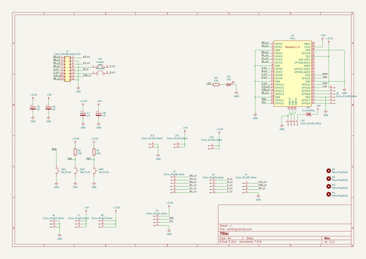
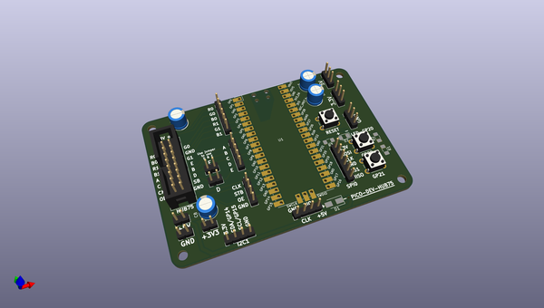
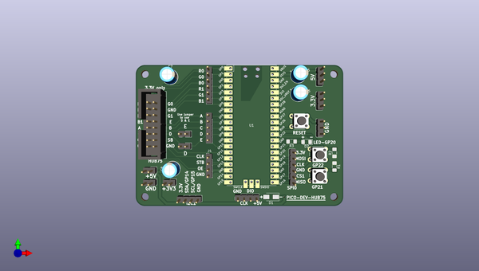
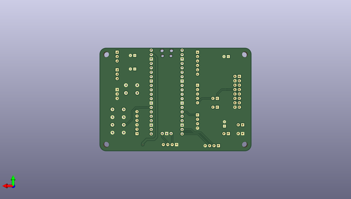

# u2if
 
## summary 
* id: adafruit_u2if_pico_hub75
* user: adafruit
* name: u2if
* board: pico_hub75
* repo: https://github.com/adafruit/u2if
* src_file_repo_kicad_pcb: board/pico-hub75/pico-hub75.kicad_pcb
* src_file_repo_kicad_pcb_link: https://github.com/adafruit/u2if/tree/main/board/pico-hub75/pico-hub75.kicad_pcb

* src_file_repo_sch: board/pico-hub75/pico-hub75.sch
*
 src_file_repo_sch_link: https://github.com/adafruit/u2if/tree/main/board/pico-hub75/pico-hub75.sch
* full details link: https://github.com/oomlout/oomlout_oomp_project_bot_v_2/tree/main/projects/adafruit_u2if_pico_hub75/current_version/working  

## schematic  
  
[schematic (pdf)](working_schematic.pdf)  

## pcb  
 
  
  
  
[board (pdf)](working.pdf)  

## working_bom
| Id | Designator | Footprint | Quantity | Designation | Supplier and ref |  | None | 
| --- | --- | --- | --- | --- | --- | --- | --- | 
| 1 | U1 | RPi_Pico_SMD_TH | 1 | Pico |  |  | [''] | 
| 2 | J6,J7,J8 | PinHeader_1x03_P2.54mm_Vertical | 3 | Conn_01x03_Male |  |  | [''] | 
| 3 | SW3,SW1,SW2 | SW_PUSH_6mm_H5mm | 3 | SW_Push |  |  | [''] | 
| 4 | J5,J2 | PinHeader_1x06_P2.54mm_Vertical | 2 | Conn_01x06_Male |  |  | [''] | 
| 5 | J10,J9 | PinHeader_1x04_P2.54mm_Vertical | 2 | Conn_01x04_Male |  |  | [''] | 
| 6 | D1 | D_SMA | 1 | D_Schottky |  |  | [''] | 
| 7 | C5,C6,C8,C7 | CP_Radial_D6.3mm_P2.50mm | 4 | CP |  |  | [''] | 
| 8 | JP1,JP2 | PinHeader_1x02_P2.54mm_Vertical | 2 | Jumper |  |  | [''] | 
| 9 | J3 | PinHeader_1x05_P2.54mm_Vertical | 1 | Conn_01x05_Male |  |  | [''] | 
| 10 | J1 | IDC-Header_2x08_P2.54mm_Vertical | 1 | Conn_02x08_Odd_Even |  |  | [''] | 
| 11 | D2 | LED_1206_3216Metric_Pad1.42x1.75mm_HandSolder | 1 | LED |  |  | [''] | 
| 12 | R1,R2 | R_1206_3216Metric_Pad1.42x1.75mm_HandSolder | 2 | 10k |  |  | [''] | 
| 13 | R3 | R_1206_3216Metric_Pad1.42x1.75mm_HandSolder | 1 | 470 |  |  | [''] | 
| 14 | J4 | PinHeader_1x04_P2.54mm_Vertical | 1 | Conn_01x05_Male |  |  | [''] | 
| 15 | +5V,+3V3,GND | PinHeader_1x02_P2.54mm_Vertical | 3 | Conn_01x02_Male |  |  | [''] | 

## bom_schematic
| Ref | Qnty | Value | Cmp name | Footprint | Description | Vendor | DNP | 
| --- | --- | --- | --- | --- | --- | --- | --- | 
| C5, C6, C7, C8 | 4 | CP | CP-Device | Capacitor_THT:CP_Radial_D6.3mm_P2.50mm |  |  |  | 
| D1 | 1 | D_Schottky | D_Schottky | Diode_SMD:D_SMA | Schottky diode |  |  | 
| D2 | 1 | LED | LED | LED_SMD:LED_1206_3216Metric_Pad1.42x1.75mm_HandSolder | Light emitting diode |  |  | 
| H1, H2, H3, H4 | 4 | MountingHole | MountingHole | MountingHole:MountingHole_3.2mm_M3 | Mounting Hole without connection |  |  | 
| J1 | 1 | Conn_02x08_Odd_Even | Conn_02x08_Odd_Even | Connector_IDC:IDC-Header_2x08_P2.54mm_Vertical | Generic connector, double row, 02x08, odd/even pin numbering scheme (row 1 odd numbers, row 2 even numbers), script generated (kicad-library-utils/schlib/autogen/connector/) |  |  | 
| J2, J5 | 2 | Conn_01x06_Male | Conn_01x06_Male-Connector | Connector_PinHeader_2.54mm:PinHeader_1x06_P2.54mm_Vertical |  |  |  | 
| J3 | 1 | Conn_01x05_Male | Conn_01x05_Male-Connector | Connector_PinHeader_2.54mm:PinHeader_1x05_P2.54mm_Vertical |  |  |  | 
| J4 | 1 | Conn_01x05_Male | Conn_01x04_Male-Connector | Connector_PinHeader_2.54mm:PinHeader_1x04_P2.54mm_Vertical |  |  |  | 
| J6, J7, J8 | 3 | Conn_01x03_Male | Conn_01x03_Male-Connector | Connector_PinHeader_2.54mm:PinHeader_1x03_P2.54mm_Vertical |  |  |  | 
| J9, J10 | 2 | Conn_01x04_Male | Conn_01x04_Male-Connector | Connector_PinHeader_2.54mm:PinHeader_1x04_P2.54mm_Vertical |  |  |  | 
| J11, J12, J13 | 3 | Conn_01x02_Male | Conn_01x02_Male-Connector | Connector_PinHeader_2.54mm:PinHeader_1x02_P2.54mm_Vertical |  |  |  | 
| JP1, JP2 | 2 | Jumper | Jumper-Device | Connector_PinHeader_2.54mm:PinHeader_1x02_P2.54mm_Vertical |  |  |  | 
| R1, R2 | 2 | 10k | R | Resistor_SMD:R_1206_3216Metric_Pad1.42x1.75mm_HandSolder | Resistor |  |  | 
| R3 | 1 | 470 | R | Resistor_SMD:R_1206_3216Metric_Pad1.42x1.75mm_HandSolder | Resistor |  |  | 
| SW1, SW2, SW3 | 3 | SW_Push | SW_Push | Button_Switch_THT:SW_PUSH_6mm_H5mm | Push button switch, generic, two pins |  |  | 
| U1 | 1 | Pico | Pico | MCU_RaspberryPi_and_Boards:RPi_Pico_SMD_TH |  |  |  | 

