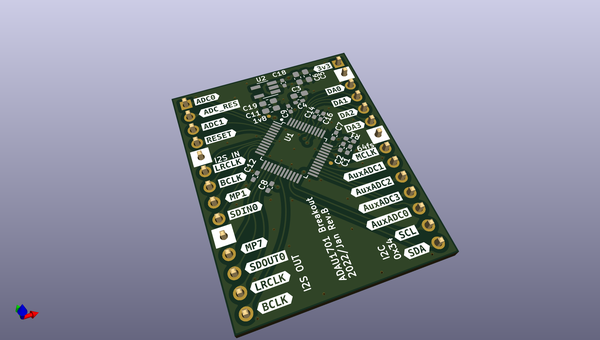

# adau1701_rppico_module
 
## summary 
* id: akiyukiokayasu_adau1701_rppico_module_adau1701_rppico_module
* user: akiyukiokayasu
* name: adau1701_rppico_module
* board: adau1701_rppico_module
* repo: https://github.com/AkiyukiOkayasu/ADAU1701-RPPico-module
* src_file_repo_kicad_pcb: ADAU1701-RPPico-module.kicad_pcb
* src_file_repo_kicad_pcb_link: https://github.com/AkiyukiOkayasu/ADAU1701-RPPico-module/tree/main/ADAU1701-RPPico-module.kicad_pcb
* src_file_repo_kicad_sch: ADAU1701-RPPico-module.kicad_sch
* src_file_repo_kicad_sch_link: https://github.com/AkiyukiOkayasu/ADAU1701-RPPico-module/tree/main/ADAU1701-RPPico-module.kicad_sch

* src_file_repo_sch: ADAU1701-RPPico-module.sch
*
 src_file_repo_sch_link: https://github.com/AkiyukiOkayasu/ADAU1701-RPPico-module/tree/main/ADAU1701-RPPico-module.sch
* full details link: https://github.com/oomlout/oomlout_oomp_project_bot_v_2/tree/main/projects/akiyukiokayasu_adau1701_rppico_module_adau1701_rppico_module/current_version/working  

## pcb  
 
  
  
  
[board (pdf)](working.pdf)  

## working_bom
| Id | Designator | Footprint | Quantity | Designation | Supplier and ref |  | None | 
| --- | --- | --- | --- | --- | --- | --- | --- | 
| 1 | C11,C6,C5,C3,C15 | C_0603_1608Metric_Pad1.08x0.95mm_HandSolder | 5 | 10u |  |  | [''] | 
| 2 | C18,C16,C9,C7,C8,C12,C14,C4,C13,C10 | C_0402_1005Metric_Pad0.74x0.62mm_HandSolder | 10 | 0.1u |  |  | [''] | 
| 3 | U1 | LQFP-48_7x7mm_P0.5mm | 1 | ADAU1701 |  |  | [''] | 
| 4 | TP1 | TestPin_0.6SMD | 1 | OSCO |  |  | [''] | 
| 5 | TP2 | TestPin_0.6SMD | 1 | 1v8 |  |  | [''] | 
| 6 | U2 | SOT-23-5_HandSoldering | 1 | NJM12888 |  |  | [''] | 
| 7 | C2 | C_0402_1005Metric_Pad0.74x0.62mm_HandSolder | 1 | 3n3 |  |  | [''] | 
| 8 | C19 | C_0603_1608Metric_Pad1.08x0.95mm_HandSolder | 1 | 2u2 |  |  | [''] | 
| 9 | R1 | R_0402_1005Metric_Pad0.72x0.64mm_HandSolder | 1 | 475 |  |  | [''] | 
| 10 | C1 | C_0402_1005Metric_Pad0.74x0.62mm_HandSolder | 1 | 56n |  |  | [''] | 
| 11 | J2,J1 | PinHeader_1x14_P2.54mm_Vertical | 2 | Conn_01x14 |  |  | [''] | 
| 12 | C17 | C_0805_2012Metric_Pad1.18x1.45mm_HandSolder | 1 | 47u |  |  | [''] | 

