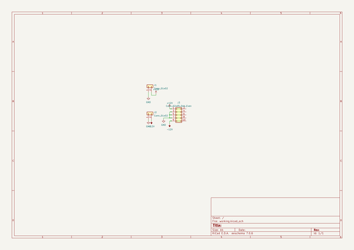
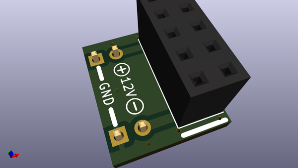
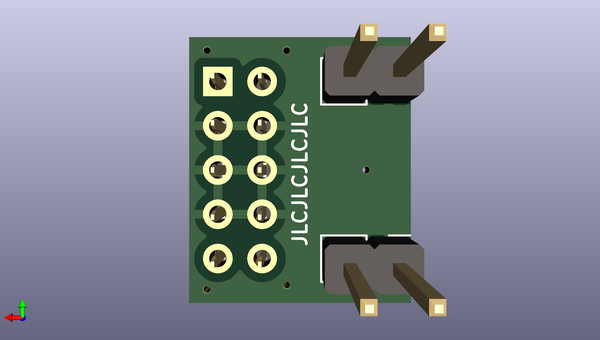

# breadboardsynthdevelopmentutilities
 
## summary 
* id: akiyukiokayasu_breadboardsynthdevelopmentutilities_eurorackpowerforbreadboard
* user: akiyukiokayasu
* name: breadboardsynthdevelopmentutilities
* board: eurorackpowerforbreadboard
* repo: https://github.com/AkiyukiOkayasu/BreadBoardSynthDevelopmentUtilities
* src_file_repo_kicad_pcb: EurorackPowerForBreadboard/EurorackPowerForBreadboard.kicad_pcb
* src_file_repo_kicad_pcb_link: https://github.com/AkiyukiOkayasu/BreadBoardSynthDevelopmentUtilities/tree/main/EurorackPowerForBreadboard/EurorackPowerForBreadboard.kicad_pcb
* src_file_repo_kicad_sch: EurorackPowerForBreadboard/EurorackPowerForBreadboard.kicad_sch
* src_file_repo_kicad_sch_link: https://github.com/AkiyukiOkayasu/BreadBoardSynthDevelopmentUtilities/tree/main/EurorackPowerForBreadboard/EurorackPowerForBreadboard.kicad_sch

* src_file_repo_sch: 
*
 src_file_repo_sch_link: https://github.com/AkiyukiOkayasu/BreadBoardSynthDevelopmentUtilities/tree/main/
* full details link: https://github.com/oomlout/oomlout_oomp_project_bot_v_2/tree/main/projects/akiyukiokayasu_breadboardsynthdevelopmentutilities_eurorackpowerforbreadboard/current_version/working  

## schematic  
  
[schematic (pdf)](working_schematic.pdf)  

## pcb  
 
  
  
  
[board (pdf)](working.pdf)  

## working_bom
| Id | Designator | Footprint | Quantity | Designation | Supplier and ref |  | None | 
| --- | --- | --- | --- | --- | --- | --- | --- | 
| 1 | J3 | PinSocket_2x05_P2.54mm_Vertical | 1 | Conn_02x05_Odd_Even |  |  | [''] | 
| 2 | J2,J1 | PinHeader_1x02_P2.54mm_Vertical | 2 | Conn_01x02 |  |  | [''] | 

## bom_schematic
| Ref | Qnty | Value | Cmp name | Footprint | Description | Vendor | DNP | 
| --- | --- | --- | --- | --- | --- | --- | --- | 
| J1, J2 | 2 | Conn_01x02 | Conn_01x02 | Connector_PinHeader_2.54mm:PinHeader_1x02_P2.54mm_Vertical | Generic connector, single row, 01x02, script generated (kicad-library-utils/schlib/autogen/connector/) |  |  | 
| J3 | 1 | Conn_02x05_Odd_Even | Conn_02x05_Odd_Even | Connector_PinSocket_2.54mm:PinSocket_2x05_P2.54mm_Vertical | Generic connector, double row, 02x05, odd/even pin numbering scheme (row 1 odd numbers, row 2 even numbers), script generated (kicad-library-utils/schlib/autogen/connector/) |  |  | 

