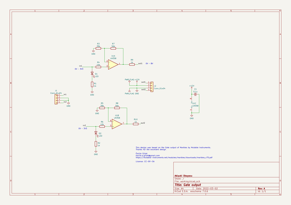
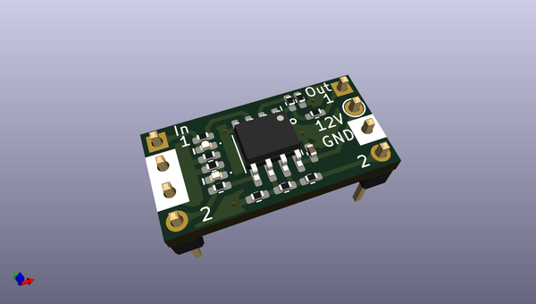
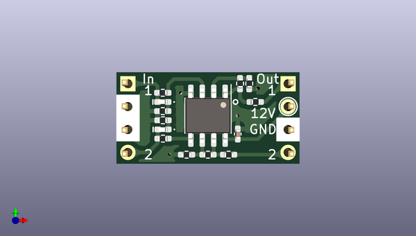
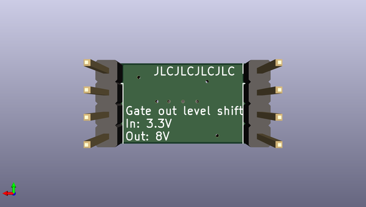

# breadboardsynthdevelopmentutilities
 
## summary 
* id: akiyukiokayasu_breadboardsynthdevelopmentutilities_gateout
* user: akiyukiokayasu
* name: breadboardsynthdevelopmentutilities
* board: gateout
* repo: https://github.com/AkiyukiOkayasu/BreadBoardSynthDevelopmentUtilities
* src_file_repo_kicad_pcb: GateOut/GateOut.kicad_pcb
* src_file_repo_kicad_pcb_link: https://github.com/AkiyukiOkayasu/BreadBoardSynthDevelopmentUtilities/tree/main/GateOut/GateOut.kicad_pcb
* src_file_repo_kicad_sch: GateOut/GateOut.kicad_sch
* src_file_repo_kicad_sch_link: https://github.com/AkiyukiOkayasu/BreadBoardSynthDevelopmentUtilities/tree/main/GateOut/GateOut.kicad_sch

* src_file_repo_sch: 
*
 src_file_repo_sch_link: https://github.com/AkiyukiOkayasu/BreadBoardSynthDevelopmentUtilities/tree/main/
* full details link: https://github.com/oomlout/oomlout_oomp_project_bot_v_2/tree/main/projects/akiyukiokayasu_breadboardsynthdevelopmentutilities_gateout/current_version/working  

## schematic  
  
[schematic (pdf)](working_schematic.pdf)  

## pcb  
 
  
  
  
[board (pdf)](working.pdf)  

## working_bom
| Id | Designator | Footprint | Quantity | Designation | Supplier and ref |  | None | 
| --- | --- | --- | --- | --- | --- | --- | --- | 
| 1 | R6,R4 | R_0402_1005Metric_Pad0.72x0.64mm_HandSolder | 2 | 10k |  |  | [''] | 
| 2 | U1 | SOIC-8_3.9x4.9mm_P1.27mm | 1 | LM358 |  |  | [''] | 
| 3 | R5,R3 | R_0402_1005Metric_Pad0.72x0.64mm_HandSolder | 2 | 39k |  |  | [''] | 
| 4 | R7,R8 | R_0402_1005Metric_Pad0.72x0.64mm_HandSolder | 2 | 56k |  |  | [''] | 
| 5 | D1,D2 | LED_0402_1005Metric_Pad0.77x0.64mm_HandSolder | 2 | LED |  |  | [''] | 
| 6 | R9,R1,R2,R10 | R_0402_1005Metric_Pad0.72x0.64mm_HandSolder | 4 | 1k |  |  | [''] | 
| 7 | C1 | C_0402_1005Metric_Pad0.74x0.62mm_HandSolder | 1 | 0.1u |  |  | [''] | 
| 8 | J2,J1 | PinHeader_1x04_P2.54mm_Vertical | 2 | Conn_01x04 |  |  | [''] | 

## bom_schematic
| Ref | Qnty | Value | Cmp name | Footprint | Description | Vendor | DNP | 
| --- | --- | --- | --- | --- | --- | --- | --- | 
| C1 | 1 | 0.1u | C_Small | Capacitor_SMD:C_0402_1005Metric_Pad0.74x0.62mm_HandSolder | Unpolarized capacitor, small symbol |  |  | 
| D1, D2 | 2 | LED | LED | LED_SMD:LED_0402_1005Metric_Pad0.77x0.64mm_HandSolder | Light emitting diode |  |  | 
| J1, J2 | 2 | Conn_01x04 | Conn_01x04 | Connector_PinHeader_2.54mm:PinHeader_1x04_P2.54mm_Vertical | Generic connector, single row, 01x04, script generated (kicad-library-utils/schlib/autogen/connector/) |  |  | 
| R1, R2, R9, R10 | 4 | 1k | R | Resistor_SMD:R_0402_1005Metric_Pad0.72x0.64mm_HandSolder | Resistor |  |  | 
| R3, R5 | 2 | 39k | R | Resistor_SMD:R_0402_1005Metric_Pad0.72x0.64mm_HandSolder | Resistor |  |  | 
| R4, R6 | 2 | 10k | R | Resistor_SMD:R_0402_1005Metric_Pad0.72x0.64mm_HandSolder | Resistor |  |  | 
| R7, R8 | 2 | 56k | R | Resistor_SMD:R_0402_1005Metric_Pad0.72x0.64mm_HandSolder | Resistor |  |  | 
| U1 | 1 | LM358 | LM358 | Package_SO:SOIC-8_3.9x4.9mm_P1.27mm | Low-Power, Dual Operational Amplifiers, DIP-8/SOIC-8/TO-99-8 |  |  | 

