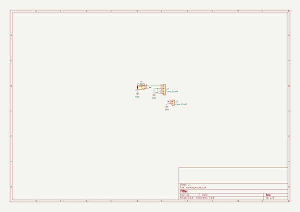

# breadboardsynthdevelopmentutilities
 
## summary 
* id: akiyukiokayasu_breadboardsynthdevelopmentutilities_pj302breakout
* user: akiyukiokayasu
* name: breadboardsynthdevelopmentutilities
* board: pj302breakout
* repo: https://github.com/AkiyukiOkayasu/BreadBoardSynthDevelopmentUtilities
* src_file_repo_kicad_pcb: PJ302Breakout/PJ302Breakout.kicad_pcb
* src_file_repo_kicad_pcb_link: https://github.com/AkiyukiOkayasu/BreadBoardSynthDevelopmentUtilities/tree/main/PJ302Breakout/PJ302Breakout.kicad_pcb
* src_file_repo_kicad_sch: PJ302Breakout/PJ302Breakout.kicad_sch
* src_file_repo_kicad_sch_link: https://github.com/AkiyukiOkayasu/BreadBoardSynthDevelopmentUtilities/tree/main/PJ302Breakout/PJ302Breakout.kicad_sch

* src_file_repo_sch: 
*
 src_file_repo_sch_link: https://github.com/AkiyukiOkayasu/BreadBoardSynthDevelopmentUtilities/tree/main/
* full details link: https://github.com/oomlout/oomlout_oomp_project_bot_v_2/tree/main/projects/akiyukiokayasu_breadboardsynthdevelopmentutilities_pj302breakout/current_version/working  

## schematic  
  
[schematic (pdf)](working_schematic.pdf)  

## pcb  
 
  
  
  
[board (pdf)](working.pdf)  

## working_bom
| Id | Designator | Footprint | Quantity | Designation | Supplier and ref |  | None | 
| --- | --- | --- | --- | --- | --- | --- | --- | 
| 1 | J1 | PJ302M | 1 | PJ302M |  |  | [''] | 
| 2 | J3 | PinHeader_1x02_P2.54mm_Vertical | 1 | Conn_01x02 |  |  | [''] | 
| 3 | J2 | PinHeader_1x04_P2.54mm_Vertical | 1 | Conn_01x04 |  |  | [''] | 

## bom_schematic
| Ref | Qnty | Value | Cmp name | Footprint | Description | Vendor | DNP | 
| --- | --- | --- | --- | --- | --- | --- | --- | 
| J1 | 1 | PJ302M | PJ302M | Akiyuki_Footprint:PJ302M | 2-pin audio jack receptable (mono/TS connector) with switching contact |  |  | 
| J2 | 1 | Conn_01x04 | Conn_01x04 | Connector_PinHeader_2.54mm:PinHeader_1x04_P2.54mm_Vertical | Generic connector, single row, 01x04, script generated (kicad-library-utils/schlib/autogen/connector/) |  |  | 
| J3 | 1 | Conn_01x02 | Conn_01x02 | Connector_PinHeader_2.54mm:PinHeader_1x02_P2.54mm_Vertical | Generic connector, single row, 01x02, script generated (kicad-library-utils/schlib/autogen/connector/) |  |  | 

