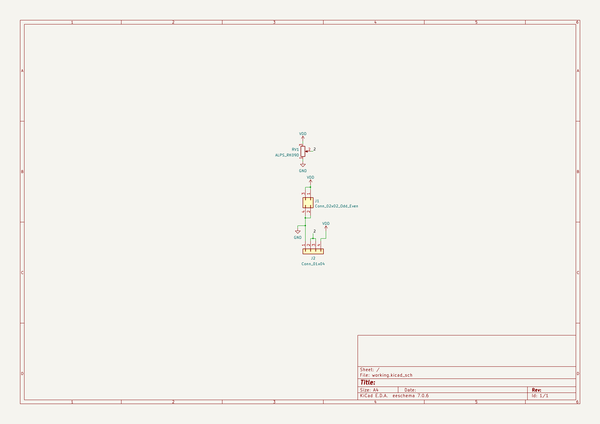
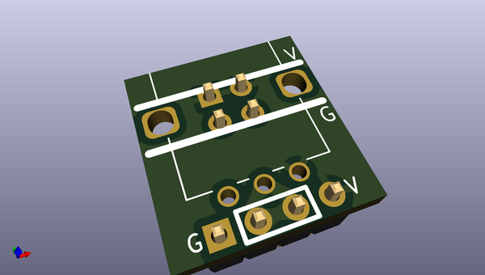
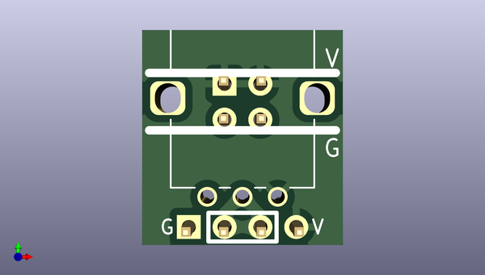
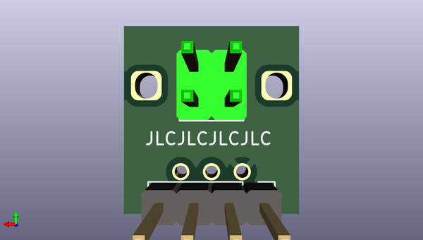

# breadboardsynthdevelopmentutilities
 
## summary 
* id: akiyukiokayasu_breadboardsynthdevelopmentutilities_podforbreadboard
* user: akiyukiokayasu
* name: breadboardsynthdevelopmentutilities
* board: podforbreadboard
* repo: https://github.com/AkiyukiOkayasu/BreadBoardSynthDevelopmentUtilities
* src_file_repo_kicad_pcb: PodForBreadboard/PodForBreadboard.kicad_pcb
* src_file_repo_kicad_pcb_link: https://github.com/AkiyukiOkayasu/BreadBoardSynthDevelopmentUtilities/tree/main/PodForBreadboard/PodForBreadboard.kicad_pcb
* src_file_repo_kicad_sch: PodForBreadboard/PodForBreadboard.kicad_sch
* src_file_repo_kicad_sch_link: https://github.com/AkiyukiOkayasu/BreadBoardSynthDevelopmentUtilities/tree/main/PodForBreadboard/PodForBreadboard.kicad_sch

* src_file_repo_sch: 
*
 src_file_repo_sch_link: https://github.com/AkiyukiOkayasu/BreadBoardSynthDevelopmentUtilities/tree/main/
* full details link: https://github.com/oomlout/oomlout_oomp_project_bot_v_2/tree/main/projects/akiyukiokayasu_breadboardsynthdevelopmentutilities_podforbreadboard/current_version/working  

## schematic  
  
[schematic (pdf)](working_schematic.pdf)  

## pcb  
 
  
  
  
[board (pdf)](working.pdf)  

## working_bom
| Id | Designator | Footprint | Quantity | Designation | Supplier and ref |  | None | 
| --- | --- | --- | --- | --- | --- | --- | --- | 
| 1 | RV1 | ALPS_RK09D117000B | 1 | ALPS_RK09D |  |  | [''] | 
| 2 | J1 | PinHeader_2x02_P2.54mm_Vertical | 1 | Conn_02x02_Odd_Even |  |  | [''] | 
| 3 | J2 | PinHeader_1x04_P2.54mm_Vertical | 1 | Conn_01x04 |  |  | [''] | 

## bom_schematic
| Ref | Qnty | Value | Cmp name | Footprint | Description | Vendor | DNP | 
| --- | --- | --- | --- | --- | --- | --- | --- | 
| J1 | 1 | Conn_02x02_Odd_Even | Conn_02x02_Odd_Even | Connector_PinHeader_2.54mm:PinHeader_2x02_P2.54mm_Vertical | Generic connector, double row, 02x02, odd/even pin numbering scheme (row 1 odd numbers, row 2 even numbers), script generated (kicad-library-utils/schlib/autogen/connector/) |  |  | 
| J2 | 1 | Conn_01x04 | Conn_01x04 | Connector_PinHeader_2.54mm:PinHeader_1x04_P2.54mm_Vertical | Generic connector, single row, 01x04, script generated (kicad-library-utils/schlib/autogen/connector/) |  |  | 
| RV1 | 1 | ALPS_RK09D | ALPS_RK09D | Akiyuki_Footprint:ALPS_RK09D117000B | Pot |  |  | 

