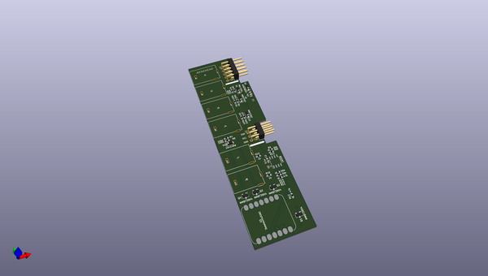
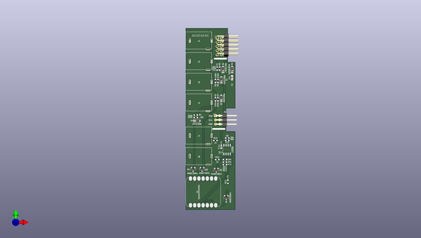
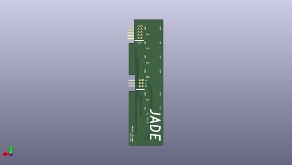

# jade
 
## summary 
* id: akiyukiokayasu_jade_jade_hardware
* user: akiyukiokayasu
* name: jade
* board: jade_hardware
* repo: https://github.com/AkiyukiOkayasu/jade
* src_file_repo_kicad_pcb: Hardware/jade_hardware.kicad_pcb
* src_file_repo_kicad_pcb_link: https://github.com/AkiyukiOkayasu/jade/tree/main/Hardware/jade_hardware.kicad_pcb
* src_file_repo_kicad_sch: Hardware/jade_hardware.kicad_sch
* src_file_repo_kicad_sch_link: https://github.com/AkiyukiOkayasu/jade/tree/main/Hardware/jade_hardware.kicad_sch

* src_file_repo_sch: 
*
 src_file_repo_sch_link: https://github.com/AkiyukiOkayasu/jade/tree/main/
* full details link: https://github.com/oomlout/oomlout_oomp_project_bot_v_2/tree/main/projects/akiyukiokayasu_jade_jade_hardware/current_version/working  

## pcb  
 
  
  
  
[board (pdf)](working.pdf)  

## working_bom
| Id | Designator | Footprint | Quantity | Designation | Supplier and ref |  | None | 
| --- | --- | --- | --- | --- | --- | --- | --- | 
| 1 | C1 | C_0805_2012Metric_Pad1.18x1.45mm_HandSolder | 1 | 10u |  |  | [''] | 
| 2 | C2 | C_0603_1608Metric_Pad1.08x0.95mm_HandSolder | 1 | 0.1u |  |  | [''] | 
| 3 | D1,D2,D3,D4 | D_SOD-123 | 4 | 1N4148W |  |  | [''] | 
| 4 | D5 | D_SOD-123 | 1 | 1N5819HW |  |  | [''] | 
| 5 | J1,J2,J3,J4,J7,J8 | PJ302M | 6 | PJ302M |  |  | [''] | 
| 6 | J5 | PinHeader_2x05_P2.54mm_Horizontal | 1 | Conn_02x05_Odd_Even |  |  | [''] | 
| 7 | J6 | PinHeader_2x03_P2.54mm_Horizontal | 1 | Conn_02x03_Odd_Even |  |  | [''] | 
| 8 | R1,R3,R4,R5,R6,R8,R2,R7 | R_0603_1608Metric_Pad0.98x0.95mm_HandSolder | 8 | 100k |  |  | [''] | 
| 9 | R9,R10 | R_0603_1608Metric_Pad0.98x0.95mm_HandSolder | 2 | 39k |  |  | [''] | 
| 10 | R13,R14 | R_0603_1608Metric_Pad0.98x0.95mm_HandSolder | 2 | 56k |  |  | [''] | 
| 11 | R15,R16 | R_0603_1608Metric_Pad0.98x0.95mm_HandSolder | 2 | 1k |  |  | [''] | 
| 12 | U2 | SOP-8_3.9x4.9mm_P1.27mm | 1 | LM358 |  |  | [''] | 
| 13 | Q4,Q3,Q2,Q1 | SOT-23 | 4 | MMBT3904 |  |  | [''] | 
| 14 | U1 | Seeeduino_XIAO_NonBottomPad | 1 | SeeeduinoXIAO |  |  | [''] | 
| 15 | R12,R11 | R_0603_1608Metric_Pad0.98x0.95mm_HandSolder | 2 | 47k |  |  | [''] | 

## bom_schematic
| Ref | Qnty | Value | Cmp name | Footprint | Description | Vendor | DNP | 
| --- | --- | --- | --- | --- | --- | --- | --- | 
| C1, C2 | 2 | 10u | C_Small | Capacitor_SMD:C_0805_2012Metric_Pad1.18x1.45mm_HandSolder | Unpolarized capacitor, small symbol |  |  | 
| C3, C4 | 2 | 0.1u | C_Small | Capacitor_SMD:C_0402_1005Metric_Pad0.74x0.62mm_HandSolder | Unpolarized capacitor, small symbol |  |  | 
| D1, D2, D3, D4 | 4 | 1N4148W | D_Small | Diode_SMD:D_SOD-123 | Diode, small symbol |  |  | 
| D5 | 1 | 1N5819HW | D_Small | Diode_SMD:D_SOD-123 | Diode, small symbol |  |  | 
| J1, J2, J3, J4, J6, J7 | 6 | PJ302M | PJ302M | Akiyuki_Footprint:PJ302M | 2-pin audio jack receptable (mono/TS connector) with switching contact |  |  | 
| J5 | 1 | Conn_02x05_Odd_Even | Conn_02x05_Odd_Even | Connector_PinHeader_2.54mm:PinHeader_2x05_P2.54mm_Horizontal | Generic connector, double row, 02x05, odd/even pin numbering scheme (row 1 odd numbers, row 2 even numbers), script generated (kicad-library-utils/schlib/autogen/connector/) |  |  | 
| J8 | 1 | monome ii | Conn_02x03_Odd_Even | Connector_PinHeader_2.54mm:PinHeader_2x03_P2.54mm_Horizontal | Generic connector, double row, 02x03, odd/even pin numbering scheme (row 1 odd numbers, row 2 even numbers), script generated (kicad-library-utils/schlib/autogen/connector/) |  |  | 
| Q1 | 1 | DTC114E | DTC114E |  | Digital NPN Transistor, 10k/10k, SOT-23 |  |  | 
| R1, R2, R3, R4 | 4 | 100k | R_Small | Resistor_SMD:R_0402_1005Metric_Pad0.72x0.64mm_HandSolder | Resistor, small symbol |  |  | 
| R5, R6 | 2 | 47k | R_Small | Resistor_SMD:R_0402_1005Metric_Pad0.72x0.64mm_HandSolder | Resistor, small symbol |  |  | 
| R7, R8 | 2 | 2k2 | R_Small | Resistor_SMD:R_0402_1005Metric_Pad0.72x0.64mm_HandSolder | Resistor, small symbol |  |  | 
| SW1 | 1 | SW_DIP_x02 | SW_DIP_x02 | Akiyuki_Footprint:OTAX_KHS_2 | 2x DIP Switch, Single Pole Single Throw (SPST) switch, small symbol |  |  | 
| U1 | 1 | TLP293-4 | TLP291-4 | Package_SO:SOIC-16_4.55x10.3mm_P1.27mm | Quad DC Optocoupler, Vce 80V, CTR 50-100%, SOP16 |  |  | 
| U2 | 1 | SeeeduinoXIAO | SeeeduinoXIAO_NonBottomPad | Akiyuki_Footprint:Seeeduino_XIAO_NonBottomPad |  |  |  | 
| U3 | 1 | MIC39100 | MIC39100 | Package_TO_SOT_SMD:SOT-223-3_TabPin2 | Linear Voltage Regulator IC 1 Output 1A SOT-223-3 |  |  | 
| U4, U5 | 2 | TLP291 | TLP291 | Package_SO:SOIC-4_4.55x2.6mm_P1.27mm | DC Optocoupler, Vce 80V, CTR 50-100%, SOP4 |  |  | 
| U6 | 1 | ADuM1250 | ADuM1250 | Package_SO:SOIC-8_3.9x4.9mm_P1.27mm | I2C isolator |  |  | 

