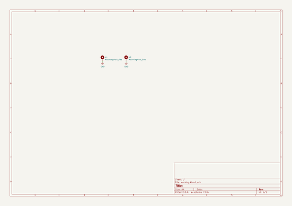
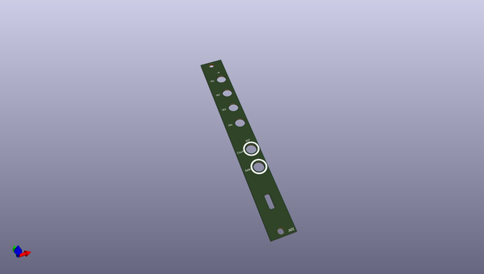
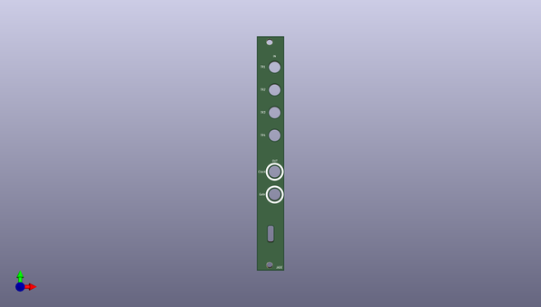
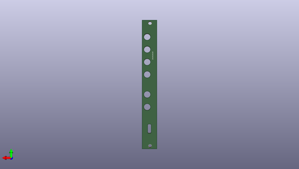

# jade
 
## summary 
* id: akiyukiokayasu_jade_jade_panel
* user: akiyukiokayasu
* name: jade
* board: jade_panel
* repo: https://github.com/AkiyukiOkayasu/jade
* src_file_repo_kicad_pcb: Panel/jade_panel.kicad_pcb
* src_file_repo_kicad_pcb_link: https://github.com/AkiyukiOkayasu/jade/tree/main/Panel/jade_panel.kicad_pcb
* src_file_repo_kicad_sch: Hardware/jade_hardware.kicad_sch
* src_file_repo_kicad_sch_link: https://github.com/AkiyukiOkayasu/jade/tree/main/Hardware/jade_hardware.kicad_sch

* src_file_repo_sch: Panel/jade_panel.sch
*
 src_file_repo_sch_link: https://github.com/AkiyukiOkayasu/jade/tree/main/Panel/jade_panel.sch
* full details link: https://github.com/oomlout/oomlout_oomp_project_bot_v_2/tree/main/projects/akiyukiokayasu_jade_jade_panel/current_version/working  

## schematic  
  
[schematic (pdf)](working_schematic.pdf)  

## pcb  
 
  
  
  
[board (pdf)](working.pdf)  

## working_bom
| Id | Designator | Footprint | Quantity | Designation | Supplier and ref |  | None | 
| --- | --- | --- | --- | --- | --- | --- | --- | 
| 1 | H1,H2 | MountingHole_3.4mm | 2 | MountingHole_Pad |  |  | [''] | 

## bom_schematic
| Ref | Qnty | Value | Cmp name | Footprint | Description | Vendor | DNP | 
| --- | --- | --- | --- | --- | --- | --- | --- | 
| H1, H2 | 2 | MountingHole_Pad | MountingHole_Pad | Akiyuki_Footprint:MountingHole_3.4mm | Mounting Hole with connection |  |  | 

## mounting_holes
| x | y | package | value | ref | size | 
| --- | --- | --- | --- | --- | --- | 
| 0.0 | 122.5 | MountingHole_3.4mm | MountingHole_Pad | H1 | m3 | 
| 0.0 | 0.0 | MountingHole_3.4mm | MountingHole_Pad | H2 | m3 | 

