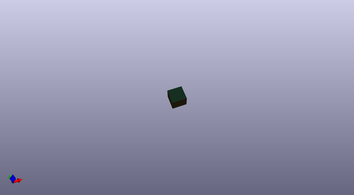
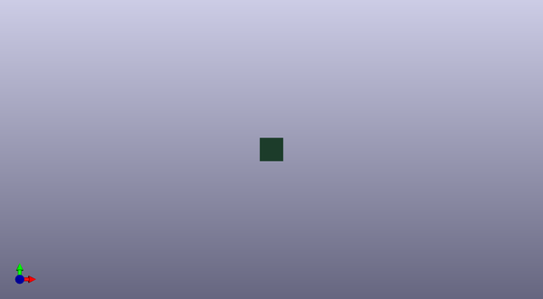
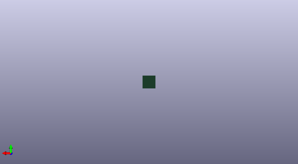

# kicad_pcb_template
 
## summary 
* id: akiyukiokayasu_kicad_pcb_template_jlc_4layer
* user: akiyukiokayasu
* name: kicad_pcb_template
* board: jlc_4layer
* repo: https://github.com/AkiyukiOkayasu/KiCad-PCB-Template
* src_file_repo_kicad_pcb: JLC_4layer/JLC_4layer.kicad_pcb
* src_file_repo_kicad_pcb_link: https://github.com/AkiyukiOkayasu/KiCad-PCB-Template/tree/main/JLC_4layer/JLC_4layer.kicad_pcb
* src_file_repo_kicad_sch: JLC_4layer/JLC_4layer.kicad_sch
* src_file_repo_kicad_sch_link: https://github.com/AkiyukiOkayasu/KiCad-PCB-Template/tree/main/JLC_4layer/JLC_4layer.kicad_sch

* src_file_repo_sch: 
*
 src_file_repo_sch_link: https://github.com/AkiyukiOkayasu/KiCad-PCB-Template/tree/main/
* full details link: https://github.com/oomlout/oomlout_oomp_project_bot_v_2/tree/main/projects/akiyukiokayasu_kicad_pcb_template_jlc_4layer/current_version/working  

## schematic  
  
[schematic (pdf)](working_schematic.pdf)  

## pcb  
 
  
  
  
[board (pdf)](working.pdf)  

## bom_schematic
no data

