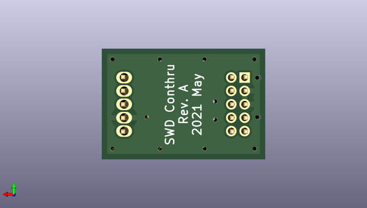

# swd2conthrough
 
## summary 
* id: akiyukiokayasu_swd2conthrough_swd2conthrough
* user: akiyukiokayasu
* name: swd2conthrough
* board: swd2conthrough
* repo: https://github.com/AkiyukiOkayasu/SWD2Conthrough
* src_file_repo_kicad_pcb: SWD2Conthrough.kicad_pcb
* src_file_repo_kicad_pcb_link: https://github.com/AkiyukiOkayasu/SWD2Conthrough/tree/main/SWD2Conthrough.kicad_pcb

* src_file_repo_sch: SWD2Conthrough.sch
*
 src_file_repo_sch_link: https://github.com/AkiyukiOkayasu/SWD2Conthrough/tree/main/SWD2Conthrough.sch
* full details link: https://github.com/oomlout/oomlout_oomp_project_bot_v_2/tree/main/projects/akiyukiokayasu_swd2conthrough_swd2conthrough/current_version/working  

## schematic  
  
[schematic (pdf)](working_schematic.pdf)  

## pcb  
 
  
  
  
[board (pdf)](working.pdf)  

## working_bom
| Id | Designator | Footprint | Quantity | Designation | Supplier and ref |  | None | 
| --- | --- | --- | --- | --- | --- | --- | --- | 
| 1 | J2 | Mac8_XB-1_P1.27mm_Vertical_5pin | 1 | Conn_01x05 |  |  | [''] | 
| 2 | J1 | PinHeader_2x05_P1.27mm_Vertical | 1 | JLink_9pinCortexM_Adapter |  |  | [''] | 

## bom_schematic
| Ref | Qnty | Value | Cmp name | Footprint | Description | Vendor | DNP | 
| --- | --- | --- | --- | --- | --- | --- | --- | 
| J1 | 1 | JLink_9pinCortexM_Adapter | Conn_02x05_Odd_Even | Connector_PinHeader_1.27mm:PinHeader_2x05_P1.27mm_Vertical | Generic connector, double row, 02x05, odd/even pin numbering scheme (row 1 odd numbers, row 2 even numbers), script generated (kicad-library-utils/schlib/autogen/connector/) |  |  | 
| J2 | 1 | Conn_01x05 | Conn_01x05 | Akiyuki_Footprint:Mac8_XB-1_P1.27mm_Vertical_5pin | Generic connector, single row, 01x05, script generated (kicad-library-utils/schlib/autogen/connector/) |  |  | 

