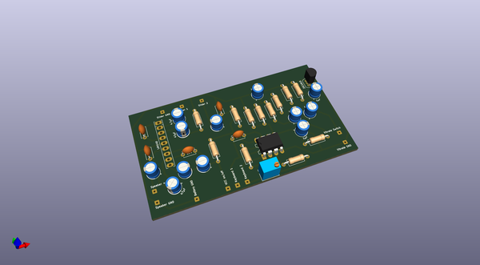
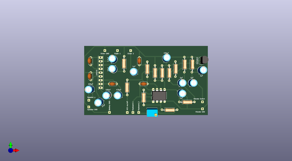
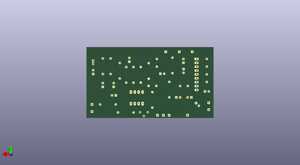

# 1979_mini_gan_pet_103
 
## summary 
* id: alasofia_1979_mini_gan_pet_103_pet103_001
* user: alasofia
* name: 1979_mini_gan_pet_103
* board: pet103_001
* repo: https://github.com/Alasofia/1979-MINI-GAN-PET-103
* src_file_repo_kicad_pcb: KiCad/PET103_001/PET103_001.kicad_pcb
* src_file_repo_kicad_pcb_link: https://github.com/Alasofia/1979-MINI-GAN-PET-103/tree/main/KiCad/PET103_001/PET103_001.kicad_pcb

* src_file_repo_sch: KiCad/PET103_001/PET103_001.sch
*
 src_file_repo_sch_link: https://github.com/Alasofia/1979-MINI-GAN-PET-103/tree/main/KiCad/PET103_001/PET103_001.sch
* full details link: https://github.com/oomlout/oomlout_oomp_project_bot_v_2/tree/main/projects/alasofia_1979_mini_gan_pet_103_pet103_001/current_version/working  

## schematic  
  
[schematic (pdf)](working_schematic.pdf)  

## pcb  
 
  
  
  
[board (pdf)](working.pdf)  

## working_bom
| Id | Designator | Footprint | Quantity | Designation | Supplier and ref |  | None | 
| --- | --- | --- | --- | --- | --- | --- | --- | 
| 1 | C1 | C_Disc_D4.7mm_W2.5mm_P5.00mm | 1 | 150PF |  |  | [''] | 
| 2 | C2 | CP_Radial_D5.0mm_P2.50mm | 1 | 470µF |  |  | [''] | 
| 3 | C3 | C_Disc_D4.7mm_W2.5mm_P5.00mm | 1 | 683 |  |  | [''] | 
| 4 | C4 | CP_Radial_D5.0mm_P2.50mm | 1 | 220µF |  |  | [''] | 
| 5 | C5 | CP_Radial_D5.0mm_P2.50mm | 1 | 4.7µF |  |  | [''] | 
| 6 | C6,C7 | CP_Radial_D5.0mm_P2.50mm | 2 | 47µF |  |  | [''] | 
| 7 | C8 | C_Disc_D4.7mm_W2.5mm_P5.00mm | 1 | 104 |  |  | [''] | 
| 8 | C9,C10 | CP_Radial_D5.0mm_P2.50mm | 2 | 100µF |  |  | [''] | 
| 9 | C11,C13,C15,C16,C17 | CP_Radial_D5.0mm_P2.50mm | 5 | 1µF |  |  | [''] | 
| 10 | C12 | C_Disc_D4.7mm_W2.5mm_P5.00mm | 1 | 223 |  |  | [''] | 
| 11 | C14 | C_Disc_D4.7mm_W2.5mm_P5.00mm | 1 | 333 |  |  | [''] | 
| 12 | Q1 | TO-92_Inline | 1 | 2SC1815 |  |  | [''] | 
| 13 | R1 | R_Axial_DIN0207_L6.3mm_D2.5mm_P10.16mm_Horizontal | 1 | 51Ω |  |  | [''] | 
| 14 | R2 | R_Axial_DIN0207_L6.3mm_D2.5mm_P10.16mm_Horizontal | 1 | 100Ω |  |  | [''] | 
| 15 | R3,R7,R10 | R_Axial_DIN0207_L6.3mm_D2.5mm_P10.16mm_Horizontal | 3 | 4.7K |  |  | [''] | 
| 16 | R4 | R_Axial_DIN0207_L6.3mm_D2.5mm_P10.16mm_Horizontal | 1 | 1M |  |  | [''] | 
| 17 | R5 | R_Axial_DIN0207_L6.3mm_D2.5mm_P10.16mm_Horizontal | 1 | 100K |  |  | [''] | 
| 18 | R6,R8 | R_Axial_DIN0207_L6.3mm_D2.5mm_P10.16mm_Horizontal | 2 | 1K |  |  | [''] | 
| 19 | R9,R11 | R_Axial_DIN0207_L6.3mm_D2.5mm_P10.16mm_Horizontal | 2 | 10K |  |  | [''] | 
| 20 | R12 | R_Axial_DIN0207_L6.3mm_D2.5mm_P10.16mm_Horizontal | 1 | 18K |  |  | [''] | 
| 21 | R13 | Potentiometer_Bourns_3266W_Vertical | 1 | 5K |  |  | [''] | 
| 22 | U1 | DIP-8_W7.62mm_LongPads | 1 | LA6458 |  |  | [''] | 
| 23 | U2 | SIP9_Housing_BigPads | 1 | LA4140 |  |  | [''] | 

## bom_schematic
no data

