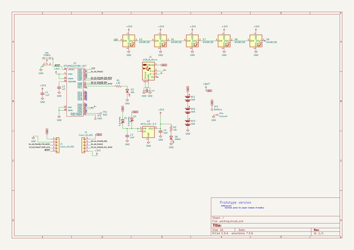
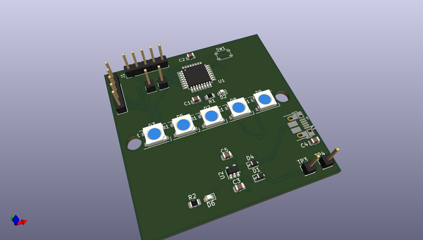
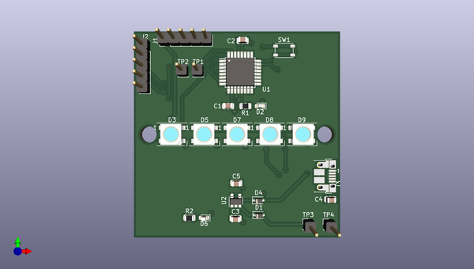
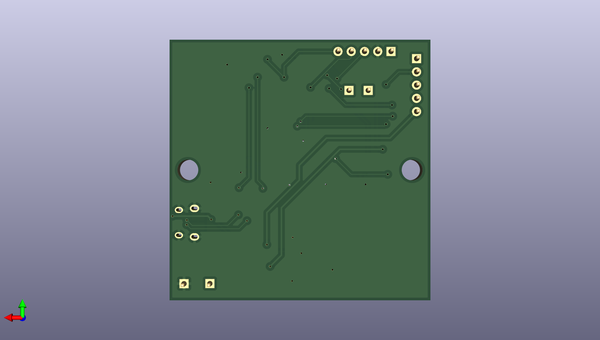

# bsidessd
 
## summary 
* id: andnxor_bsidessd_bsidessd
* user: andnxor
* name: bsidessd
* board: bsidessd
* repo: https://github.com/ANDnXOR/BSidesSD
* src_file_repo_kicad_pcb: bsidessd/bsidessd.kicad_pcb
* src_file_repo_kicad_pcb_link: https://github.com/ANDnXOR/BSidesSD/tree/master/bsidessd/bsidessd.kicad_pcb

* src_file_repo_sch: bsidessd/bsidessd.sch
*
 src_file_repo_sch_link: https://github.com/ANDnXOR/BSidesSD/tree/master/bsidessd/bsidessd.sch
* full details link: https://github.com/oomlout/oomlout_oomp_project_bot_v_2/tree/main/projects/andnxor_bsidessd_bsidessd/current_version/working  

## schematic  
  
[schematic (pdf)](working_schematic.pdf)  

## pcb  
 
  
  
  
[board (pdf)](working.pdf)  

## working_bom
| Id | Designator | Footprint | Quantity | Designation | Supplier and ref |  | None | 
| --- | --- | --- | --- | --- | --- | --- | --- | 
| 1 | C1,C2 | C_0805_2012Metric | 2 | 1uF |  |  | [''] | 
| 2 | C3,C5 | C_0805_2012Metric | 2 | 10uF |  |  | [''] | 
| 3 | C4 | C_0805_2012Metric | 1 | 1nF |  |  | [''] | 
| 4 | D1,D4 | D_SOD-323 | 2 | D_Schottky |  |  | [''] | 
| 5 | D2 | LED_0603_1608Metric | 1 | RED |  |  | [''] | 
| 6 | D3,D5,D7,D8,D9 | LED_WS2812B_PLCC4_5.0x5.0mm_P3.2mm | 5 | WS2812B |  |  | [''] | 
| 7 | D6 | LED_0603_1608Metric | 1 | GREEN |  |  | [''] | 
| 8 | J1,J2 | PinHeader_1x05_P2.54mm_Vertical | 2 | Conn_01x05 |  |  | [''] | 
| 9 | J3 | USB_Micro-B_Amphenol_10103594-0001LF_Horizontal | 1 | USB_B_Micro |  |  | [''] | 
| 10 | R1 | R_0805_2012Metric | 1 | 1.5K |  |  | [''] | 
| 11 | TP1 | PinHeader_1x01_P2.54mm_Vertical | 1 | SWD |  |  | [''] | 
| 12 | TP2 | PinHeader_1x01_P2.54mm_Vertical | 1 | SWC |  |  | [''] | 
| 13 | TP3 | PinHeader_1x01_P2.54mm_Vertical | 1 | Battery |  |  | [''] | 
| 14 | TP4 | PinHeader_1x01_P2.54mm_Vertical | 1 | Ground |  |  | [''] | 
| 15 | U1 | TQFP-32_7x7mm_P0.8mm | 1 | ATSAMD21E18A-AUT |  |  | [''] | 
| 16 | U2 | SOT-23-5 | 1 | AP2112K-3.3 |  |  | [''] | 
| 17 | SW1 | SW_SPST_PTS810 | 1 | PTS810 |  |  | [''] | 
| 18 | R2 | R_0805_2012Metric | 1 | 10K |  |  | [''] | 

## bom_schematic
| Ref | Qnty | Value | Cmp name | Footprint | Description | Vendor | DNP | 
| --- | --- | --- | --- | --- | --- | --- | --- | 
| BT1, BT2, BT3 | 3 | AAA | Battery |  | Multiple-cell battery |  |  | 
| C1, C2 | 2 | 1uF | C_Small | Capacitor_SMD:C_0805_2012Metric | Unpolarized capacitor, small symbol |  |  | 
| C3, C5 | 2 | 10uF | C_Small | Capacitor_SMD:C_0805_2012Metric | Unpolarized capacitor, small symbol |  |  | 
| C4 | 1 | 1nF | C_Small | Capacitor_SMD:C_0805_2012Metric | Unpolarized capacitor, small symbol |  |  | 
| D1, D4 | 2 | D_Schottky | D_Schottky | Diode_SMD:D_SOD-323 | Schottky diode |  |  | 
| D2 | 1 | RED | LED | LED_SMD:LED_0603_1608Metric | Light emitting diode |  |  | 
| D3, D5, D7, D8, D9 | 5 | WS2812B | WS2812B | LED_SMD:LED_WS2812B_PLCC4_5.0x5.0mm_P3.2mm | RGB LED with integrated controller |  |  | 
| D6 | 1 | GREEN | LED | LED_SMD:LED_0603_1608Metric | Light emitting diode |  |  | 
| J1, J2 | 2 | Conn_01x05 | Conn_01x05 | Connector_PinHeader_2.54mm:PinHeader_1x05_P2.54mm_Vertical | Generic connector, single row, 01x05, script generated (kicad-library-utils/schlib/autogen/connector/) |  |  | 
| J3 | 1 | USB_B_Micro | USB_B_Micro-Connector | Connector_USB:USB_Micro-B_Amphenol_10103594-0001LF_Horizontal |  |  |  | 
| R1 | 1 | 1.5K | R_US | Resistor_SMD:R_0805_2012Metric | Resistor, US symbol |  |  | 
| R2 | 1 | 10K | R_US | Resistor_SMD:R_0805_2012Metric | Resistor, US symbol |  |  | 
| SW1 | 1 | PTS810 | PTS810-pts810_alt | Button_Switch_SMD:SW_SPST_PTS810 |  |  |  | 
| TP1 | 1 | SWD | TestPoint | Connector_PinHeader_2.54mm:PinHeader_1x01_P2.54mm_Vertical | test point |  |  | 
| TP2 | 1 | SWC | TestPoint | Connector_PinHeader_2.54mm:PinHeader_1x01_P2.54mm_Vertical | test point |  |  | 
| TP3 | 1 | Battery | TestPoint | Connector_PinHeader_2.54mm:PinHeader_1x01_P2.54mm_Vertical | test point |  |  | 
| TP4 | 1 | Ground | TestPoint | Connector_PinHeader_2.54mm:PinHeader_1x01_P2.54mm_Vertical | test point |  |  | 
| U1 | 1 | ATSAMD21E18A-AUT | ATSAMD21E18A-AUT-ATSAMD21E | Package_QFP:TQFP-32_7x7mm_P0.8mm |  |  |  | 
| U2 | 1 | AP2112K-3.3 | AP2112K-3.3-Regulator_Linear | Package_TO_SOT_SMD:SOT-23-5 |  |  |  | 

