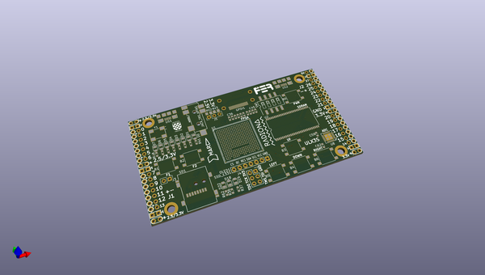
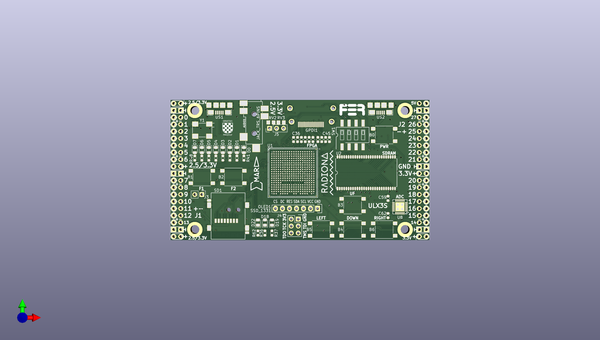
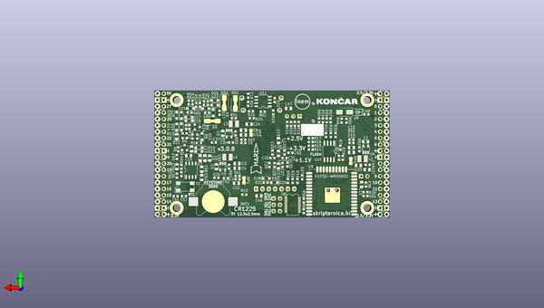

# buspirateultrahardware
 
## summary 
* id: dangerousprototypes_buspirateultrahardware_bpuv2a
* user: dangerousprototypes
* name: buspirateultrahardware
* board: bpuv2a
* repo: https://github.com/DangerousPrototypes/BusPirateUltraHardware
* src_file_repo_kicad_pcb: BPUv2a/BPUv2a.kicad_pcb
* src_file_repo_kicad_pcb_link: https://github.com/DangerousPrototypes/BusPirateUltraHardware/tree/master/BPUv2a/BPUv2a.kicad_pcb

* src_file_repo_sch: 
*
 src_file_repo_sch_link: https://github.com/DangerousPrototypes/BusPirateUltraHardware/tree/master/
* full details link: https://github.com/oomlout/oomlout_oomp_project_bot_v_2/tree/main/projects/dangerousprototypes_buspirateultrahardware_bpuv2a/current_version/working  

## pcb  
 
  
  
  
[board (pdf)](working.pdf)  

## working_bom
| Id | Designator | Footprint | Quantity | Designation | Supplier and ref |  | None | 
| --- | --- | --- | --- | --- | --- | --- | --- | 
| 1 | AUDIO1 | CUI_SJ-43516-SMT | 1 | JACK_TRS_6PINS |  |  | [''] | 
| 2 | U1 | BGA-381_pitch0.8mm_dia0.4mm | 1 | LFE5U-85F-6BG381C |  |  | [''] | 
| 3 | H1,H2,H3,H4 | MountingHole_3.2mm_M3_ISO14580_Pad | 4 | HOLE |  |  | [''] | 
| 4 | J1,J2 | Socket_Strip_Angled_2x20 | 2 | CONN_02X20 |  |  | [''] | 
| 5 | OLED1 | oled_13xx | 1 | SSD_1331 |  |  | [''] | 
| 6 | SD1 | SCHD3A100 | 1 | SCHD3A0100 |  |  | [''] | 
| 7 | radiona | radiona | 1 | radiona |  |  | [''] | 
| 8 | U2 | TSOP54 | 1 | MT48LC16M16A2TG |  |  | [''] | 
| 9 | HR | hrvatski | 1 | HR |  |  | [''] | 
| 10 | D1,D5 | LED_0805_2012Metric | 2 | ORANGE |  |  | [''] | 
| 11 | C36,C37,C38,C39,C40,C41,C42,C43,C44,C45,C59,C62,C14,C60 | C_0603_1608Metric | 14 | 220nF |  |  | [''] | 
| 12 | D19,D0,D4,D11 | LED_0805_2012Metric | 4 | RED |  |  | [''] | 
| 13 | GPDI1 | CONN-10029449-111RLF | 1 | GPDI-D |  |  | [''] | 
| 14 | R41,R42,R43,R44,R45,R46,R47,R48,R36,R37,R62,R65,R58,R61,R15,R19,R35 | R_0603_1608Metric | 17 | 549 |  |  | [''] | 
| 15 | D2,D6,D18 | LED_0805_2012Metric | 3 | GREEN |  |  | [''] | 
| 16 | D3,D7,D22 | LED_0805_2012Metric | 3 | BLUE |  |  | [''] | 
| 17 | J5 | PinHeader_1x03_P2.54mm_Vertical | 1 | VJ1 |  |  | [''] | 
| 18 | J4 | Socket_Strip_Straight_2x03 | 1 | CONN_02X03 |  |  | [''] | 
| 19 | RV3 | R_0805_2012Metric_Pad1.29x1.40mm_HandSolder | 1 | 0 |  |  | [''] | 
| 20 | US1,US2 | USB-MICRO-B-FCI-10118192-0001LF | 2 | MICRO_USB |  |  | [''] | 
| 21 | fer | fer4mm6 | 1 | fer |  |  | [''] | 
| 22 | J3 | PinHeader_1x02_P2.54mm_Vertical | 1 | WIFI_OFF |  |  | [''] | 
| 23 | Y1 | Crystal_SMD_7050_4Pads | 1 | FNETHE025 |  |  | [''] | 
| 24 | REF**,REF** | emard12mm | 2 | emard12mm |  |  | [''] | 
| 25 | B0,B1,B2,B3,B4,B5,B6 | SW_SPST_PTS645 | 7 | PTS645 |  |  | [''] | 
| 26 | SW1 | SW_DIP_x4_W8.61mm_Slide_LowProfile | 1 | SW_DIP_x04 |  |  | [''] | 
| 27 | U8 | MAX1112x-TQFN-28-1EP_5x5mm_Pitch0.5mm | 1 | MAX11125 |  |  | [''] | 
| 28 | U3,U4,U5 | TSOT-25 | 3 | TLV62569DBV |  |  | [''] | 
| 29 | BAT1 | Keystone_3000_1x12mm-CoinCell | 1 | CR1225 |  |  | [''] | 
| 30 | Y2 | Crystal_SMD_ABS25 | 1 | 32768Hz |  |  | [''] | 
| 31 | U7 | SOT96-1 | 1 | MCP7940NT |  |  | [''] | 
| 32 | C47,C16,C17,C19,C20,C22,C23,C46,C24,C13 | C_0805_2012Metric | 10 | 2.2uF |  |  | [''] | 
| 33 | C2,C6,C10,C18 | C_0603_1608Metric | 4 | 470pF |  |  | [''] | 
| 34 | C3,C4,C5,C7,C8,C9,C11,C15,C54,C12,C55,C1,C21,C61,C58 | C_0805_2012Metric | 15 | 22uF |  |  | [''] | 
| 35 | C25,C27,C28,C30,C32,C33,C34,C35,C48,C49,C50,C51,C52,C29,C31,C53,C26 | C_0603_1608Metric | 17 | 22nF |  |  | [''] | 
| 36 | D21,D20 | D_SOD-323_HandSoldering | 2 | 3.6V |  |  | [''] | 
| 37 | D17,D10,D13,D14,D16,D23,D24,D27,D29,D25,D26 | D_SOD-323_HandSoldering | 11 | 1N914 |  |  | [''] | 
| 38 | R40,R54,R57,R6,R8,R14,R18,R29,R66 | R_0603_1608Metric | 9 | 1.1k |  |  | [''] | 
| 39 | R9,R31,R32,R33,R63,R64,RA1,RA2,RA3,R13,R55,R34 | R_0603_1608Metric | 12 | 15k |  |  | [''] | 
| 40 | R49,R50,R52,R53 | R_0603_1608Metric | 4 | 27 |  |  | [''] | 
| 41 | R51,R60,R7,R10,R17,R21,R39 | R_0603_1608Metric | 7 | 130 |  |  | [''] | 
| 42 | R59,R16,R20 | R_0603_1608Metric | 3 | 270 |  |  | [''] | 
| 43 | D12,D15 | D_SOD-323_HandSoldering | 2 | BAT54W |  |  | [''] | 
| 44 | U11 | SM8 | 1 | PCA9306D |  |  | [''] | 
| 45 | L1,L3,L2 | L_1008_1210 | 3 | 2.2uH |  |  | [''] | 
| 46 | R1,R3,R4,R25,R26,R30,RB2 | R_0603_1608Metric | 7 | 4.7k |  |  | [''] | 
| 47 | R2,RB1 | R_0603_1608Metric | 2 | 18k |  |  | [''] | 
| 48 | R5 | R_0603_1608Metric | 1 | 2.2M |  |  | [''] | 
| 49 | R11,R12,R27,R28 | R_0603_1608Metric | 4 | 10k |  |  | [''] | 
| 50 | R22,R23,RB3 | R_0603_1608Metric | 3 | 3.3k |  |  | [''] | 
| 51 | R24 | R_0603_1608Metric | 1 | 100k |  |  | [''] | 
| 52 | D8 | D_SMA | 1 | STPS2L30AF |  |  | [''] | 
| 53 | Q2 | SOT-23 | 1 | 2N7002 |  |  | [''] | 
| 54 | REF** | inem | 1 | inem |  |  | [''] | 
| 55 | U6 | FT231X-SSOP-20_4.4x6.5mm_Pitch0.65mm | 1 | FT231XS |  |  | [''] | 
| 56 | R38 | R_0603_1608Metric | 1 | 0.47 |  |  | [''] | 
| 57 | Q1 | SOT-23 | 1 | BC857 |  |  | [''] | 
| 58 | U10 | SOA008-150-208mil | 1 | IS25LP128F-JBLE |  |  | [''] | 
| 59 | C56,C57 | C_0603_1608Metric | 2 | 3.3pF |  |  | [''] | 
| 60 | L5,L4 | L_0805_2012Metric_Pad1.15x1.40mm_HandSolder | 2 | 33uH |  |  | [''] | 
| 61 | U9 | ESP32-WROOM32 | 1 | ESP32-WROOM |  |  | [''] | 

## bom_schematic
| Ref | Qnty | Value | Cmp name | Footprint | Description | Vendor | DNP | 
| --- | --- | --- | --- | --- | --- | --- | --- | 
| H1, H2, H3, H4 | 4 | HOLE | Conn_01x01 | Mounting_Holes:MountingHole_3.2mm_M3_ISO14580_Pad | Generic connector, single row, 01x01, script generated (kicad-library-utils/schlib/autogen/connector/) |  |  | 

## mounting_holes
| x | y | package | value | ref | size | 
| --- | --- | --- | --- | --- | --- | 
| 0.0 | 0.0 | MountingHole_3.2mm_M3_ISO14580_Pad | HOLE | H1 | m3 | 
| 76.2 | 0.0 | MountingHole_3.2mm_M3_ISO14580_Pad | HOLE | H2 | m3 | 
| 76.2 | 43.18 | MountingHole_3.2mm_M3_ISO14580_Pad | HOLE | H3 | m3 | 
| 0.0 | 43.18 | MountingHole_3.2mm_M3_ISO14580_Pad | HOLE | H4 | m3 | 

