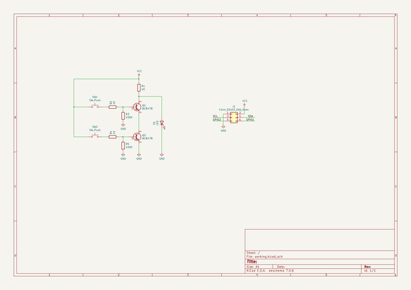
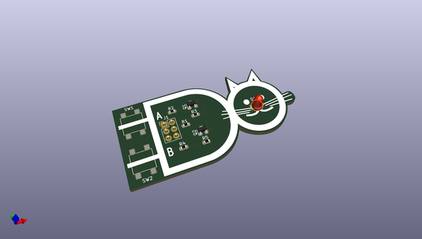
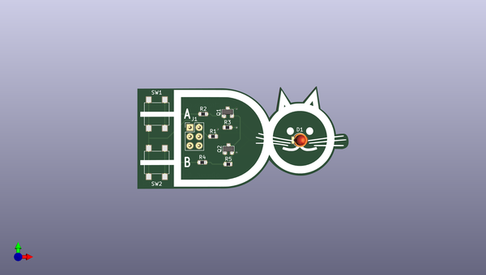
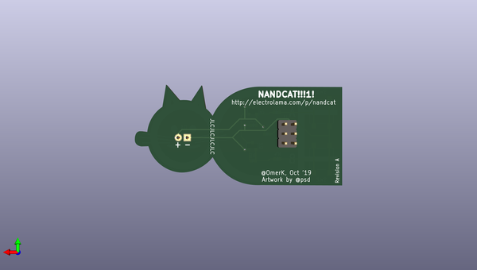

# nandcat
 
## summary 
* id: electrolama_nandcat_nand_cat
* user: electrolama
* name: nandcat
* board: nand_cat
* repo: https://github.com/electrolama/nandcat
* src_file_repo_kicad_pcb: Revision A/nand-cat.kicad_pcb
* src_file_repo_kicad_pcb_link: https://github.com/electrolama/nandcat/tree/master/Revision A/nand-cat.kicad_pcb

* src_file_repo_sch: Revision A/nand-cat.sch
*
 src_file_repo_sch_link: https://github.com/electrolama/nandcat/tree/master/Revision A/nand-cat.sch
* full details link: https://github.com/oomlout/oomlout_oomp_project_bot_v_2/tree/main/projects/electrolama_nandcat_nand_cat/current_version/working  

## schematic  
  
[schematic (pdf)](working_schematic.pdf)  

## pcb  
 
  
  
  
[board (pdf)](working.pdf)  

## working_bom
| Id | Designator | Footprint | Quantity | Designation | Supplier and ref |  | None | 
| --- | --- | --- | --- | --- | --- | --- | --- | 
| 1 | J1 | PinHeader_2x03_P2.54mm_Vertical | 1 | Conn_02x03_Odd_Even |  |  | [''] | 
| 2 | SW2,SW1 | SW_SPST_B3S-1000 | 2 | SW_Push |  |  | [''] | 
| 3 | R2,R4,R1 | R_0603_1608Metric | 3 | 1K |  |  | [''] | 
| 4 | G*** | nand-cat | 1 | LOGO |  |  | [''] | 
| 5 | Q1,Q2 | SOT-23 | 2 | BC847B |  |  | [''] | 
| 6 | R5,R3 | R_0603_1608Metric | 2 | 100K |  |  | [''] | 
| 7 | D1 | LED_D3.0mm | 1 | LED |  |  | [''] | 

## bom_schematic
| Ref | Qnty | Value | Cmp name | Footprint | Description | Vendor | DNP | 
| --- | --- | --- | --- | --- | --- | --- | --- | 
| D1 | 1 | LED | LED | LED_THT:LED_D3.0mm | Light emitting diode |  |  | 
| J1 | 1 | Conn_02x03_Odd_Even | Conn_02x03_Odd_Even | Connector_PinHeader_2.54mm:PinHeader_2x03_P2.54mm_Vertical | Generic connector, double row, 02x03, odd/even pin numbering scheme (row 1 odd numbers, row 2 even numbers), script generated (kicad-library-utils/schlib/autogen/connector/) |  |  | 
| Q1, Q2 | 2 | BC847B | BC847 | Package_TO_SOT_SMD:SOT-23 | 0.1A Ic, 45V Vce, NPN Transistor, SOT-23 |  |  | 
| R1, R2, R4 | 3 | 1K | R | Resistor_SMD:R_0603_1608Metric | Resistor |  |  | 
| R3, R5 | 2 | 100K | R | Resistor_SMD:R_0603_1608Metric | Resistor |  |  | 
| SW1, SW2 | 2 | SW_Push | SW_Push | Button_Switch_SMD:SW_SPST_B3S-1000 | Push button switch, generic, two pins |  |  | 

